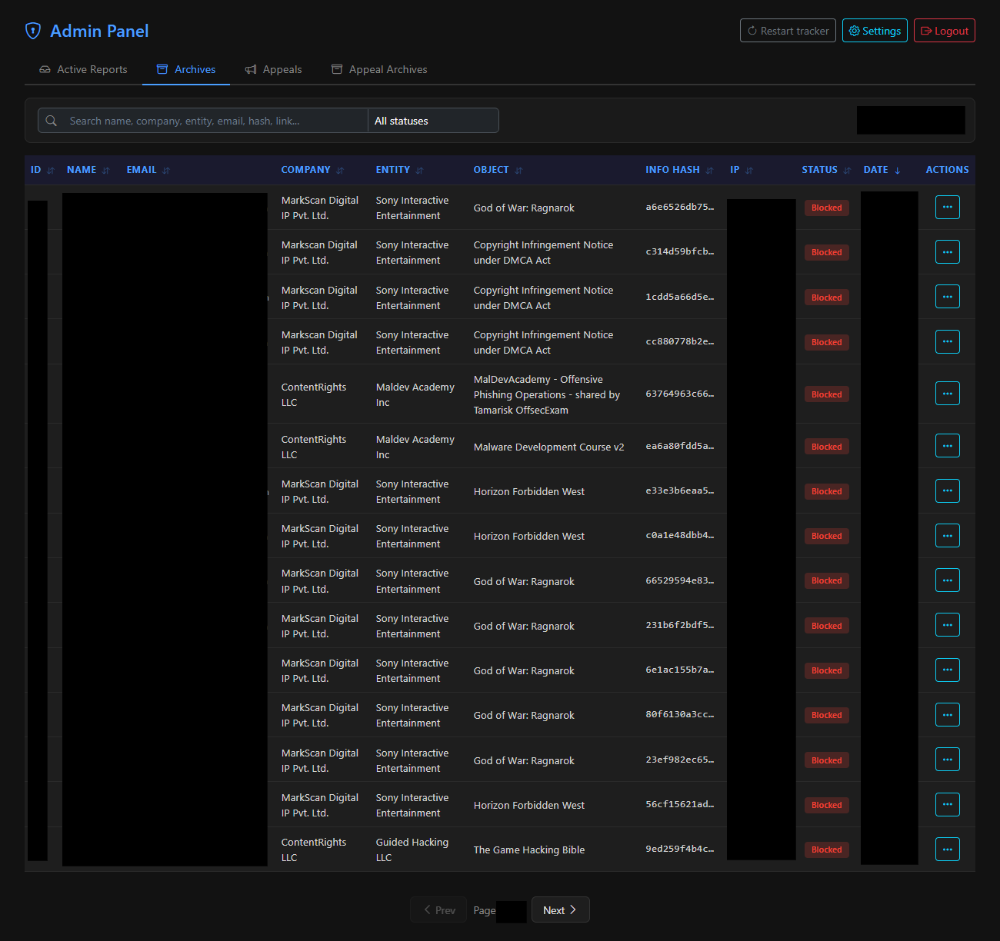
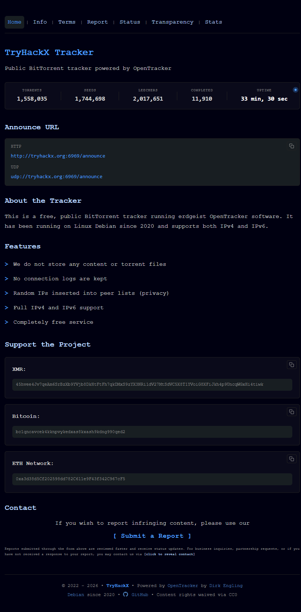
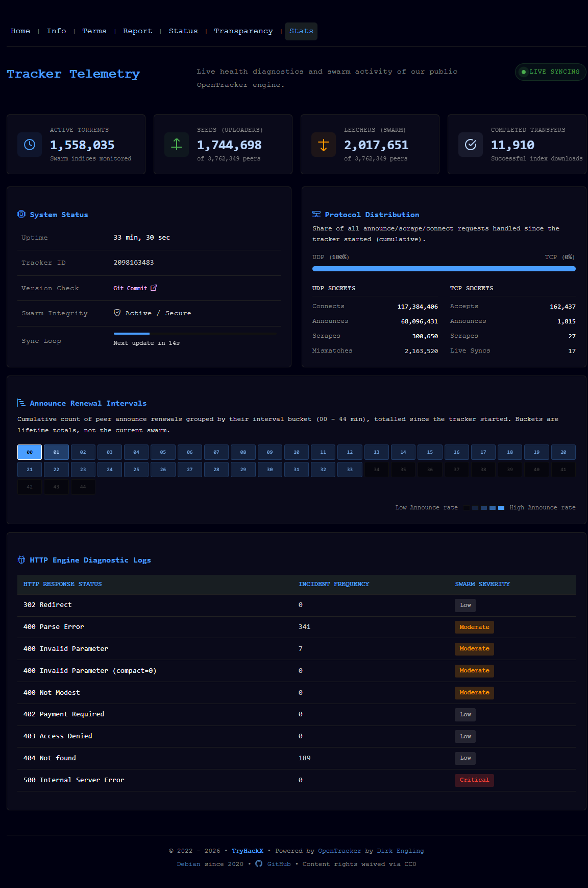

# TryHackX Tracker


A self-hosted BitTorrent tracker information and DMCA/abuse report management system. Built with PHP and MySQL — no frameworks, no dependencies, no build step.

Compatible with [erdgeist OpenTracker](https://erdgeist.org/arts/software/opentracker/) and any other tracker software that uses a newline-separated text file for blacklisting info hashes. Point the blacklist file path in admin settings to your tracker's blacklist file and the application manages entries automatically.

Provides a public-facing website for tracker information, abuse report submission, report status checking, block checking, appeal management, and a full-featured admin panel with email notifications.

---

## Features

### Public Pages
- **Home** — tracker announce URLs, features overview, donation links, contact info
- **Submit a Report** — DMCA/abuse report form with info hash extraction from magnet links, optional additional message
- **Check Report Status** — look up report status by report number or info hash + email (privacy-safe: requires email match)
- **Block Check** — verify if an info hash is currently blocked on the tracker (never reveals whether reports exist)
- **Appeal System** — submit appeals to request blocking or unblocking of info hashes
- **Transparency Page** — public statistics showing aggregated block counts per organization
- **Terms of Service** — configurable ToS page

### Admin Panel
- **Dashboard** — sortable tables with multi-level sorting, search, filtering, pagination
- **Report Workflow** — pending → reviewed → blocked/archived, with inline editing for company/entity fields
- **Appeal Management** — accept/reject appeals with optional admin response, auto-close related appeals
- **Blacklist Integration** — block/unblock info hashes via newline-separated blacklist file, with path validation
- **Tracker Restart + Smart Recommendations** — optional one-click `systemctl restart` of your tracker service (password-confirmed), with orange/red hints that surface when a restart is due after blacklist changes or a long uptime — see [OpenTracker service restart](#opentracker-service-restart)
- **Email Notifications** — professional dark-themed HTML emails for all status changes, with per-type unsubscribe
- **Auto-Archiving** — automatically archive old reviewed reports and resolved appeals after configurable days
- **Settings** — all configuration via web UI (site info, reCAPTCHA, CAPTCHA tuning, donations, footer, etc.)

### Email System
- **Submission Confirmation** — sent when a report is filed
- **Under Review** — sent when an admin first opens a report
- **Status Updates** — sent on every status change (reviewed, blocked, archived, restored)
- **Custom Messages** — admin can send freeform messages to reporters
- **Appeal Confirmation** — sent when an appeal is submitted
- **Appeal Decision** — sent when an appeal is accepted/rejected, with colored status and object title
- **Notification Preferences** — users can manage per-type email preferences via HMAC-secured link
- **One-Click Unsubscribe** — RFC 8058 compliant `List-Unsubscribe-Post` header for Gmail/Yahoo

### Security
- **Smart CAPTCHA** — point-based reCAPTCHA v2 system with modal overlay; CAPTCHA only appears after configurable activity threshold, with grace period after solving
- **CSRF Protection** — token validation on all public form submissions and on every admin write (via the `X-CSRF-Token` header)
- **Login Hardening** — per-IP brute-force lockout on admin login (attempts + window now admin-configurable) + constant-time username/password comparison
- **Admin Session Timeouts** — idle timeout and absolute lifetime cap; an expired session is destroyed server-side so a stale cookie can't be reused
- **Rate Limiting** — per-IP throttling on report submission **and** on status checks, block lookups and appeal submissions (all admin-tunable, `0` = off), plus a duplicate-appeal guard
- **Prepared Statements** — all database queries use PDO with parameterized queries; dynamic `ORDER BY`/table names are whitelisted
- **Input Sanitization** — `htmlspecialchars` on all output, server-side validation on all input; untrusted upstream stats data is escaped before it touches the DOM
- **Password Hashing** — bcrypt via `password_hash()`
- **HMAC Tokens** — SHA-256 signed unsubscribe links with timing-safe comparison
- **No Secrets in Source** — DB credentials are injected by the installer or via `DB_HOST`/`DB_NAME`/`DB_USER`/`DB_PASS` environment variables; nothing sensitive is committed
- **Generic Error Responses** — raw database/exception messages are logged server-side, never returned to clients
- **Directory Protection** — `.htaccess` deny rules on `config/`, `includes/`, `templates/`, `api/`, `sql/`, `tests/`, `.claude/`; `assets/` blocks server-side script execution and directory listing (see [Reverse proxy / Nginx](#reverse-proxy--nginx-notes) for non-Apache servers)
- **Security Headers** — `Content-Security-Policy`, `X-Content-Type-Options`, `X-Frame-Options`, `Referrer-Policy`, `Permissions-Policy`
- **Subresource Integrity** — pinned CDN assets (Bootstrap, Bootstrap Icons) loaded with `integrity` hashes
- **Reverse-Proxy Aware** — optional trusted-proxy allow-list + configurable client-IP header so per-IP limits work correctly behind Cloudflare / nginx without opening a spoofing hole
- **Information Leak Prevention** — generic responses for not-found queries, email always required for status checks

### Donations
- **Custom Fields** — up to 15 donation fields with custom labels
- **Smart Display** — URLs (http/https) render as clickable links; wallet addresses/hashes render as copyable code blocks
- **Backward Compatible** — auto-migrates from legacy BTC/ETH/XMR fields

---

## Screenshots

<p align="center">
  
</p>
<p align="center"><em>Admin dashboard — reports/appeals with search, sorting, filters and one-click workflow.</em></p>

<table>
  <tr>
    <td width="50%" valign="top"></td>
    <td width="50%" valign="top"></td>
  </tr>
  <tr>
    <td align="center"><em>Public home — announce URLs, features, donations, contact.</em></td>
    <td align="center"><em>Live tracker statistics (cached, auto-refreshing).</em></td>
  </tr>
</table>

---

## Requirements

- **PHP 8.0+** with extensions: `pdo_mysql`, `json`, `openssl`, `mbstring`
- **MySQL 5.7+** or **MariaDB 10.3+**
- **Apache** with `mod_rewrite` enabled (for Nginx see [Reverse proxy / Nginx notes](#reverse-proxy--nginx-notes))
- **PHP `mail()` function** — for email notifications (or configure a local MTA)
- *(Optional)* **APCu** — if the `apcu` extension is present, site settings are cached across requests to avoid a settings query on every hit; the app works fine without it

---

## Installation

### 1. Download

```bash
git clone https://github.com/TryHackX/tracker.git
cd tracker
```

Or download and extract the ZIP from GitHub releases.

### 2. Upload

Upload all files to your web server document root or a subdirectory.

> **Do not upload runtime state.** The app writes several files into `config/` while running —
> `stats_cache.json`, `stats_fetch.lock`, `rate_limits.json`, `login_attempts.json`, `*.marker`.
> These are machine-local; never copy them from a dev machine to production (a stale
> `stats_fetch.lock` will wedge the stats endpoint on "Syncing Swarms…" — see Troubleshooting).
> They are already in `.gitignore`, so a `git`-based deploy skips them automatically; if you upload
> by FTP, exclude them. Also delete any `*.orig`/`*.bak` backups (e.g. `hash.txt.orig` leaks the
> admin password hash).

### 3. Set Permissions

The `config/` directory **must be writable by the web-server user** — the app persists the shared
stats cache, its fetch lock, and rate-limit/login-throttle state there at runtime. If it isn't
writable, stats never refresh and rate limiting silently fails open.

```bash
# Linux with Apache/Nginx + php-fpm (adjust user:group to your PHP process, often www-data)
sudo chown -R www-data:www-data config/
sudo chmod 775 config/
```

Find out which user PHP runs as with `<?php echo exec('whoami'); ?>` or check your php-fpm pool
config. On shared hosting where PHP runs as your account user, the files just need to be owned by
that account (typically `755` on the directory is enough). Avoid `777`.

### 4. Configure RewriteBase

Edit `.htaccess` and set `RewriteBase` to match your installation path:

```apache
# If installed at domain root:
RewriteBase /

# If installed in a subdirectory:
RewriteBase /tracker/
```

### 5. Run the Installer

Navigate to `https://your-domain.com/install.php` in your browser.

**Step 1 — Environment Check**
- Verifies PHP version, required extensions, and directory permissions

**Step 2 — Database**
- Enter MySQL credentials (database will be created automatically if it doesn't exist)
- Creates all required tables

**Step 3 — Site & Admin Settings**
- Admin username and password (min 10 characters, must include upper- and lower-case letters, a digit and a symbol)
- Site name, URL, and contact email
- Tracker announce URLs (HTTP/S and UDP)
- reCAPTCHA v2 keys (optional — get them from [Google reCAPTCHA](https://www.google.com/recaptcha/admin))
- Blacklist file path (with Test button to verify permissions)

**Step 4 — Complete**
- Click **"Delete install.php"** to remove the installer for security
- If you skip this step, delete `install.php` manually from the server

### 6. Configure Your Tracker

Point your tracker software's blacklist file to the path configured in step 3. For OpenTracker, this is the `-b` flag:

```bash
opentracker -b /path/to/blacklist
```

The application writes one info hash per line (lowercase hex, 40 characters). When you block a hash through the admin panel, it's appended to this file. When you unblock, it's removed.

---

## Configuration

All settings are managed through **Admin Panel → Settings** (`/?action=admin` → Settings icon):

| Section | Settings |
|---------|----------|
| **Site Configuration** | Site name, URL, announce URLs (HTTP/S + UDP), GitHub URL |
| **Contact & Email** | Site email, contact visibility, email obfuscation, HMAC secret |
| **reCAPTCHA v2** | Enable/disable globally and per-context (report, login, status, appeals, block check) |
| **Smart CAPTCHA** | Point threshold, grace period, points per action type |
| **Public Pages** | Auto-archive days for reports and appeals |
| **Rate Limits & Blacklist** | Reports/status-checks/block-lookups/appeals per hour (per IP), items per page, message length limits, blacklist file path with test |
| **Admin Sessions & Proxy** | Session idle timeout, absolute session cap, login lockout attempts/window, trusted proxy IPs, client IP header |
| **Donation Fields** | Enable/disable, custom label+value fields (max 15), auto-detects URLs vs addresses |
| **Transparency** | Enable/disable, results per page |
| **Tracker Statistics** | Enable, source URL, home/page refresh intervals, **cache lifetime (TTL)**, request timeout, loading delays, peer-label style — see [Tracker statistics & caching](#tracker-statistics--caching) |
| **OpenTracker Service** | systemd unit name, sudo toggle, restart-recommendation thresholds — see [OpenTracker service restart](#opentracker-service-restart) |
| **Footer** | Copyright year, brand/tracker software/OS elements with names and URLs |
| **Security & Credentials** | Admin username, password change (separate form) |

### Smart CAPTCHA

The CAPTCHA system uses activity points instead of showing CAPTCHA on every request:

1. Each user action adds configurable points to the session (e.g., submit report = 2 pts, status check = 1 pt)
2. CAPTCHA only appears when accumulated points reach the threshold (default: 6)
3. After solving, a grace period (default: 5 minutes) bypasses all CAPTCHAs
4. Failed admin login always resets grace and sets points to threshold
5. CAPTCHA renders in a modal overlay — form data is preserved

### Email Notification Preferences

Users receive a "Manage notification preferences" link in every email footer. The preferences page allows per-type control:

| Type | Description |
|------|-------------|
| Submission Confirmations | Confirmation after submitting a report |
| Under Review | Notification when admin starts reviewing |
| Status Updates | Changes to report status (reviewed, blocked, archived) |
| Admin Messages | Custom messages from the admin team |
| Appeal Notifications | Appeal confirmations and decision emails |

A master toggle disables/enables all at once.

### Tracker statistics & caching

The tracker stats (home widget + `/?action=stats` page) are fetched from an upstream OpenTracker
`stats` endpoint, which can be slow (tens of seconds under load). To keep this fast and to avoid
every visitor triggering their own fetch, the data is cached **server-side** and shared by everyone:

- **One shared cache** (`config/stats_cache.json`). The first visitor whose cache has expired
  triggers a single upstream fetch under an exclusive lock (`config/stats_fetch.lock`); everyone
  else is served the existing cached data and polls until the fresh copy lands. One fetch, many
  readers — even with 50 people on the page at once.
- **Cache Lifetime / TTL** (`tracker_stats_cache_ttl`, default **60s**) is the shared server-side
  lifetime of the data and is **decoupled** from the client refresh intervals. While the cache is
  younger than the TTL, reloads and polls are cheap cache hits and the upstream is **not** re-fetched.
  Set the TTL **≥ your real upstream fetch time** (often 90–120s) so slow fetches don't cause
  constant re-syncing.
- **Home / Stats-page refresh intervals** only control how often each browser re-checks the shared
  cache; they no longer decide when the upstream is fetched.
- **Request Timeout** (`tracker_stats_timeout`) bounds the upstream fetch. PHP's execution limit is
  derived from it automatically, so raising the timeout no longer causes the fetch to be killed
  mid-flight (the cause of the earlier "stats never load" behaviour).
- **Live Syncs counter** (`tracker_stats_livesync_mode`): OpenTracker's own `livesync` value is `0`
  on single-node setups. Set this to *"Count our cache refreshes"* (Admin → Settings → Tracker
  Statistics) to repurpose the **Live Syncs** stat as the number of times the cache has been
  refreshed since the tracker last started. It auto-resets to 1 when a tracker restart is detected
  (the reported uptime drops well below the previous reading). `upstream` (default) keeps the raw value.

> Optional: instead of relying on visitor traffic to refresh the cache, you can run a cron job that
> hits the endpoint periodically, e.g. `*/2 * * * * curl -s 'https://your-domain/api.php?endpoint=tracker_stats&source=home' >/dev/null`.
> Combined with a longer TTL this makes visitors *always* hit a warm cache.

### OpenTracker service restart

OpenTracker reads its blacklist file **only at startup**, so a blocked/unblocked hash doesn't take
effect until the tracker is restarted. To make that a one-click operation — and to nudge you when
it's due — set **Admin → Settings → OpenTracker Service → Service name** to your systemd unit
(e.g. `opentracker` or `opentracker.service`). When set:

- A **Restart tracker** button appears in the Dashboard header. It runs `systemctl restart <name>`
  on the server (password-confirmed) and clears the pending-change tracking on success.
- **Smart recommendations** appear as a warning chip next to the button. Hover (or tap on mobile)
  to see the full list; the button's glow and the chip colour reflect the highest active severity.
  Warnings stack and are configurable:
  - **Blacklist changed since last start** — orange once pending changes reach *Blacklist → orange*
    (default **1**), red at *Blacklist → red* (default **5**). "Pending" is measured against the
    tracker's boot time (from the stats cache uptime), so it self-clears the moment the tracker
    restarts — whether from the panel or from the shell.
  - **Long uptime** — orange at *Uptime → orange* days (default **14**), red at *Uptime → red*
    (default **30**). Requires Tracker Statistics to be enabled (that's where uptime comes from).

Leave the service name empty to hide the button and chip entirely.

**Server permission (required).** php-fpm runs unprivileged, so grant it permission to run just that
one command via sudo (keep **Run via sudo = Yes**):

```bash
# adjust the user (php-fpm user, often www-data) and unit name to match your box
echo 'www-data ALL=(root) NOPASSWD: /bin/systemctl restart opentracker' \
  | sudo tee /etc/sudoers.d/tracker-restart
sudo chmod 440 /etc/sudoers.d/tracker-restart
```

The service name is validated against a strict systemd-unit whitelist and passed through
`escapeshellarg`, so it can't be used to inject a second command. If PHP's `exec()` is disabled the
button is greyed out with an explanatory note. On failure the exact `systemctl`/sudo output is shown
so you can fix the sudoers rule.

### Reverse proxy / Nginx notes

The bundled `.htaccess` files (URL rewriting, directory `deny`, security headers) are **Apache only**.
On **Nginx** you must replicate two things in your server config:

```nginx
# 1. Never serve the private directories (equivalent of the deny-all .htaccess files)
location ~ ^/(config|includes|templates|api|sql|tests|\.claude)/ { deny all; return 404; }
location ~* \.(orig|bak|sql|log|lock|marker)$ { deny all; return 404; }

# 2. Front-controller routing
location /api/ { rewrite ^/api/(.*)$ /api.php?endpoint=$1 last; }
location / { try_files $uri $uri/ /index.php?action=$request_uri; }
```

Also port the security headers from `.htaccess` into an `add_header` block, and **delete
`install.php`** after setup.

**Behind Cloudflare / a reverse proxy:** by default the app uses the raw connection IP
(`REMOTE_ADDR`), which will be the proxy — so all visitors would share one IP for rate limiting. Set
**Admin → Settings → Admin Sessions & Proxy → Trusted proxy IPs** to your proxy addresses and
**Client IP header** to the header it sets (e.g. `CF-Connecting-IP` or `X-Forwarded-For`). The
forwarded header is trusted **only** when the request actually originates from a listed proxy.

> **Note on CSP:** the Content-Security-Policy in `.htaccess` intentionally allows `'unsafe-inline'`
> / `'unsafe-eval'` because the pages use inline `onclick` handlers and Google reCAPTCHA. If you
> refactor those out (or self-host reCAPTCHA), tighten the policy with nonces/hashes.

---

## Project Structure

```
tracker/
├── index.php                  # Main router (public pages)
├── api.php                    # API router (all endpoints)
├── install.php                # Installation wizard (delete after setup)
├── .htaccess                  # URL rewriting, security headers, directory protection
├── .gitignore
├── LICENSE                     # MIT
├── README.md
│
├── api/                       # API endpoint handlers
│   ├── submit_report.php      # POST — submit abuse report
│   ├── check_status.php       # POST — check report status (requires email)
│   ├── check_block.php        # POST/GET — check if hash is blocked
│   ├── submit_appeal.php      # POST — submit block/unblock appeal
│   ├── unsubscribe.php        # GET/POST — unsubscribe (supports one-click)
│   ├── save_email_preferences.php  # POST — save per-type email preferences
│   ├── transparency.php       # GET — transparency data
│   └── admin/                 # Admin-only endpoints (session-authenticated)
│       ├── login.php          # POST — admin login
│       ├── logout.php         # POST — admin logout
│       ├── fetch_reports.php  # GET — paginated report list
│       ├── fetch_appeals.php  # GET — paginated appeal list
│       ├── change_status.php  # POST — change report status
│       ├── block_hash.php     # POST — block info hash
│       ├── unblock_hash.php   # POST — unblock info hash
│       ├── block_archived.php # POST — block hash from archives
│       ├── delete_report.php  # POST — archive/delete report
│       ├── delete_all.php     # POST — bulk archive reports
│       ├── restore_report.php # POST — restore archived report
│       ├── resolve_appeal.php # POST — accept/reject appeal
│       ├── restore_appeal.php # POST — restore archived appeal
│       ├── notify_review.php  # POST — send under-review notification
│       ├── send_email.php     # POST — send custom email to reporter
│       ├── update_field.php   # POST — inline edit report field
│       ├── save_settings.php  # POST — save admin settings
│       ├── change_password.php # POST — change admin credentials
│       ├── check_blacklist.php # GET — test blacklist file permissions
│       ├── tracker_service_status.php # GET — restart recommendations for the dashboard
│       └── restart_tracker.php # POST — restart the tracker service (password-confirmed)
│
├── assets/
│   ├── css/
│   │   ├── style.css          # Public site styles (dark theme)
│   │   └── admin.css          # Admin panel styles
│   ├── js/
│   │   ├── app.js             # Public site JavaScript
│   │   └── admin.js           # Admin panel JavaScript
│   └── img/
│       ├── favicon.ico
│       ├── favicon.svg
│       └── screenshots/       # README screenshots (home, admin, stats)
│
├── config/                    # Generated + runtime state (mostly gitignored, web-denied)
│   ├── app.php                # Bootstrap config (loads password hash)
│   ├── database.php           # PDO connection (generated; creds via installer or env vars)
│   ├── hash.txt               # Bcrypt password hash (generated)
│   ├── installed.lock         # Installation lock file (generated)
│   ├── stats_cache.json       # Shared tracker-stats cache (runtime)
│   ├── stats_fetch.lock       # Exclusive lock for the in-flight stats fetch (runtime)
│   ├── login_attempts.json    # Per-IP login throttle state (runtime)
│   ├── rate_limits.json       # Per-IP/action rate-limit state (runtime)
│   ├── blacklist_changes.json # Blacklist add/remove log since last tracker start (runtime)
│   └── .htaccess              # Deny all access
│
├── includes/                  # Core PHP libraries (protected)
│   ├── functions.php          # Helper functions (CSRF, sanitize, blacklist, archiving)
│   ├── auth.php               # Authentication (login, session, attempt checking)
│   ├── mail.php               # Email system (sending, templates, preferences)
│   ├── settings.php           # Database settings management (getSettings, setSettings)
│   └── .htaccess              # Deny all access
│
├── templates/                 # PHP templates (protected)
    ├── layout.php             # Main HTML layout wrapper
    ├── nav.php                # Navigation bar
    ├── admin/
    │   ├── dashboard.php      # Admin dashboard (reports/appeals tables)
    │   ├── login.php          # Admin login form
    │   └── settings.php       # Admin settings page
    ├── pages/
    │   ├── home.php           # Homepage (announce URLs, features, donations, contact)
    │   ├── report.php         # Report submission form
    │   ├── status.php         # Report status check + block check + appeal forms
    │   ├── transparency.php   # Public transparency report
    │   ├── info.php           # Info page
    │   ├── tos.php            # Terms of service
    │   └── unsubscribe.php    # Email notification preferences
    └── .htaccess              # Deny all access
```

---

## Database Schema

The installer creates the following tables:

| Table | Purpose |
|-------|---------|
| `settings` | Key-value store for all site configuration |
| `reports` | Active abuse reports |
| `archives` | Archived (closed) reports |
| `appeals` | Active appeals (block/unblock requests) |
| `appeal_archives` | Archived (resolved) appeals |
| `sent_emails` | Log of all sent email notifications |
| `unsubscribed_emails` | Legacy full-unsubscribe list |
| `email_preferences` | Per-email, per-type notification preferences |

---

## Tech Stack

- **Backend:** PHP 8.x — no framework, single entry point routing (`index.php` for pages, `api.php` for API)
- **Database:** MySQL/MariaDB with PDO (prepared statements, FETCH_ASSOC mode)
- **Frontend:** Vanilla JavaScript (no build step), Bootstrap 5 (CDN) for admin panel, custom dark theme CSS for public pages
- **Email:** PHP `mail()` with multipart MIME (HTML + plain text), dark-themed templates
- **Icons:** Bootstrap Icons (CDN, admin panel only)
- **CAPTCHA:** Google reCAPTCHA v2 (explicit render mode, modal overlay)

---

## API Reference

All API endpoints are accessed via `api.php?endpoint=<name>` (or `/api/<name>` with URL rewriting). Public endpoints accept POST with JSON body. Admin endpoints require an active session.

### Public Endpoints

| Endpoint | Method | Description |
|----------|--------|-------------|
| `submit_report` | POST | Submit a new abuse report |
| `check_status` | POST | Check report status (requires email + report ID or hash) |
| `check_block` | POST/GET | Check if an info hash is blocked |
| `submit_appeal` | POST | Submit a block/unblock appeal |
| `unsubscribe` | GET/POST | Unsubscribe from emails (GET = link click, POST = one-click) |
| `save_email_preferences` | POST | Save per-type notification preferences |
| `transparency` | GET | Get transparency page data |

### Admin Endpoints

All require active admin session. Prefix: `admin/`

| Endpoint | Method | Description |
|----------|--------|-------------|
| `admin/login` | POST | Authenticate |
| `admin/logout` | POST | End session |
| `admin/fetch_reports` | GET | Paginated reports (supports search, sort, filter) |
| `admin/fetch_appeals` | GET | Paginated appeals |
| `admin/change_status` | POST | Update report status |
| `admin/block_hash` | POST | Block an info hash |
| `admin/unblock_hash` | POST | Unblock an info hash |
| `admin/resolve_appeal` | POST | Accept or reject an appeal |
| `admin/save_settings` | POST | Save site settings |
| `admin/send_email` | POST | Send custom email to reporter |
| `admin/check_blacklist` | GET | Test blacklist file permissions |
| `admin/tracker_service_status` | GET | Restart recommendations + service status for the dashboard |
| `admin/restart_tracker` | POST | Restart the configured tracker service (password-confirmed) |

---

## Troubleshooting

### Tracker stats stuck on "Syncing Swarms…" / never refresh
Almost always `config/` is not writable by the web-server user, and/or a stale runtime file was
uploaded from another machine. Symptoms in the API response (`?action=stats` → network tab, or the
raw `api.php?endpoint=tracker_stats&source=stats` JSON): `syncing_in_background: true` with a large
`lock_age`, and `cache_age` that keeps growing.

1. **Remove stale runtime files** on the server (they regenerate automatically):
   ```bash
   cd /path/to/tracker
   rm -f config/stats_fetch.lock config/stats_cache.json \
         config/rate_limits.json config/login_attempts.json config/archive_*.marker
   ```
   A leftover `stats_fetch.lock` makes every visitor think a fetch is already in progress, so nobody
   ever triggers a new one — a permanent "Syncing Swarms…".
2. **Make `config/` writable by the web server** (see [Set Permissions](#3-set-permissions)):
   ```bash
   sudo chown -R www-data:www-data config/ && sudo chmod 775 config/
   ```
   Quick check: `sudo -u www-data test -w config && echo WRITABLE || echo NOT-WRITABLE`.
3. Load `/?action=stats` and confirm a **fresh `config/stats_cache.json`** appears within a few
   seconds. If it does, you're fixed; if not, `config/` still isn't writable by PHP.
4. Make sure **Admin → Settings → Tracker Statistics → Cache Lifetime / TTL** is ≥ your real upstream
   fetch time (check `last_fetch_duration_ms` in the JSON — e.g. if fetches take ~25s, a TTL of 60–120s
   is fine; a TTL shorter than the fetch time causes constant re-syncing).

### Emails not sending
- Verify PHP `mail()` is working: `php -r "var_dump(mail('test@example.com', 'Test', 'Test'));"`
- Check your server's mail queue and MTA logs
- Ensure `site_email` is set in admin settings (used as From address)

### Blacklist file not updating
- Use the **Test** button in admin settings to verify path and permissions
- The PHP process user (e.g., `www-data`) must have read+write access
- On Linux: `sudo chown www-data:www-data /path/to/blacklist && sudo chmod 664 /path/to/blacklist`

### 500 errors or blank pages
- Check PHP error logs: `tail -f /var/log/apache2/error.log`
- Ensure all required PHP extensions are installed: `php -m | grep -E "pdo_mysql|json|openssl|mbstring"`
- Verify `config/database.php` exists and contains valid credentials

### reCAPTCHA not appearing
- Ensure both Site Key and Secret Key are set in admin settings
- The reCAPTCHA widget is loaded in a modal overlay — it appears only when the Smart CAPTCHA threshold is reached
- Check browser console for loading errors

---

## License

Released under the [MIT License](LICENSE) — free to use, modify and redistribute; keep the copyright notice.

## Author

**TryHackX** — [github.com/TryHackX](https://github.com/TryHackX)
