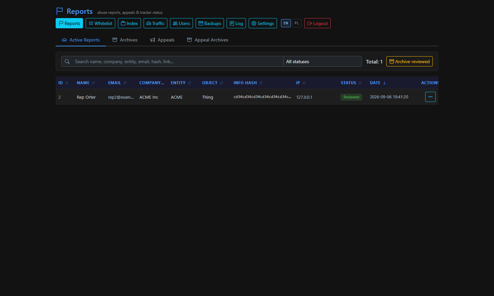
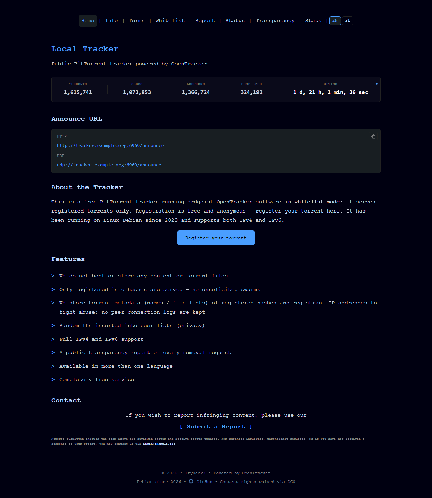
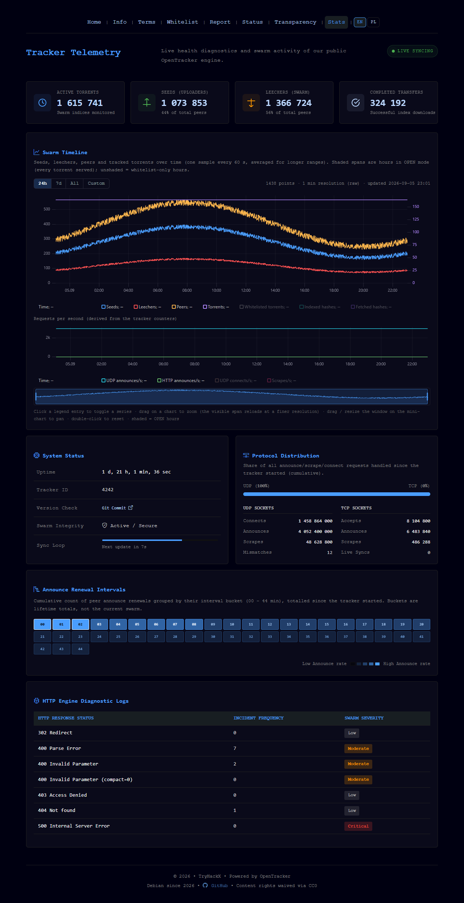

# TryHackX Tracker


A self-hosted BitTorrent tracker information and DMCA/abuse report management system. Built with PHP and MySQL — no frameworks, no dependencies, no build step.

Compatible with [erdgeist OpenTracker](https://erdgeist.org/arts/software/opentracker/) and any other tracker software that uses a newline-separated text file for black- or whitelisting info hashes. Two modes (setting **Tracker mode**):

- **Blacklist** (classic) — every torrent is served except blocked hashes; the app manages the blacklist file.
- **Whitelist** (1.2.0+) — **only registered hashes are served**. The app owns the whitelist (database → atomically generated file → SIGHUP), offers a public **registration page** (CAPTCHA + rate limits), a **server-to-server API** with bearer keys and strict IP bans (used by the [Flarum forum extension](https://github.com/TryHackX/flarum-homepage-blocks) to register every posted magnet link), an **admin Whitelist page** (multi-column sort, IP grouping, name/file search, magnet generator, seed/leech scrape, bans, API clients) and an optional **metadata worker** (libtorrent, DHT) that stores torrent names and file lists. See [Whitelist mode](#whitelist-mode).

Provides a public-facing website for tracker information, abuse report submission, report status checking, block checking, appeal management, and a full-featured admin panel with email notifications.

---

## Features

### Public Pages
- **Home** — tracker announce URLs, features overview, donation links, contact info
- **Submit a Report** — DMCA/abuse report form with info hash extraction from magnet links, optional additional message
- **Check Report Status** — look up report status by report number or info hash + email (privacy-safe: requires email match)
- **Block Check** — verify if an info hash is currently blocked on the tracker (never reveals whether reports exist)
- **Appeal System** — submit appeals to request blocking or unblocking of info hashes
- **Transparency Page** — public statistics showing aggregated block counts per organization
- **Terms of Service** — configurable ToS page

### Admin Panel
- **Dashboard** — sortable tables with multi-level sorting, search, filtering, pagination
- **Report Workflow** — pending → reviewed → blocked/archived, with inline editing for company/entity fields
- **Appeal Management** — accept/reject appeals with optional admin response, auto-close related appeals
- **Blacklist Integration** — block/unblock info hashes via newline-separated blacklist file, with path validation
- **Tracker Reload / Restart + Smart Recommendations** — automatically reload the tracker's blacklist (SIGHUP via `systemctl reload`, no downtime) after every block/unblock/restore, plus one-click **Reload** and **Restart** buttons (password-confirmed), permission **Test** buttons, and orange/red hints that surface when a restart is due after blacklist changes or a long uptime — see [OpenTracker service reload & restart](#opentracker-service-reload--restart)
- **Email Notifications** — professional dark-themed HTML emails for all status changes, with per-type unsubscribe
- **Auto-Archiving** — automatically archive old reviewed reports and resolved appeals after configurable days
- **Settings** — all configuration via web UI (site info, CAPTCHA provider + tuning, whitelist, API, donations, footer, etc.)

### Whitelist mode (1.2.0)
- **Registration page** (`?action=whitelist`) — anyone can register magnet links / info hashes for free (CAPTCHA always required, per-IP hourly + daily caps, global daily cap, duplicate / banned checks, registrant IP stored for abuse detection); shows a generated magnet with the tracker's announce URLs and a "check status" form
- **Whitelist file service** — DB is the source of truth; the accesslist file is appended for additions and **regenerated atomically** (temp file + rename) for removals; the tracker is reloaded via SIGHUP with debounce (adds ≥ 45 s apart, removals/bans promptly, capped per 5 min); refuses to write an empty file (OpenTracker whitelist mode is fail-closed); a systemd timer runs the janitor so pending reloads fire even without web traffic
- **Server-to-server API** (`v1/whitelist/submit`, `v1/whitelist/ping`) — `Authorization: Bearer key_id.secret` (only the secret's SHA-256 is stored), additive-only, idempotent; **any failed authentication attempt bans the source IP (v4 exact / v6 /64) for 30 days**, storing the whole offending request for review; exempt-IP list (seeded with the server's own addresses); admin panel to create/disable/delete clients and to view/lift bans
- **Admin Whitelist page** — status card (mode, file health, DB counts, pending reload, last reload, worker heartbeat, warnings), table with multi-column sort, hash-prefix / IP / name / file-name search (FULLTEXT), source & metadata filters, **Group by IP**, bulk delete/ban/fetch-metadata, details modal (magnet generator, name/size/file tree, seeders/leechers via live scrape, source & forum reference), Banned hashes, API clients, API bans (pretty-printed request snapshot)
- **Metadata worker** — optional `python3-libtorrent` daemon (systemd, unprivileged, column-level MySQL grants) that resolves name / size / file list through DHT + trackers in upload mode; the panel queues rows and polls
- **Mode-aware moderation** — in whitelist mode "block" = ban (removed from the served list, can never be re-registered) and the report/appeal flows, status page and public copy adapt automatically
- **CAPTCHA provider** — Google reCAPTCHA v2 or Cloudflare Turnstile (one shared modal, fail-closed verification with timeouts)

### Email System
- **Submission Confirmation** — sent when a report is filed
- **Under Review** — sent when an admin first opens a report
- **Status Updates** — sent on every status change (reviewed, blocked, archived, restored)
- **Custom Messages** — admin can send freeform messages to reporters
- **Appeal Confirmation** — sent when an appeal is submitted
- **Appeal Decision** — sent when an appeal is accepted/rejected, with colored status and object title
- **Notification Preferences** — users can manage per-type email preferences via HMAC-secured link
- **One-Click Unsubscribe** — RFC 8058 compliant `List-Unsubscribe-Post` header for Gmail/Yahoo

### Security
- **Smart CAPTCHA** — point-based reCAPTCHA v2 system with modal overlay; CAPTCHA only appears after configurable activity threshold, with grace period after solving
- **CSRF Protection** — token validation on all public form submissions and on every admin write (via the `X-CSRF-Token` header)
- **Login Hardening** — per-IP brute-force lockout on admin login (attempts + window now admin-configurable) + constant-time username/password comparison
- **Admin Session Timeouts** — idle timeout and absolute lifetime cap; an expired session is destroyed server-side so a stale cookie can't be reused
- **Rate Limiting** — per-IP throttling on report submission **and** on status checks, block lookups and appeal submissions (all admin-tunable, `0` = off), plus a duplicate-appeal guard
- **Prepared Statements** — all database queries use PDO with parameterized queries; dynamic `ORDER BY`/table names are whitelisted
- **Input Sanitization** — `htmlspecialchars` on all output, server-side validation on all input; untrusted upstream stats data is escaped before it touches the DOM
- **Password Hashing** — bcrypt via `password_hash()`
- **HMAC Tokens** — SHA-256 signed unsubscribe links with timing-safe comparison
- **No Secrets in Source** — DB credentials are injected by the installer or via `DB_HOST`/`DB_NAME`/`DB_USER`/`DB_PASS` environment variables; nothing sensitive is committed
- **Generic Error Responses** — raw database/exception messages are logged server-side, never returned to clients
- **Directory Protection** — `.htaccess` deny rules on `config/`, `includes/`, `templates/`, `api/`, `sql/`, `tests/`; `assets/` blocks server-side script execution and directory listing (see [Reverse proxy / Nginx](#reverse-proxy--nginx-notes) for non-Apache servers)
- **Security Headers** — `Content-Security-Policy`, `X-Content-Type-Options`, `X-Frame-Options`, `Referrer-Policy`, `Permissions-Policy`
- **Subresource Integrity** — pinned CDN assets (Bootstrap, Bootstrap Icons) loaded with `integrity` hashes
- **Reverse-Proxy Aware** — optional trusted-proxy allow-list + configurable client-IP header so per-IP limits work correctly behind Cloudflare / nginx without opening a spoofing hole
- **Information Leak Prevention** — generic responses for not-found queries, email always required for status checks

### Donations
- **Custom Fields** — up to 15 donation fields with custom labels
- **Smart Display** — URLs (http/https) render as clickable links; wallet addresses/hashes render as copyable code blocks
- **Backward Compatible** — auto-migrates from legacy BTC/ETH/XMR fields

---

## Screenshots

<p align="center">
  
</p>
<p align="center"><em>Admin dashboard — reports/appeals with search, sorting, filters and one-click workflow.</em></p>

<table>
  <tr>
    <td width="50%" valign="top"></td>
    <td width="50%" valign="top"></td>
  </tr>
  <tr>
    <td align="center"><em>Public home — announce URLs, features, donations, contact.</em></td>
    <td align="center"><em>Live tracker statistics (cached, auto-refreshing).</em></td>
  </tr>
</table>

---

## Requirements

- **PHP 8.0+** with extensions: `pdo_mysql`, `json`, `openssl`, `mbstring`
- **MySQL 5.7+** or **MariaDB 10.3+**
- **Apache** with `mod_rewrite` enabled (for Nginx see [Reverse proxy / Nginx notes](#reverse-proxy--nginx-notes))
- **PHP `mail()` function** — for email notifications (or configure a local MTA)
- *(Optional)* **APCu** — if the `apcu` extension is present, site settings are cached across requests to avoid a settings query on every hit; the app works fine without it

---

## Installation

### 1. Download

```bash
git clone https://github.com/TryHackX/tryhackx-tracker.git
cd tryhackx-tracker
```

Or download and extract the ZIP from GitHub releases.

### 2. Upload

Upload all files to your web server document root or a subdirectory.

> **Do not upload runtime state.** The app writes several files into `config/` while running —
> `stats_cache.json`, `stats_fetch.lock`, `rate_limits.json`, `login_attempts.json`, `*.marker`.
> These are machine-local; never copy them from a dev machine to production (a stale
> `stats_fetch.lock` will wedge the stats endpoint on "Syncing Swarms…" — see Troubleshooting).
> They are already in `.gitignore`, so a `git`-based deploy skips them automatically; if you upload
> by FTP, exclude them. Also delete any `*.orig`/`*.bak` backups (e.g. `hash.txt.orig` leaks the
> admin password hash).

### 3. Set Permissions

The `config/` directory **must be writable by the web-server user** — the app persists the shared
stats cache, its fetch lock, and rate-limit/login-throttle state there at runtime. If it isn't
writable, stats never refresh and rate limiting silently fails open.

```bash
# Linux with Apache/Nginx + php-fpm (adjust user:group to your PHP process, often www-data)
sudo chown -R www-data:www-data config/
sudo chmod 775 config/
```

Find out which user PHP runs as with `<?php echo exec('whoami'); ?>` or check your php-fpm pool
config. On shared hosting where PHP runs as your account user, the files just need to be owned by
that account (typically `755` on the directory is enough). Avoid `777`.

### 4. Configure RewriteBase

Edit `.htaccess` and set `RewriteBase` to match your installation path:

```apache
# If installed at domain root:
RewriteBase /

# If installed in a subdirectory:
RewriteBase /tracker/
```

### 5. Run the Installer

Navigate to `https://your-domain.com/install.php` in your browser.

**Step 1 — Environment Check**
- Verifies PHP version, required extensions, and directory permissions

**Step 2 — Database**
- Enter MySQL credentials (database will be created automatically if it doesn't exist)
- Creates all required tables

**Step 3 — Site & Admin Settings**
- Admin username and password (min 10 characters, must include upper- and lower-case letters, a digit and a symbol)
- Site name, URL, and contact email
- Tracker announce URLs (HTTP/S and UDP)
- reCAPTCHA v2 keys (optional — get them from [Google reCAPTCHA](https://www.google.com/recaptcha/admin))
- Blacklist file path (with Test button to verify permissions)

**Step 4 — Complete**
- Click **"Delete install.php"** to remove the installer for security
- If you skip this step, delete `install.php` manually from the server

### 6. Configure Your Tracker

Point your tracker software's blacklist file to the path configured in step 3. For OpenTracker, this is the `-b` flag:

```bash
opentracker -b /path/to/blacklist
```

The application writes one info hash per line (lowercase hex, 40 characters). When you block a hash through the admin panel, it's appended to this file. When you unblock, it's removed.

---

## Configuration

All settings are managed through **Admin Panel → Settings** (`/?action=admin` → Settings icon):

| Section | Settings |
|---------|----------|
| **Site Configuration** | Site name, URL, announce URLs (HTTP/S + UDP), GitHub URL |
| **Contact & Email** | Site email, contact visibility, email obfuscation, HMAC secret |
| **CAPTCHA** | Provider (reCAPTCHA v2 / Turnstile), keys, enable globally and per-context (report, login, status, appeals, block check); the whitelist registration page always requires a CAPTCHA |
| **Tracker Mode & Whitelist** | `blacklist` / `whitelist`, whitelist file path (+ Test), public registration on/off, max hashes per submission, submissions per hour, per-IP and global daily caps, minimum seconds between tracker reloads, OpenTracker scrape URL, **require our tracker** (public registration accepts only magnets whose `tr=` list includes one of *Our tracker hosts* / the announce hosts; bare hashes refused) — see [Whitelist mode](#whitelist-mode) |
| **Server-to-server API** | Enable, ban length (days), exempt IPs — clients and bans are managed on the Whitelist page |
| **Smart CAPTCHA** | Point threshold, grace period, points per action type |
| **Public Pages** | Auto-archive days for reports and appeals |
| **Rate Limits & Blacklist** | Reports/status-checks/block-lookups/appeals per hour (per IP), items per page, message length limits, blacklist file path with test |
| **Admin Sessions & Proxy** | Session idle timeout, absolute session cap, login lockout attempts/window, trusted proxy IPs, client IP header |
| **Donation Fields** | Enable/disable, custom label+value fields (max 15), auto-detects URLs vs addresses |
| **Transparency** | Enable/disable, results per page |
| **Tracker Statistics** | Enable, source URL, home/page refresh intervals, **cache lifetime (TTL)**, request timeout, loading delays, peer-label style — see [Tracker statistics & caching](#tracker-statistics--caching) |
| **OpenTracker Service** | systemd unit name, sudo toggle, blacklist auto-reload (SIGHUP), permission test buttons, restart-recommendation thresholds — see [OpenTracker service reload & restart](#opentracker-service-reload--restart) |
| **Footer** | Copyright year, brand/tracker software/OS elements with names and URLs |
| **Security & Credentials** | Admin username, password change (separate form) |

### Smart CAPTCHA

The CAPTCHA system uses activity points instead of showing CAPTCHA on every request:

1. Each user action adds configurable points to the session (e.g., submit report = 2 pts, status check = 1 pt)
2. CAPTCHA only appears when accumulated points reach the threshold (default: 6)
3. After solving, a grace period (default: 5 minutes) bypasses all CAPTCHAs
4. Failed admin login always resets grace and sets points to threshold
5. CAPTCHA renders in a modal overlay — form data is preserved

### Email Notification Preferences

Users receive a "Manage notification preferences" link in every email footer. The preferences page allows per-type control:

| Type | Description |
|------|-------------|
| Submission Confirmations | Confirmation after submitting a report |
| Under Review | Notification when admin starts reviewing |
| Status Updates | Changes to report status (reviewed, blocked, archived) |
| Admin Messages | Custom messages from the admin team |
| Appeal Notifications | Appeal confirmations and decision emails |

A master toggle disables/enables all at once.

### Tracker statistics & caching

The tracker stats (home widget + `/?action=stats` page) are fetched from an upstream OpenTracker
`stats` endpoint, which can be slow (tens of seconds under load). To keep this fast and to avoid
every visitor triggering their own fetch, the data is cached **server-side** and shared by everyone:

- **One shared cache** (`config/stats_cache.json`). The first visitor whose cache has expired
  triggers a single upstream fetch under an exclusive lock (`config/stats_fetch.lock`); everyone
  else is served the existing cached data and polls until the fresh copy lands. One fetch, many
  readers — even with 50 people on the page at once.
- **Cache Lifetime / TTL** (`tracker_stats_cache_ttl`, default **60s**) is the shared server-side
  lifetime of the data and is **decoupled** from the client refresh intervals. While the cache is
  younger than the TTL, reloads and polls are cheap cache hits and the upstream is **not** re-fetched.
  Set the TTL **≥ your real upstream fetch time** (often 90–120s) so slow fetches don't cause
  constant re-syncing.
- **Home / Stats-page refresh intervals** only control how often each browser re-checks the shared
  cache; they no longer decide when the upstream is fetched.
- **Request Timeout** (`tracker_stats_timeout`) bounds the upstream fetch. PHP's execution limit is
  derived from it automatically, so raising the timeout no longer causes the fetch to be killed
  mid-flight (the cause of the earlier "stats never load" behaviour).
- **Live Syncs counter** (`tracker_stats_livesync_mode`): OpenTracker's own `livesync` value is `0`
  on single-node setups. Set this to *"Count our cache refreshes"* (Admin → Settings → Tracker
  Statistics) to repurpose the **Live Syncs** stat as the number of times the cache has been
  refreshed since the tracker last started. It auto-resets to 1 when a tracker restart is detected
  (the reported uptime drops well below the previous reading). `upstream` (default) keeps the raw value.

> Optional: instead of relying on visitor traffic to refresh the cache, you can run a cron job that
> hits the endpoint periodically, e.g. `*/2 * * * * curl -s 'https://your-domain/api.php?endpoint=tracker_stats&source=home' >/dev/null`.
> Combined with a longer TTL this makes visitors *always* hit a warm cache.

### OpenTracker service reload & restart

OpenTracker reads its blacklist file **only at startup**, so a blocked/unblocked hash doesn't take
effect until the tracker re-reads it. OpenTracker's own docs say: *"To make opentracker reload its
white/blacklist, send a SIGHUP unix signal."* This app can do that for you. Set **Admin → Settings →
OpenTracker Service → Service name** to your systemd unit (e.g. `opentracker` or `opentracker.service`).
When set:

- **Automatic reload (default on).** After every panel action that changes the blacklist file —
  accepting a report (block), accepting an appeal, unblocking, restoring a report to active, or a
  permanent delete — the app runs `systemctl reload <name>`, which delivers **SIGHUP** so OpenTracker
  re-reads its white/blacklist **without any downtime**. On success the pending-change tracking is
  cleared. It's best-effort: if it can't run (no permission, `exec()` disabled) the action still
  succeeds and the restart hint below stays as a fallback. Toggle it with **Auto-reload blacklist**.
- A **Reload** button in the Dashboard header does the same thing on demand (password-confirmed,
  SIGHUP, no downtime), and a **Restart tracker** button runs `systemctl restart <name>` (full
  restart, brief downtime). Both clear the pending-change tracking on success.
- **Smart recommendations** appear as a warning chip next to the buttons. Hover (or tap on mobile)
  to see the full list; the buttons' glow and the chip colour reflect the highest active severity.
  Warnings stack and are configurable:
  - **Blacklist changed since last start** — orange once pending changes reach *Blacklist → orange*
    (default **1**), red at *Blacklist → red* (default **5**). "Pending" is measured against the
    tracker's boot time (from the stats cache uptime), so it self-clears the moment the tracker
    restarts — whether from the panel or from the shell. (Auto-reload clears it on each successful
    reload too.)
  - **Long uptime** — orange at *Uptime → orange* days (default **14**), red at *Uptime → red*
    (default **30**). Requires Tracker Statistics to be enabled (that's where uptime comes from).

Leave the service name empty to hide the buttons and chip entirely.

**Server permission (required).** php-fpm runs unprivileged, so grant it permission to run just those
commands via sudo (keep **Run via sudo = Yes**). Add both the restart and the reload rule:

```bash
# adjust the user (php-fpm user, often www-data) and unit name to match your box
cat <<'EOF' | sudo tee /etc/sudoers.d/tracker-restart
www-data ALL=(root) NOPASSWD: /bin/systemctl restart opentracker
www-data ALL=(root) NOPASSWD: /bin/systemctl reload opentracker
EOF
sudo chmod 440 /etc/sudoers.d/tracker-restart
```

For **Reload** to work, the systemd unit must define an `ExecReload` that sends SIGHUP. If your
`opentracker.service` doesn't already have one, add it and reload the daemon:

```ini
# /etc/systemd/system/opentracker.service  (in the [Service] section)
ExecReload=/bin/kill -HUP $MAINPID
LimitNOFILE=65536
```
```bash
sudo systemctl daemon-reload
```

> **`LimitNOFILE` matters.** systemd's default soft limit is 1024 open files. A busy public tracker
> keeps more HTTP (TCP) connections than that in flight; once the limit is hit `accept()` fails,
> OpenTracker's main thread spins at 100 % CPU, the accept backlog fills up and **every HTTP
> announce / scrape times out** (the panel shows "Tracker did not answer", S/L stay empty) while UDP
> keeps working. Check with `ls /proc/$(pidof opentracker)/fd | wc -l` vs `grep 'open files'
> /proc/$(pidof opentracker)/limits`.

Use the **Test restart permission** / **Test reload permission** buttons in Settings to verify the
sudoers rules — they run a read-only `sudo -n -l` check (they never restart or reload anything) and
print copy-paste fix instructions if a rule is missing. The service name is validated against a
strict systemd-unit whitelist and passed through `escapeshellarg`, so it can't be used to inject a
second command. If PHP's `exec()` is disabled the buttons are greyed out with an explanatory note.
On failure the exact `systemctl`/sudo output is shown so you can fix the sudoers rule.

### Whitelist mode

Since 1.2.0 the app can drive OpenTracker in **whitelist** mode: the tracker answers only for
info hashes present in its accesslist file. This is the answer to datacenters/bots hammering a
public tracker with millions of foreign torrents — after the switch the tracker only tracks *your*
catalogue (forum magnets + registered hashes), memory drops from hundreds of MB to a few MB and the
outbound peer-list traffic disappears. (It does **not** reduce the inbound UDP swarm — see
*What whitelist mode does NOT fix* at the end of this section for the measured egress-budget fix.)

#### 1. Build OpenTracker with whitelist support

Black- and whitelist are compile-time exclusive. Build from source with:

```bash
sudo apt install -y build-essential git zlib1g-dev wget xz-utils
mkdir -p ~/build && cd ~/build
wget http://www.fefe.de/libowfat/libowfat-0.34.tar.xz && tar -xf libowfat-0.34.tar.xz && mv libowfat-0.34 libowfat
make -C libowfat -j$(nproc)
git clone git://erdgeist.org/opentracker && cd opentracker
git apply /path/to/tryhackx-tracker/tools/opentracker/sighup-udp-workers.patch   # see below
patch -p1 < /path/to/tryhackx-tracker/tools/opentracker/udp-reject-interval.patch # see below (optional)
COMMON="-DWANT_COMPRESSION_GZIP -DWANT_RESTRICT_STATS -DWANT_FULLSCRAPE -DWANT_MODEST_FULLSCRAPES -DWANT_SPOT_WOODPECKER"
make -j$(nproc) opentracker FEATURES="-DWANT_ACCESSLIST_WHITE $COMMON" && cp opentracker ../opentracker.white
make clean && make -j$(nproc) opentracker FEATURES="-DWANT_ACCESSLIST_BLACK $COMMON" && cp opentracker ../opentracker.black
strings ../opentracker.white | grep -E 'access\.whitelist|deflate|access\.stats_path'   # all three must appear
```

Black- and whitelist are compile-time exclusive, so keep **both** binaries around
(`/home/tracker/opentracker` = the active one, `/home/tracker/opentracker.black` = the other):
switching **Tracker mode** in the panel only switches the web app — to really switch you also swap
the binary, use the matching `access.whitelist` / `access.blacklist` line and restart the service.

> `make FEATURES=...` on the command line **overrides** the Makefile's `include Makefile.gzip`,
> so `-DWANT_COMPRESSION_GZIP` must be listed explicitly. Keep `-DWANT_RESTRICT_STATS` — without it
> `/stats` (including `mode=statedump`) is public.

> **`tools/opentracker/sighup-udp-workers.patch`** — upstream spawns the `listen.udp.workers`
> threads before it blocks SIGHUP, so `systemctl reload` (SIGHUP) can hit a worker thread and
> **kill the tracker** instead of reloading the list. The one-line patch blocks the signals first.
> Apply it whenever you use `listen.udp.workers`.

> **`tools/opentracker/udp-reject-interval.patch`** (optional, recommended for a busy public IP) —
> upstream answers a UDP announce for a hash the accesslist rejects with a truncated 8-byte packet;
> clients treat that as a broken tracker and keep retrying (libtorrent backs off to 1 h at most), so
> the old swarm never calms down. With `access.udp_reject_interval 86400` in the conf the tracker
> answers with a **well-formed "0 peers, come back in 24 h"** reply instead and compliant clients go
> quiet for a day (HTTP keeps the explicit "not authorized" failure). Pairs with
> `egress-budget/ottrack.nft`, which recognises that reply (interval 86400) and does not count it as
> a whitelisted-client reply.

`/home/tracker/opentracker.conf` (no `listen.*` line = default dual-stack bind on 6969):

```
listen.udp.workers 4
access.whitelist /home/tracker/accesslist/whitelist
access.udp_reject_interval 86400         # optional, needs udp-reject-interval.patch
access.stats 203.0.113.10                # your web server's IP (requires -DWANT_RESTRICT_STATS)
access.stats_path stats-8f3a1c2d9e0b     # random path instead of /stats — put it in "Tracker stats URL"
tracker.redirect_url https://tracker.example.org/?action=whitelist   # HTTP GET / → registration page
```

#### 2. Whitelist file location

The file is **replaced by rename()** as the web user, so the *directory* must be writable by PHP;
OpenTracker (user `tracker`) only needs to read it:

```bash
sudo install -d -o tracker -g www-data -m 2770 /home/tracker/accesslist
```

Set **Settings → Tracker Mode & Whitelist → Whitelist file path** to
`/home/tracker/accesslist/whitelist` and press **Test**. Do not create the file by hand — the panel's
**Regenerate file** (or the first addition) creates it as `www-data`, mode 0644. The path is
validated: absolute, outside the web root, no `.php`/`.htaccess` names, no symlinks.

#### 3. Switch over (zero-downtime order)

1. Deploy the app (schema upgrades itself on the first request: tables `whitelist`,
   `whitelist_files`, `banned_hashes`, `api_clients`, `api_bans`; `settings.schema_version = 2`).
2. Bootstrap the whitelist while still in blacklist mode, e.g. from a file of hashes:
   `sudo -u www-data php tools/whitelist_cli.php add --source=forum < hashes.txt`
   (or paste them into **Whitelist → Add hashes**).
3. **Import blacklist → bans** (Whitelist page) so previously blocked hashes stay unservable.
4. Settings: `Tracker mode = whitelist`, then **Regenerate file** and check
   `grep -cE '^[0-9a-f]{40}$' /home/tracker/accesslist/whitelist` equals the active count.
5. Install the new binary + config, `systemctl start opentracker`, and verify with
   `journalctl -u opentracker` (**no** "Can't open accesslist file") and one HTTP announce for a
   whitelisted hash (bencoded `interval`) vs a random one (`failure reason ... not authorized`).
6. Rollback = restore the previous binary/config and set `Tracker mode = blacklist`.

Install the janitor timer so pending reloads fire even when nobody visits the site (there is no
cron dependency otherwise):

```ini
# /etc/systemd/system/tracker-whitelist-janitor.service
[Unit]
Description=Tracker whitelist janitor
[Service]
Type=oneshot
User=www-data
ExecStart=/usr/bin/php /var/www/tracker.example.org/tools/janitor.php
```
```ini
# /etc/systemd/system/tracker-whitelist-janitor.timer
[Timer]
OnBootSec=2min
OnUnitActiveSec=60s
[Install]
WantedBy=timers.target
```
`sudo systemctl enable --now tracker-whitelist-janitor.timer`. The sudoers rule from
[OpenTracker service reload & restart](#opentracker-service-reload--restart) is all the web user needs.

#### 4. Public registration

`?action=whitelist` — one magnet link or 40-hex hash per line (max **Max hashes per submission**),
CAPTCHA **always** required (registration is disabled when no CAPTCHA provider is configured —
fail closed), **Submissions per hour** per IP (v6 counted per /64), **New hashes per day** per IP
and globally. Every row stores the registrant IP; hashes on the ban list are refused. The response
lists each item as *registered / already registered / banned / invalid* and tells the user in how
many seconds the tracker will pick the new hashes up.

**Require our tracker** (1.2.1, off by default): when on, a submission is accepted only as a magnet
link whose `tr=` parameters include one of **Our tracker hosts** (hostnames / IPs; the hosts of the
configured announce URLs always count) — a hash whose torrent never announces to this tracker would
just occupy the whitelist. Bare hashes are refused with an explanatory error; admin adds and the
S2S API are not affected (the forum extension has the same option on its side).

#### 5. Server-to-server API

Create a client on **Whitelist → API clients** — the bearer token `key_id.secret` is shown **once**
(only `sha256(secret)` is stored). Enable the API in Settings (`api_enabled`).

```
POST /api.php?endpoint=v1/whitelist/submit
Authorization: Bearer 0123456789abcdef.<64 hex>
Content-Type: application/json

{"items":[{"magnet":"magnet:?xt=urn:btih:...","name":"optional","ref":{"post_id":12,"discussion_id":3,"url":"https://forum/d/3/1"}},
          {"hash":"<40 hex>"}],
 "source":"forum"}
→ 200 {"ok":true,"results":[{"index":0,"hash":"...","status":"added|exists|banned|invalid","error":null}],
        "summary":{"added":1,"exists":0,"banned":0,"invalid":0},"active_in_seconds":37,"server_time":1755500000}

GET  /api.php?endpoint=v1/whitelist/ping   → {"ok":true,"server_time":..,"mode":"whitelist","whitelist_count":159,"api_version":1,"client":"label"}
```

Rules (deliberately strict — "very restrictive"):

- ≤ 500 items per call, body ≤ 512 KB, additive-only (there is no remove endpoint — removal is a
  moderation decision made in the panel).
- **Any failed authentication with an `Authorization` header present** (malformed header, unknown
  key ID, wrong secret) → **the source IP is banned for `api_ban_days` (30)** and the full request
  (headers without secrets, body up to 256 KB) is stored — review, lift or add bans on
  **Whitelist → API bans**. Requests without any `Authorization` header get 401 and are not banned
  (crawler noise); a *disabled* key gets 403 without a ban (admin action).
- IPs in **API ban exempt IPs** (seeded with `127.0.0.1, ::1` and the server's own address — keep
  your forum's outbound IP there) are never banned nor blocked. Test new keys from an exempt IP.
- `tools/api_client_example.py` is a stdlib-only client; the Flarum extension
  [flarum-homepage-blocks](https://github.com/TryHackX/flarum-homepage-blocks) ≥ 2.6.0 uses this API
  to register every magnet posted on the forum (live + "scan whole forum").

#### 5b. Scheduled mode — whitelist hours (optional, 1.4.0)

Run whitelist mode only during configured hours (per weekday, in a timezone) and the open blacklist
mode the rest of the time — e.g. whitelist Mon–Fri 10:00 → 02:30 next day and all weekend, open
at night. Because black- and whitelist are compile-time exclusive builds, the switch swaps the binary
and config **symlinks** and restarts the service through a tiny root helper:

```bash
# layout: /home/tracker/opentracker.{white,black}, opentracker.conf.{white,black},
#         opentracker -> opentracker.white (symlink), opentracker.conf -> opentracker.conf.white
sudo install -m 0755 tools/opentracker/tracker-mode.sh /usr/local/sbin/tracker-mode.sh
echo 'www-data ALL=(root) NOPASSWD: /usr/local/sbin/tracker-mode.sh' | sudo tee /etc/sudoers.d/tracker-mode
sudo chmod 0440 /etc/sudoers.d/tracker-mode && sudo visudo -c -f /etc/sudoers.d/tracker-mode
sudo /usr/local/sbin/tracker-mode.sh status     # white | black
```

Then **Settings → Tracker Mode & Whitelist → Scheduled mode**: On, timezone, the switch command
(`sudo -n /usr/local/sbin/tracker-mode.sh`; leave empty to only flip the web setting), and one row
per weekday: *Whitelist all day* / *Whitelist window from–to* (`to ≤ from` = ends the next day) /
*Blacklist (open) all day*. Settings keys: `tracker_schedule_enabled`, `tracker_schedule` (JSON
`{"mon":{"from":"10:00","to":"02:30"}, …, "sat":"all", "sun":"all"}`), `tracker_schedule_tz`,
`tracker_mode_switch_cmd`.

The janitor timer (`tools/janitor.php`, every minute — never a web request) compares the desired
mode with `tracker_mode` and, when they differ, runs the helper with `white`/`black`, flips the
setting and keeps bans consistent: switching to blacklist appends every banned hash to the blacklist
file; switching to whitelist imports the blacklist file into the ban list and regenerates the served
whitelist file first. `tools/whitelist_cli.php mode [--apply]` shows current / desired / next change
or forces a switch. While a schedule is on, the public whitelist page stays available in both modes
(registration works; hashes are served during the next whitelist hours) with a notice showing the
hours and the next change; the status card shows the schedule state and the last switch result.
Without a schedule everything behaves as before (blacklist mode hides the whitelist page).

#### 6. Metadata worker (optional)

See [`worker/README.md`](worker/README.md): a small `python3-libtorrent` daemon that resolves torrent
name / size / file list for whitelisted hashes (DHT + trackers, upload mode — never downloads
payload) into `whitelist` / `whitelist_files`, where the panel shows and searches them. Runs as the
`tracker` user with column-level MySQL grants; the panel shows its heartbeat.

#### CLI

```bash
sudo -u www-data php tools/whitelist_cli.php status
sudo -u www-data php tools/whitelist_cli.php add [--source=admin|api|forum|web] [--meta=0] < hashes.txt
sudo -u www-data php tools/whitelist_cli.php regen [--reload]
sudo -u www-data php tools/whitelist_cli.php import-blacklist
sudo -u www-data php tools/whitelist_cli.php reload
```

#### What whitelist mode does NOT fix — the inbound UDP swarm (optional, measured on tryhackx.org)

Whitelist mode does not reduce **inbound** traffic: every client that ever had this tracker in a
torrent keeps sending `connect` + `announce` (measured on tryhackx.org: **90–210k packets/s from
~60 000 distinct IPs per 5 s**, the busiest single IP ≈ 70 pkt/s, 99.4 % of packets from IPs below
60 pkt/s — i.e. a diffuse BitTorrent swarm, *not* a few attackers). Two consequences and one lever:

- **Per-source-IP rate limits are useless** against this pattern (they catch < 1 % of packets and a
  dynamic nft set of that many addresses overflows within a minute); they only help against a
  *concentrated* flood. Measure first: `tcpdump -nn -i any -c 200000 udp dst port 6969 | awk
  '{print $3}' | sort | uniq -c | sort -rn | head`.
- **The tracker answers every packet.** On a VPS its ~90k pps of replies saturated the virtual NIC's
  transmit path and the hypervisor then dropped ~50 % of **all inbound** packets for the VM (TCP SYNs,
  SSH, the game server on the same box) — with zero RX drops visible in the guest. Bigger socket
  buffers (`net.core.rmem/wmem_default`) made it *worse* (more tracker packets queued ahead of
  everyone else's).
- **Lever = an egress budget for the tracker**, in [`tools/opentracker/egress-budget/`](tools/opentracker/egress-budget/):
  - `ottrack.nft` — nftables OUTPUT table: replies to clients that recently received a real
    announce/scrape reply (whitelisted torrents; `udp length >= 28`) always pass and mark the client
    "good" for 3 h; connect replies + 8-byte "not authorized" replies to everyone else share one
    packet budget (`limit rate over 50000/second`, tune it). Rollback: `nft delete table inet ottrack`.
  - `tracker-egress-prio.sh` (+ `.service`) — `tc prio` root qdisc: everything except UDP sport 6969
    leaves first. Rollback: `tc qdisc replace dev ens3 root fq_codel`.

  Result on tryhackx.org: TCP connects from outside 20/40 delayed → 0/40, ICMP loss 66 % → 0 %,
  downloads 0 → 6 MB/s, while the tracker still serves every whitelisted client (≈ 3 500 "good"
  addresses within 30 s). The unregistered swarm only decays when its clients give up; a proper way
  to speed that up is a UDP reply that makes them back off (long `interval`), which is a policy /
  patch decision, not a config one.

### Reverse proxy / Nginx notes

The bundled `.htaccess` files (URL rewriting, directory `deny`, security headers) are **Apache only**.
On **Nginx** you must replicate two things in your server config:

```nginx
# 1. Never serve the private directories (equivalent of the deny-all .htaccess files)
location ~ ^/(config|includes|templates|api|sql|tests)/ { deny all; return 404; }
location ~* \.(orig|bak|sql|log|lock|marker)$ { deny all; return 404; }

# 2. Front-controller routing
location /api/ { rewrite ^/api/(.*)$ /api.php?endpoint=$1 last; }
location / { try_files $uri $uri/ /index.php?action=$request_uri; }
```

Also port the security headers from `.htaccess` into an `add_header` block, and **delete
`install.php`** after setup.

**Behind Cloudflare / a reverse proxy:** by default the app uses the raw connection IP
(`REMOTE_ADDR`), which will be the proxy — so all visitors would share one IP for rate limiting. Set
**Admin → Settings → Admin Sessions & Proxy → Trusted proxy IPs** to your proxy addresses and
**Client IP header** to the header it sets (e.g. `CF-Connecting-IP` or `X-Forwarded-For`). The
forwarded header is trusted **only** when the request actually originates from a listed proxy, and a
comma-separated `X-Forwarded-For` is read from the **right** (skipping listed proxies) — the left-most
entry is whatever the client sent. Prefer a header the proxy *overwrites* (`CF-Connecting-IP`,
`X-Real-IP`) when you have one; the API bans / exempt list and the registration limits are keyed by
this IP.

> **Note on CSP:** the Content-Security-Policy in `.htaccess` intentionally allows `'unsafe-inline'`
> / `'unsafe-eval'` because the pages use inline `onclick` handlers and Google reCAPTCHA. If you
> refactor those out (or self-host reCAPTCHA), tighten the policy with nonces/hashes.

---

## Project Structure

```
tracker/
├── index.php                  # Main router (public pages)
├── api.php                    # API router (all endpoints)
├── install.php                # Installation wizard (delete after setup)
├── .htaccess                  # URL rewriting, security headers, directory protection
├── .gitignore
├── LICENSE                     # MIT
├── README.md
│
├── api/                       # API endpoint handlers
│   ├── submit_report.php      # POST — submit abuse report
│   ├── check_status.php       # POST — check report status (requires email)
│   ├── check_block.php        # POST/GET — check if hash is blocked
│   ├── submit_appeal.php      # POST — submit block/unblock appeal
│   ├── unsubscribe.php        # GET/POST — unsubscribe (supports one-click)
│   ├── save_email_preferences.php  # POST — save per-type email preferences
│   ├── transparency.php       # GET — transparency data
│   └── admin/                 # Admin-only endpoints (session-authenticated)
│       ├── login.php          # POST — admin login
│       ├── logout.php         # POST — admin logout
│       ├── fetch_reports.php  # GET — paginated report list
│       ├── fetch_appeals.php  # GET — paginated appeal list
│       ├── change_status.php  # POST — change report status
│       ├── block_hash.php     # POST — block info hash
│       ├── unblock_hash.php   # POST — unblock info hash
│       ├── block_archived.php # POST — block hash from archives
│       ├── delete_report.php  # POST — archive/delete report
│       ├── delete_all.php     # POST — bulk archive reports
│       ├── restore_report.php # POST — restore archived report
│       ├── resolve_appeal.php # POST — accept/reject appeal
│       ├── restore_appeal.php # POST — restore archived appeal
│       ├── notify_review.php  # POST — send under-review notification
│       ├── send_email.php     # POST — send custom email to reporter
│       ├── update_field.php   # POST — inline edit report field
│       ├── save_settings.php  # POST — save admin settings
│       ├── change_password.php # POST — change admin credentials
│       ├── check_blacklist.php # GET — test blacklist file permissions
│       ├── tracker_service_status.php # GET — restart recommendations for the dashboard
│       ├── restart_tracker.php # POST — restart the tracker service (password-confirmed)
│       ├── reload_tracker.php  # POST — reload the tracker blacklist via SIGHUP (password-confirmed)
│       └── test_tracker_permission.php # GET — test sudo perms for restart/reload (read-only)
│
├── assets/
│   ├── css/
│   │   ├── style.css          # Public site styles (dark theme)
│   │   └── admin.css          # Admin panel styles
│   ├── js/
│   │   ├── app.js             # Public site JavaScript
│   │   └── admin.js           # Admin panel JavaScript
│   └── img/
│       ├── favicon.ico
│       ├── favicon.svg
│       └── screenshots/       # README screenshots (home, admin, stats)
│
├── config/                    # Generated + runtime state (mostly gitignored, web-denied)
│   ├── app.php                # Bootstrap config (loads password hash)
│   ├── database.php           # PDO connection (generated; creds via installer or env vars)
│   ├── hash.txt               # Bcrypt password hash (generated)
│   ├── installed.lock         # Installation lock file (generated)
│   ├── stats_cache.json       # Shared tracker-stats cache (runtime)
│   ├── stats_fetch.lock       # Exclusive lock for the in-flight stats fetch (runtime)
│   ├── login_attempts.json    # Per-IP login throttle state (runtime)
│   ├── rate_limits.json       # Per-IP/action rate-limit state (runtime)
│   ├── blacklist_changes.json # Blacklist add/remove log since last tracker start (runtime)
│   └── .htaccess              # Deny all access
│
├── includes/                  # Core PHP libraries (protected)
│   ├── functions.php          # Helper functions (CSRF, sanitize, blacklist, archiving)
│   ├── auth.php               # Authentication (login, session, attempt checking)
│   ├── mail.php               # Email system (sending, templates, preferences)
│   ├── settings.php           # Database settings management (getSettings, setSettings)
│   └── .htaccess              # Deny all access
│
├── templates/                 # PHP templates (protected)
    ├── layout.php             # Main HTML layout wrapper
    ├── nav.php                # Navigation bar
    ├── admin/
    │   ├── dashboard.php      # Admin dashboard (reports/appeals tables)
    │   ├── login.php          # Admin login form
    │   └── settings.php       # Admin settings page
    ├── pages/
    │   ├── home.php           # Homepage (announce URLs, features, donations, contact)
    │   ├── report.php         # Report submission form
    │   ├── status.php         # Report status check + block check + appeal forms
    │   ├── transparency.php   # Public transparency report
    │   ├── info.php           # Info page
    │   ├── tos.php            # Terms of service
    │   └── unsubscribe.php    # Email notification preferences
    └── .htaccess              # Deny all access
```

---

## Database Schema

The installer creates the following tables:

| Table | Purpose |
|-------|---------|
| `settings` | Key-value store for all site configuration |
| `reports` | Active abuse reports |
| `archives` | Archived (closed) reports |
| `appeals` | Active appeals (block/unblock requests) |
| `appeal_archives` | Archived (resolved) appeals |
| `sent_emails` | Log of all sent email notifications |
| `unsubscribed_emails` | Legacy full-unsubscribe list |
| `email_preferences` | Per-email, per-type notification preferences |
| `whitelist` | Whitelisted info hashes (source, IP, metadata, scrape cache, ban flag) — schema v2 |
| `whitelist_files` | File lists resolved by the metadata worker (FULLTEXT searchable) |
| `banned_hashes` | Hashes that must never be served / re-registered (whitelist mode "block") |
| `api_clients` | Server-to-server API clients (bearer key id + secret hash) |
| `api_bans` | IP bans issued by the API auth layer (with request snapshot) or manually |

Schema upgrades are applied automatically on the first request (`includes/schema.php`,
`settings.schema_version`); fresh installs get the same tables from `install.php`.

---

## Tech Stack

- **Backend:** PHP 8.x — no framework, single entry point routing (`index.php` for pages, `api.php` for API)
- **Database:** MySQL/MariaDB with PDO (prepared statements, FETCH_ASSOC mode)
- **Frontend:** Vanilla JavaScript (no build step), Bootstrap 5 (CDN) for admin panel, custom dark theme CSS for public pages
- **Email:** PHP `mail()` with multipart MIME (HTML + plain text), dark-themed templates
- **Icons:** Bootstrap Icons (CDN, admin panel only)
- **CAPTCHA:** Google reCAPTCHA v2 or Cloudflare Turnstile (explicit render mode, one shared modal — `assets/js/captcha.js`)
- **Metadata worker (optional):** Python 3 + `python3-libtorrent` (see `worker/`)

---

## API Reference

All API endpoints are accessed via `api.php?endpoint=<name>` (or `/api/<name>` with URL rewriting). Public endpoints accept POST with JSON body. Admin endpoints require an active session.

### Public Endpoints

| Endpoint | Method | Description |
|----------|--------|-------------|
| `submit_report` | POST | Submit a new abuse report |
| `check_status` | POST | Check report status (requires email + report ID or hash) |
| `check_block` | POST/GET | Check if an info hash is blocked |
| `submit_appeal` | POST | Submit a block/unblock appeal |
| `unsubscribe` | GET/POST | Unsubscribe from emails (GET = link click, POST = one-click) |
| `save_email_preferences` | POST | Save per-type notification preferences |
| `transparency` | GET | Get transparency page data |
| `whitelist_submit` | POST | Register magnet links / hashes (CSRF + CAPTCHA + rate limits) |
| `whitelist_check` | GET/POST | Is a hash registered / banned? |
| `v1/whitelist/submit` | POST | Server-to-server registration (bearer key, see [Whitelist mode](#whitelist-mode)) |
| `v1/whitelist/ping` | GET | Server-to-server health check |

### Admin Endpoints

All require active admin session. Prefix: `admin/`

| Endpoint | Method | Description |
|----------|--------|-------------|
| `admin/login` | POST | Authenticate |
| `admin/logout` | POST | End session |
| `admin/fetch_reports` | GET | Paginated reports (supports search, sort, filter) |
| `admin/fetch_appeals` | GET | Paginated appeals |
| `admin/change_status` | POST | Update report status |
| `admin/block_hash` | POST | Block an info hash |
| `admin/unblock_hash` | POST | Unblock an info hash |
| `admin/resolve_appeal` | POST | Accept or reject an appeal |
| `admin/save_settings` | POST | Save site settings |
| `admin/send_email` | POST | Send custom email to reporter |
| `admin/check_blacklist` | GET | Test blacklist file permissions |
| `admin/tracker_service_status` | GET | Restart recommendations + service status for the dashboard |
| `admin/restart_tracker` | POST | Restart the configured tracker service (password-confirmed) |
| `admin/reload_tracker` | POST | Reload the tracker blacklist via SIGHUP / `systemctl reload` (password-confirmed) |
| `admin/test_tracker_permission` | GET | Read-only `sudo -n -l` check of restart/reload permission (`op=restart\|reload`) |
| `admin/check_whitelist_path` | POST | Test the whitelist file / directory permissions |
| `admin/whitelist_status` | GET | Status card data (file, state, counts, worker heartbeat, warnings) |
| `admin/fetch_whitelist` | GET | Paginated whitelist (`sort=col:dir,…`, `search`, `search_files`, `source`, `meta`, `banned`, `ip`, `group=ip`) |
| `admin/whitelist_item` | GET | Details for one entry (magnet, files, scrape, ban reason, API client) |
| `admin/whitelist_add` / `whitelist_delete` / `whitelist_ban` / `whitelist_unban` | POST | Manage entries |
| `admin/whitelist_fetch_meta` / `whitelist_scrape` | POST | Queue metadata fetch / live scrape |
| `admin/whitelist_regenerate` / `whitelist_import_blacklist` | POST | Rewrite the file (+ reload) / import the legacy blacklist as bans |
| `admin/fetch_banned` / `banned_add` | GET / POST | Banned hashes |
| `admin/fetch_api_clients` / `api_client_create` / `api_client_update` / `api_client_delete` | GET / POST | API clients (secret shown once) |
| `admin/fetch_api_bans` / `api_ban_lift` / `api_ban_add` | GET / POST | API bans (`&id=` returns the request snapshot) |

---

## Troubleshooting

### Tracker stats stuck on "Syncing Swarms…" / never refresh
Almost always `config/` is not writable by the web-server user, and/or a stale runtime file was
uploaded from another machine. Symptoms in the API response (`?action=stats` → network tab, or the
raw `api.php?endpoint=tracker_stats&source=stats` JSON): `syncing_in_background: true` with a large
`lock_age`, and `cache_age` that keeps growing.

1. **Remove stale runtime files** on the server (they regenerate automatically):
   ```bash
   cd /path/to/tracker
   rm -f config/stats_fetch.lock config/stats_cache.json \
         config/rate_limits.json config/login_attempts.json config/archive_*.marker
   ```
   A leftover `stats_fetch.lock` makes every visitor think a fetch is already in progress, so nobody
   ever triggers a new one — a permanent "Syncing Swarms…".
2. **Make `config/` writable by the web server** (see [Set Permissions](#3-set-permissions)):
   ```bash
   sudo chown -R www-data:www-data config/ && sudo chmod 775 config/
   ```
   Quick check: `sudo -u www-data test -w config && echo WRITABLE || echo NOT-WRITABLE`.
3. Load `/?action=stats` and confirm a **fresh `config/stats_cache.json`** appears within a few
   seconds. If it does, you're fixed; if not, `config/` still isn't writable by PHP.
4. Make sure **Admin → Settings → Tracker Statistics → Cache Lifetime / TTL** is ≥ your real upstream
   fetch time (check `last_fetch_duration_ms` in the JSON — e.g. if fetches take ~25s, a TTL of 60–120s
   is fine; a TTL shorter than the fetch time causes constant re-syncing).

### Emails not sending
- Verify PHP `mail()` is working: `php -r "var_dump(mail('test@example.com', 'Test', 'Test'));"`
- Check your server's mail queue and MTA logs
- Ensure `site_email` is set in admin settings (used as From address)

### Blacklist file not updating
- Use the **Test** button in admin settings to verify path and permissions
- The PHP process user (e.g., `www-data`) must have read+write access
- On Linux: `sudo chown www-data:www-data /path/to/blacklist && sudo chmod 664 /path/to/blacklist`

### Blacklist changes not taking effect at the tracker
The file updates but OpenTracker keeps its old copy until it re-reads it (only at startup or on
SIGHUP). Configure the service name and enable **Auto-reload blacklist** so the app sends SIGHUP
(`systemctl reload`) automatically after each change — see
[OpenTracker service reload & restart](#opentracker-service-reload--restart). Use **Test reload
permission** to confirm the sudoers rule, and make sure the unit defines
`ExecReload=/bin/kill -HUP $MAINPID`.

### 500 errors or blank pages
- Check PHP error logs: `tail -f /var/log/apache2/error.log`
- Ensure all required PHP extensions are installed: `php -m | grep -E "pdo_mysql|json|openssl|mbstring"`
- Verify `config/database.php` exists and contains valid credentials

### reCAPTCHA not appearing
- Ensure both Site Key and Secret Key are set in admin settings
- The reCAPTCHA widget is loaded in a modal overlay — it appears only when the Smart CAPTCHA threshold is reached
- Check browser console for loading errors

---

## License

Released under the [MIT License](LICENSE) — free to use, modify and redistribute; keep the copyright notice.

## Author

**TryHackX** — [github.com/TryHackX](https://github.com/TryHackX)