# TryHackX Tracker


[](#support-the-project)

A self-hosted BitTorrent tracker website: the tracker's public pages, a DMCA/abuse report system, a
whitelist and an observed-hash catalogue, optional member accounts with a whole community around the
torrents (profiles, lists, friends, messages, comments, a shoutbox), and an admin panel that drives the
tracker and the machine it runs on. Built with PHP and MariaDB — no frameworks, no dependencies, no build
step. **Installing: [INSTALL.md](INSTALL.md).** Version history: [CHANGELOG.md](CHANGELOG.md).

Compatible with [erdgeist OpenTracker](https://erdgeist.org/arts/software/opentracker/) and any other tracker software that uses a newline-separated text file for black- or whitelisting info hashes. Two modes (setting **Tracker mode**):

- **Blacklist** (classic) — every torrent is served except blocked hashes; the app manages the blacklist file.
- **Whitelist** (1.2.0+) — **only registered hashes are served**. The app owns the whitelist (database → atomically generated file → SIGHUP), offers a public **registration page** (CAPTCHA + rate limits), a **server-to-server API** with bearer keys and strict IP bans (used by the [Flarum forum extension](https://github.com/TryHackX/flarum-homepage-blocks) to register every posted magnet link), an **admin Whitelist page** (multi-column sort, IP grouping, name/file search, magnet generator, seed/leech scrape, bans, API clients) and an optional **metadata worker** (libtorrent, DHT) that stores torrent names and file lists. See [Whitelist mode](#whitelist-mode).

Provides a public-facing website for tracker information, abuse report submission, report status checking, block checking, appeal management, and a full-featured admin panel with email notifications.

---

## Support the project

TryHackX Tracker is free and open source under the MIT license, and the public tracker at
[tracker.tryhackx.org](https://tracker.tryhackx.org/) runs on a paid server. If this project is useful
to you, please consider a donation — it pays for the server and keeps new releases coming. Any amount
helps. Thank you!

<table>
  <thead>
    <tr><th>Currency</th><th>Network</th></tr>
  </thead>
  <tbody>
    <tr><td><b>Monero</b> (XMR)</td><td>Monero</td></tr>
    <tr><td colspan="2"><code>45hvee4Jv7qeAm6SrBzXb9YVjb8DkHtFtFh7qkDMxS9zYX3NRi1dV27MtSdVC5X8T1YVoiG8XFiJkh4p9UncqWGxHi4tiwk</code></td></tr>
    <tr><td><b>Bitcoin</b> (BTC)</td><td>Bitcoin (on-chain)</td></tr>
    <tr><td colspan="2"><code>bc1qncavcek4kknpvykedxas8kxash9kdng990qed2</code></td></tr>
    <tr><td><b>Ethereum</b> (ETH)</td><td>Ethereum (mainnet)</td></tr>
    <tr><td colspan="2"><code>0xa3d38d5Cf202598dd782C611e9F43f342C967cF5</code></td></tr>
  </tbody>
</table>

Send each coin only over the network named beside it; a transfer made over a different network may
never arrive. The same addresses are on the home page of
[tracker.tryhackx.org](https://tracker.tryhackx.org/), so each one can be checked against a second
source before you send.

---

## Features

Everything below is in the code of this version. **Needs:** says what switches a feature on — the
setting (its name in the database, and the default in brackets), the group permission (Users →
Groups; the seeded group that holds it), and anything outside the panel. Almost everything about
members also needs **`users_enabled`** [0], which is off as shipped: every feature that touches privacy
or trust starts off. The built-in Info and Terms pages describe exactly the features that are on.

### The tracker and its lists
- **Two modes** (`tracker_mode` [blacklist]) — *blacklist*: every torrent is served except banned
  hashes; *whitelist*: **only registered hashes are served**. The database is the source of truth; the
  accesslist file is appended for additions and **regenerated atomically** (temp file + rename) for
  removals, the tracker reloaded with SIGHUP, debounced; an empty whitelist is never written (whitelist
  mode is fail-closed). The mode is switched on the Whitelist page (**Switch the tracker now**).
  *Needs:* the opentracker builds (INSTALL §5), `tracker-mode.sh` for the switch.
- **Scheduled mode** (`tracker_schedule_enabled` [0]) — whitelist hours on a weekly schedule, open outside
  them; registration stays open. *Needs:* the janitor timer and `tracker-mode.sh`.
- **Registration page** (`?action=whitelist`, `whitelist_public_enabled` [1]) — magnet links or info
  hashes, for free: in `whitelist_submit_mode` *public* [public] anyone, with a CAPTCHA every time (no
  provider configured = no public registration); in *users* signed-in members holding `whitelist.add`,
  without one. Hourly, per-submission, daily and global caps; the registrant's address is kept with the
  row. *Needs:* a CAPTCHA provider (public mode).
- **Submissions that prove themselves** (`wl_probe_required` [0]) and **whitelist upkeep**
  (`wl_dead_after_days` [0]) — a registration stays only once the swarm answers here (it is served while
  it tries, at most `wl_probe_timeout_minutes`, and leaves the list the moment it fails); dead rows are
  marked or removed.
- **Mode-aware moderation** — in whitelist mode "block" means ban (removed from the list, never
  registrable again); the report and appeal flows, the status page and the public texts follow the mode.
- **OpenTracker service** — Reload (SIGHUP) and Restart from the panel, automatic reload after list
  changes, permission tests. *Needs:* `opentracker_service_name` ['' — set it], two sudoers lines.
- **OpenTracker — performance** (workers, open files, CPU scheduling), **extra instances** on ports of
  their own (`ot_cluster_enabled` [0]) and **live peer sync** with a second machine (`livesync_enabled`
  [0]). *Needs:* `tracker-instance.sh`, `tracker-cluster.sh`, `tracker-livesync.sh` (+ a
  `-DWANT_SYNC_LIVE` build and WireGuard).

### The observed-hash catalogue
- **Index** (`index_enabled` [0]) — the janitor polls the tracker's own full scrape
  (`index_source_url` [http://127.0.0.1:6969/scrape], every `index_poll_minutes` [30]) and keeps every hash
  with at least `index_min_seeders` [1] seeder: counts, first and last seen. An entry whose name never
  arrives lives `index_grace_days` [3]; one with a name lives `index_protect_days` [10] after the last
  scrape with a seeder; `index_max_rows` [200 000] caps the table; `index_keep_saved` [off] can spare
  what members starred or listed. *Needs:* PHP `curl`, the janitor timer (its slow half: INSTALL §8).
- **Metadata worker** — names, sizes and file lists over DHT, `index_meta_daily_budget` [500] a day for
  the index, the whitelist first or by share (Settings → Index → *Metadata fetch order*), file lists
  loaded page by page (`index_files_batch` / `index_files_max`). *Needs:* `worker/worker.py`,
  python3-libtorrent + python3-pymysql, its database user (worker/README.md).
- **Member search** (`?action=search`, `index_search_enabled` [1]) — relevance-ranked live search over
  the catalogue (the whitelist folded in with `whitelist.view`), file lists, magnet links, an address for
  every search and a Share button (`search_share_enabled` [1]). *Needs:* accounts, `index.view` (member),
  `index.files` / `index.files_all` / `index.magnet` for the parts.
- **"What does this tracker know about a hash?"** on the status page — `status.hash_check` (member).
- **Federation** (`fed_enabled` [0], `fed_export_enabled` [0]) — pull resolved metadata from peer
  trackers and share yours (a cursor-paged gzip or NDJSON export). *Needs:* the API, `federation.py` on
  its timer — see [Federation / cluster](#federation--cluster--a-shared-metadata-catalogue-160).

### Public pages
- **Home** — the tracker's announce URLs, live statistics, About, Features, donations, contact, the
  shoutbox, and up to six sections of your own; eight built-in sections in any order, hidden or renamed,
  each one's text replaceable per language — see [Home page layout](#home-page-layout).
- **Info and Terms** — built in, written for this version: every paragraph about an optional feature is
  shown only while that feature is on, and every retention period the Info page quotes is read from the
  setting that decides it. Replaceable per language, in Markdown or BBCode, with the same conditions as
  markers — see [Site pages](#site-pages-terms--info).
- **Submit a Report** — DMCA/abuse report form with info-hash extraction from magnet links; **Check
  Report Status**, **Block Check** and **Appeals** on the status page; the **Transparency** page
  (`transparency_enabled` [1]) counts the reports per organisation.
- **Statistics** (`tracker_stats_enabled` [0]) and the **swarm timeline** (`stats_timeline_enabled` [0]).
  *Needs:* the tracker's `/stats` (`tracker_stats_url`, INSTALL §7); `stats.view`, `stats.timeline`,
  `home.stats` (every seeded group).
- **The integration guide** (`?action=apidocs&scope=…`) — generated per API key; unlisted, carries no
  secret.
- **Interface languages** — English and Polish ship, more install from a JSON file; the switcher changes
  the page in place (`lang_swap_enabled` [1]), a member can save a preference, and the site default can be
  *Automatic* (`Accept-Language`) — see [Languages](#languages).
- **Health check** (`?action=health`) — one JSON answer for an uptime monitor. *Needs:* `health_token`
  [''] of 16+ characters.

### Accounts (all need `users_enabled`)
- **Registration and sign-in** (`users_registration_enabled` [1]) with CAPTCHA, e-mail verification
  (`users_require_email_verify` [1] — until confirmed an account has a guest's rights), a chosen sign-in
  duration, password reset, a two-step e-mail change with a cool-down (`users_email_change_cooldown_days`
  [30]).
- **A second factor for members** (`user_2fa_enabled` [0], `user_2fa_required` [off]) — TOTP with
  recovery codes; **signed-in devices** listed on the account page, "sign out everywhere else".
- **Groups and permissions** — `guest` for anonymous visitors, the union of a member's own groups
  otherwise, the `admin` group passes everything except the consent grants (a member's own yes: their
  favourites, lists, likes, descriptions or uploads shown to others); timed memberships with expiry
  notices; seeded groups (guest, member, moderator, premium, admin) with a **recommended permission
  set** each, applied in Users → Groups or with `tools/groups.php`. Moderators get panel permissions of
  their own. See [User accounts, groups & permissions](#user-accounts-groups--permissions-160).
- **Profiles** (`?action=u`, `profiles_enabled` [0]) — shown to signed-in members holding
  `favourites.view_others`; what a profile lists is each member's own choice (all off at first):
  - a **picture and a cover** (`avatars_enabled` [1], `covers_enabled` [1]) — `profile.avatar` (member),
    `profile.cover` (premium); re-encoded to WebP in the database. *Needs:* PHP GD with WebP; upload limits
    (INSTALL §2);
  - a **description** (`profile_bio_enabled` [1], `profile_bio_max` [300]) — `profile.bio` (member);
  - **likes / ratings** (`profile_votes_enabled` [1] + `rep_enabled`) — `rating.public`;
  - **descriptions written** (`profile_descriptions_enabled` [1]) — `content.public`;
  - **favourites** and **registered torrents** (`fav_public_enabled`, `wl_submitter_public` [0]) —
    `favourites.public`, `uploads.public`.
- **Favourites and the star** (`fav_enabled` [0], `fav_max_per_user` [500]) — `favourites.use`; "who has
  this in favourites" (`fav_who_enabled` [0]).
- **Lists** (`lists_enabled` [0], `lists_public_enabled` [0]) — private, for friends, or public, with a
  description; `lists.use`, `lists.public`; a public list can be handed to somebody as an address.
- **People** (Settings → User accounts → *People*) — **private messages** (`pm_enabled` [0], `pm.send`,
  `pm_who` [friends], a daily cap), with read receipts, live refresh (`pm_live_seconds` [0]), a typing
  line (`pm_typing_enabled` [0]), an **Archive** and a **Trash** (`pm_archive_returns` [1],
  `pm_trash_days` [30] — 1.73.0), a confirmation and an undo; **following, friends and blocks**
  (`friends_enabled` [0], `friends.use`); a **member directory** (`directory_enabled` [0],
  `directory.view`). A reported message reaches a moderator as that message and the one before it
  (`pm.report`; the queue needs `panel.messages.view` — nobody's as shipped).
- **Notifications and sounds** — in-app notifications (read ones kept 90 days, any one a year), the live
  badge (`site_live_seconds` [60]), a sound per kind of event (`sounds_enabled` [1], `sounds.use`) — none
  plays until a member picks one. Times in each reader's own zone (`site_timezone`, the account's own).
- **Sign-in bridge** (`auth_bridge_enabled` [0]) — a forum holding a `users` key signs its members in
  here (and back), with one-time tickets and two-way sign-out. *Needs:* the API.

### What people write
- **Comments and replies** on a torrent's Info panel (`comments_enabled` [1], `comments_reply_depth` [3])
  — `comment.view` / `.post` / `.reply` / `.edit_own` / `.delete_own` (member), `comment.moderate`
  (moderator: remove with a reason the author is shown, edit, release a guest's comment). Guests only
  where the guest group is granted `comment.post`, with a CAPTCHA every time and a moderator's review
  (`comments_guest_review` [1]). Removal is soft: the words are kept with who, when and why.
- **Descriptions and source links** for any torrent the tracker knows (`wl_allow_description`,
  `wl_allow_source_url` [0]) — `content.submit`, `.propose`, `.view`, `.delete_own` (member),
  `.delete_any` (moderator); a review queue (`wl_content_review` [1], `panel.whitelist.content`), proposed
  rewrites and edits credited to their co-authors, the ten newest replaced versions kept.
- **Ratings** (`rep_enabled` [0], thumbs or stars) — `rating.vote`; a vote pressed again is taken back.
- **The shoutbox** (`shout_enabled` [0]) — on the home page, a page of its own (`shout_page_action`
  [shoutbox]) or both (`shout_placement` [home]), in the navigation (`shout_nav` [0]); pinned lines, lines
  the site says itself, @mentions, corrections for a while; `shout.view` / `.post` / `.edit_own` /
  `.delete_own` (member), `shout.moderate` / `.edit_any` (moderator). Lines are kept `shout_keep_days`
  [30] / `shout_keep_rows` [2000].
- **Emoji, emotes and stickers** in every editor (`emotes_everywhere` [1]; the emotes need the shoutbox):
  every emoji with a search and the variants, Font Awesome icons as the picker offers them
  (`shout_emoji_fa`), members' own emotes with `shout.upload_emote` (premium) and the operator's approval
  (`shout_emote_approval` [1]).
- **Reports of words and warnings** — a flag on a comment, a description or a shout (`content.report`,
  member); the Reports page's queues per kind (`panel.reports.comments|descriptions|shouts.view|handle`,
  moderator); close, remove, warn, silence or suspend — each silently or as a warning the author receives.
- **One anti-spam layer** for everything people write (`antispam_enabled` [1]) — a free burst, growing
  pauses, a duplicate rule, stricter pacing and plain-text links for new accounts, a CAPTCHA for whoever
  keeps pushing. *Needs:* a CAPTCHA provider for the CAPTCHA half.
- **"Who has this"** — the favourites, the likes and ratings and the lists a torrent is in, twenty at a
  time, from each member's own consent.

### Admin panel
- **Reports** — pending → reviewed → blocked / archived, inline editing, e-mails to the reporter, appeals,
  auto-archiving; the message and content report queues.
- **Whitelist** and **Index** pages — status cards, multi-column sort, IP grouping, name and file-name
  search, bulk actions, a details modal with a live scrape, bans, the review queue, API clients and bans,
  scrape coverage.
- **Users** — accounts, groups, notices, warnings, pictures; **Log** — the audit log (`audit_enabled`
  [1], `audit_keep_days` [180]); **Backups**; **Traffic** — the UDP monitor and inbound limit, address
  lists, the stability probe, kernel buffers, the database's memory.
- **Settings** — every setting from the web, eighteen groups with a search that knows synonyms; the
  **icon library** for the whole site (`icon_library` [bootstrap]: Bootstrap Icons or Font Awesome 6/7,
  Free from jsDelivr or your own Pro package, `fa_source` [cdn6]); the **operator's digest**
  (`digest_enabled` [0]); the build line (`version_display` [panel]).
- **Moderators** — a panel session opened from a member account reaches exactly what its groups grant
  (`panel.*` permissions); settings, backups, groups and the machine stay with the owner.
- **The panel's own security** — a movable sign-in address, a second factor, the owner's password asked
  again for everything that changes the machine.

### Network and the machine (each off until you switch it on, each through one root helper)
- **UDP traffic monitor and inbound rate limit** (`net_monitor_enabled`, `net_limit_enabled` [0]) — see
  [UDP traffic monitor + inbound rate limit](#7-udp-traffic-monitor--inbound-rate-limit-optional-1110).
  *Needs:* `tracker-netlimit.sh`, nftables.
- **Address lists** (`net_lists_enabled` [0]) — whole networks and countries allowed, blocked or softened.
- **Stability probe** (`tuner_enabled` [0]), **kernel network buffers** (`sysctl_enabled` [0]),
  **database memory** (`dbmem_enabled` [0]) — *Needs:* `tools/tuner.py`, `tracker-sysctl.sh`,
  `tracker-dbmem.sh`.
- **Backups** (`backup_enabled` [0]) — make, schedule, rotate, verify, download and restore — see
  [Backups](#8-backups-from-the-panel-optional-1110). *Needs:* `tracker-backup.sh`.

### Integrations
- **Server-to-server API** (`api_enabled` [0]) — `Authorization: Bearer key_id.secret`; scopes
  `whitelist` (`v1/whitelist/submit`, `/status`, `/ping`), `abuse` (`v1/blacklist/submit`), `users`
  (accounts and the sign-in bridge), `shop` (lookup, grant and revoke a group, idempotent on the shop's
  `order_id`), `federation` (`v1/federation/ping`, `/export`) and `all`; per key: publish or hold for
  review, required fields. A malformed, unknown or wrong key bans the address it came from for
  `api_ban_days` [30]; a key has a per-minute and a daily byte budget. The Flarum extension uses the
  `whitelist` scope to register every posted magnet link.

### Email System
Mail goes out through PHP's `mail()` — the machine needs an MTA (INSTALL §1).
- **Submission Confirmation** — sent when a report is filed
- **Under Review** — sent when an admin first opens a report
- **Status Updates** — sent on every status change (reviewed, blocked, archived, restored)
- **Custom Messages** — admin can send freeform messages to reporters
- **Appeal Confirmation** — sent when an appeal is submitted
- **Appeal Decision** — sent when an appeal is accepted/rejected, with colored status and object title
- **Notification Preferences** — users can manage per-type email preferences via HMAC-secured link
- **One-Click Unsubscribe** — RFC 8058 compliant `List-Unsubscribe-Post` header for Gmail/Yahoo; the
  unsubscribe page records the client's one-click POST (1.73.0 — it used to render the page and record nothing)
- **Member mail** — verification, password reset, e-mail change, group expiry and security notices, the
  operator's announcements to members (bulk mail, `bulk_mail_enabled` [0])

### Security
- **Smart CAPTCHA** — point-based CAPTCHA with a modal overlay; it appears only after a configurable
  activity threshold, with a grace period after solving
- **CSRF Protection** — token validation on all public form submissions and on every admin write (via the `X-CSRF-Token` header); every public page publishes the session's token once (`<meta name="csrf-token">`) and every public script reads it through one helper, so a button works on whichever page it turns up (1.71.0)
- **Login Hardening** — per-IP brute-force lockout on admin login (attempts + window admin-configurable) + constant-time username/password comparison
- **Admin Session Timeouts** — idle timeout and absolute lifetime cap; an expired session is destroyed server-side so a stale cookie can't be reused
- **Rate Limiting** — per-IP throttling on report submission **and** on status checks, block lookups and appeal submissions (all admin-tunable, `0` = off), plus a duplicate-appeal guard
- **Prepared Statements** — all database queries use PDO with parameterized queries; dynamic `ORDER BY`/table names are whitelisted
- **Input Sanitization** — `htmlspecialchars` on all output, server-side validation on all input; untrusted upstream stats data is escaped before it touches the DOM
- **Password Hashing** — bcrypt via `password_hash()`
- **HMAC Tokens** — SHA-256 signed unsubscribe links with timing-safe comparison
- **No Secrets in Source** — the database credentials are written by the installer into `config/database.php`, which is never committed (and never touched by an upgrade)
- **Generic Error Responses** — raw database/exception messages are logged server-side, never returned to clients
- **Directory Protection** — `.htaccess` deny rules on `config/`, `includes/`, `templates/`, `api/`, dotfiles and `*.sql|log|bak|old|ini|sh|env|lock`; `assets/` blocks server-side script execution and directory listing. `.git/`, `tests/`, `tools/`, `worker/` and `lang/` are **not** denied by the shipped files — the vhost does that (INSTALL §4; [Reverse proxy / Nginx](#reverse-proxy--nginx-notes) for nginx)
- **Security Headers** — `Content-Security-Policy`, `X-Content-Type-Options`, `X-Frame-Options`, `Referrer-Policy`, `Permissions-Policy`
- **Content-Security-Policy with a per-request nonce** — built in PHP (so it works on nginx, which never reads `.htaccess`, and so a nonce can exist at all), sent report-only until you switch it to enforce, `script-src` with no `'unsafe-inline'` and no `'unsafe-eval'`, a narrower policy for the panel than for public pages, only the CAPTCHA provider you actually configured, and an optional bounded store of what browsers reported. On Apache the `.htaccess` fallback policy is enforced beside it — see [Content-Security-Policy](#content-security-policy)
- **Subresource Integrity** — pinned CDN assets (Bootstrap, Bootstrap Icons or Font Awesome) loaded with `integrity` hashes
- **Reverse-Proxy Aware** — optional trusted-proxy allow-list (single addresses **or CIDR ranges**, so a CDN's published ranges can be pasted in) + configurable client-IP header so per-IP limits work correctly behind Cloudflare / nginx without opening a spoofing hole; a block wider than /8 (v4) or /16 (v6) is refused and ignored
- **Transport security** — `Secure` on the session, language and remember-me cookies, decided once for all of them (automatic detection, or forced on/off), plus optional HSTS with its own `max-age`, `includeSubDomains` and `preload` switches, off by default and never sent over plain HTTP
- **Information Leak Prevention** — generic responses for not-found queries, email always required for status checks

### Donations
- **Custom Fields** — up to 15 donation fields with custom labels (`donations_enabled` [0])
- **Smart Display** — URLs (http/https) render as clickable links; wallet addresses/hashes render as copyable code blocks
- **Backward Compatible** — auto-migrates from legacy BTC/ETH/XMR fields

---

## Screenshots

*The public pages — home, statistics, status, info — are the live tracker at
[tracker.tryhackx.org](https://tracker.tryhackx.org/), seen by a guest. The whitelist page and the panel come from a
local instance with simulated data (a catalogue of free and open works, members with made-up names, reports by
fictitious organisations at example.org addresses): the live site runs in blacklist mode, and its panel holds real
members' data.*

<p align="center">
  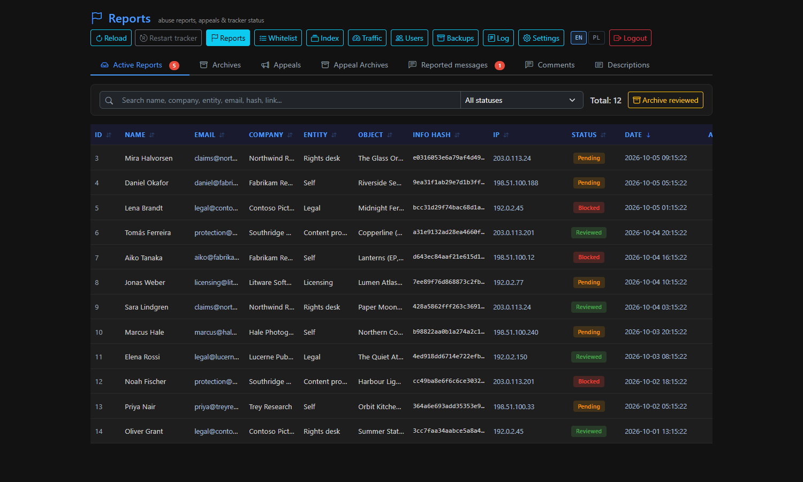
</p>
<p align="center"><em>Admin dashboard — reports/appeals with search, sorting, filters and one-click workflow.</em></p>

<table>
  <tr>
    <td width="50%" valign="top">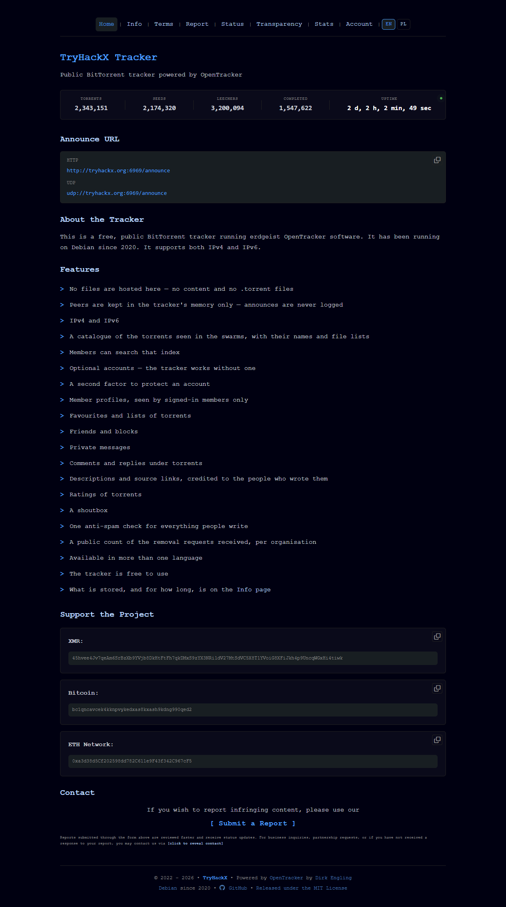</td>
    <td width="50%" valign="top">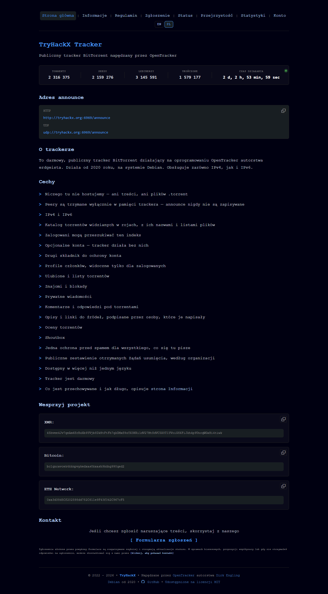</td>
  </tr>
  <tr>
    <td align="center"><em>Public home — announce URLs, features, contact; sections and their text are editable.</em></td>
    <td align="center"><em>The same page in Polish — one switch, every string.</em></td>
  </tr>
  <tr>
    <td width="50%" valign="top">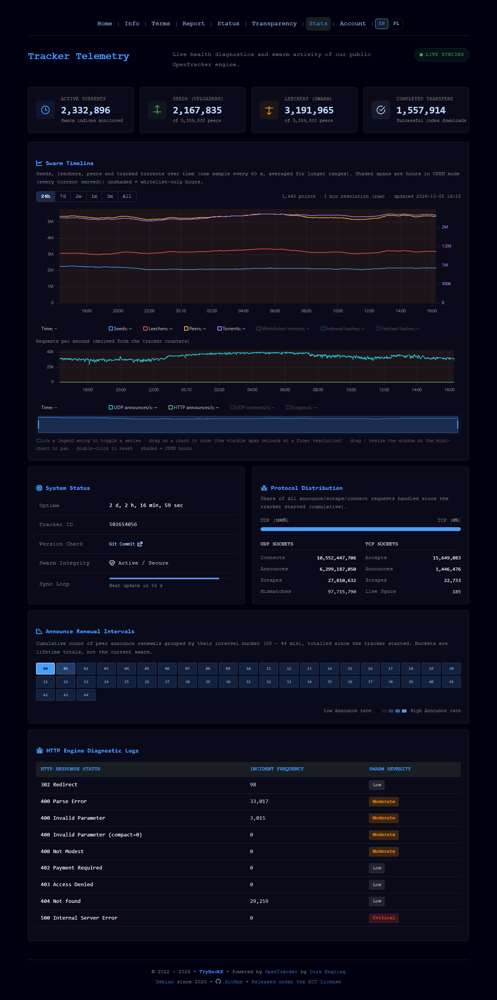</td>
    <td width="50%" valign="top">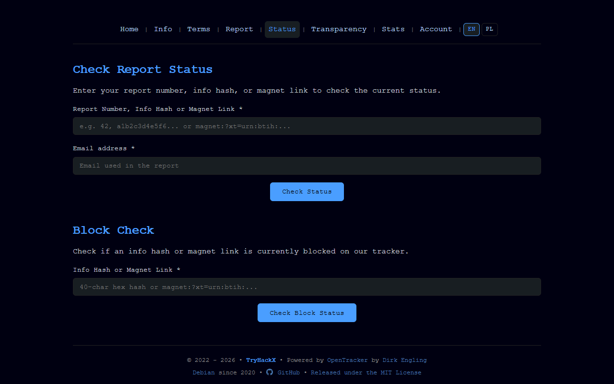</td>
  </tr>
  <tr>
    <td align="center"><em>Live tracker statistics (cached, auto-refreshing) with the swarm timeline.</em></td>
    <td align="center"><em>Status — follow a report by its number, check whether a hash is blocked.</em></td>
  </tr>
  <tr>
    <td width="50%" valign="top">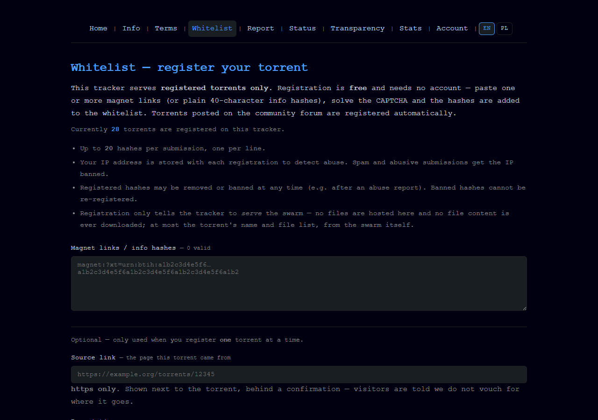</td>
    <td width="50%" valign="top">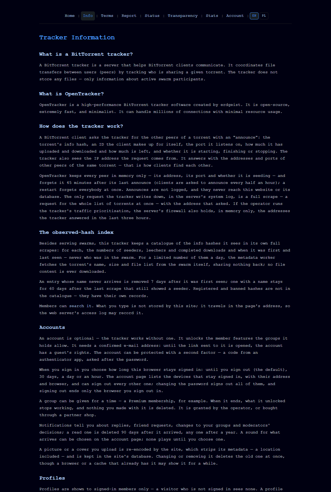</td>
  </tr>
  <tr>
    <td align="center"><em>Whitelist registration — paste a hash or a magnet.</em></td>
    <td align="center"><em>Info — the built-in page follows the tracker mode; the operator can replace it per language.</em></td>
  </tr>
  <tr>
    <td width="50%" valign="top">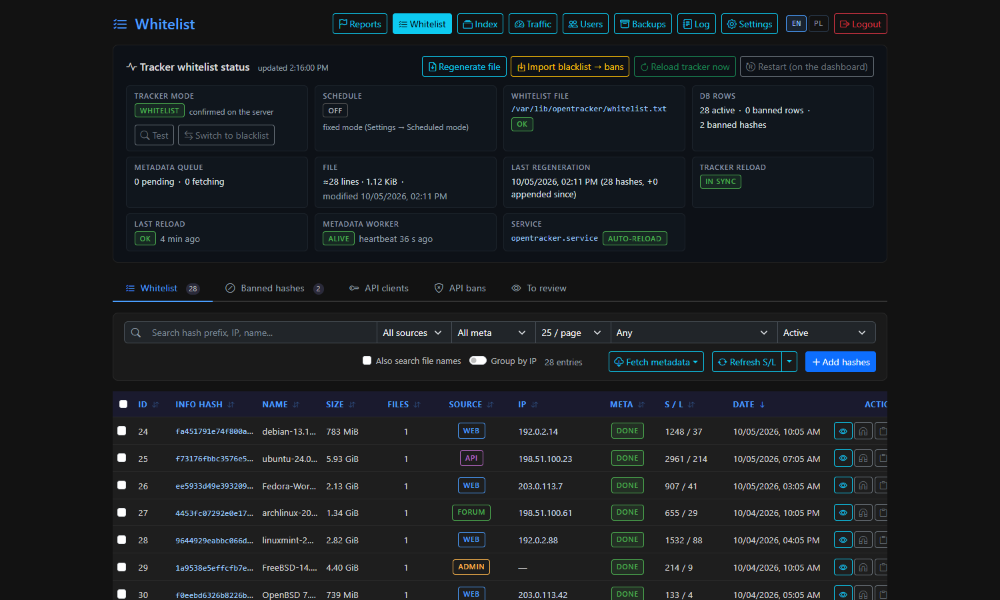</td>
    <td width="50%" valign="top">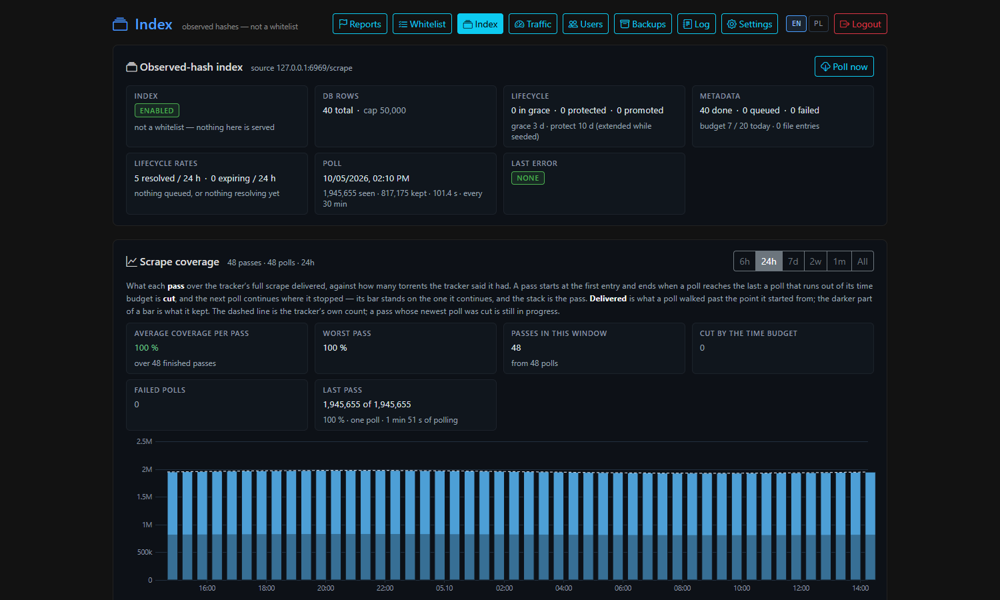</td>
  </tr>
  <tr>
    <td align="center"><em>Whitelist management — hashes, bans, metadata, the swarm timeline.</em></td>
    <td align="center"><em>The index — every hash the tracker has seen, with names and file lists.</em></td>
  </tr>
  <tr>
    <td width="50%" valign="top">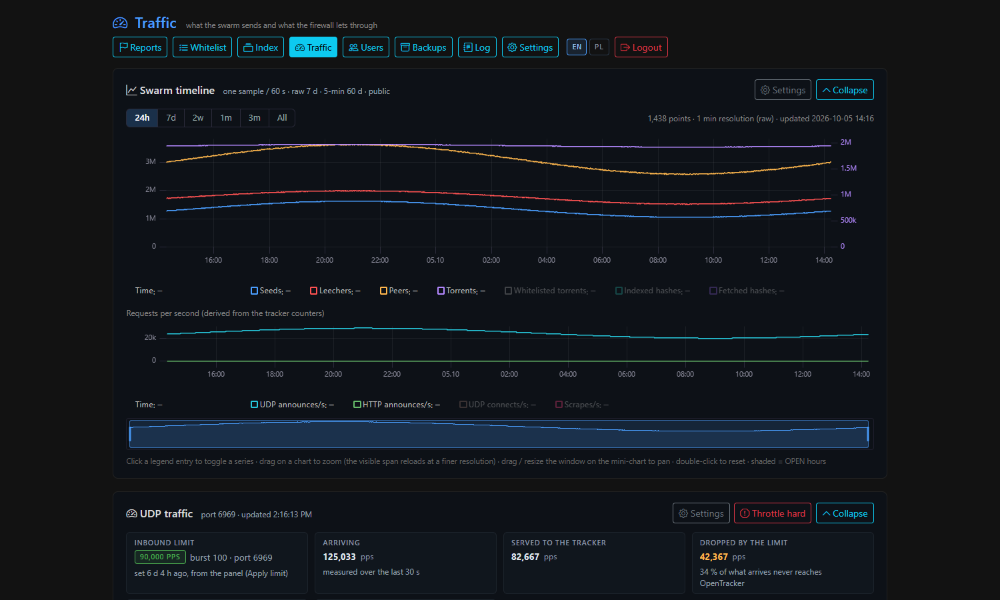</td>
    <td width="50%" valign="top">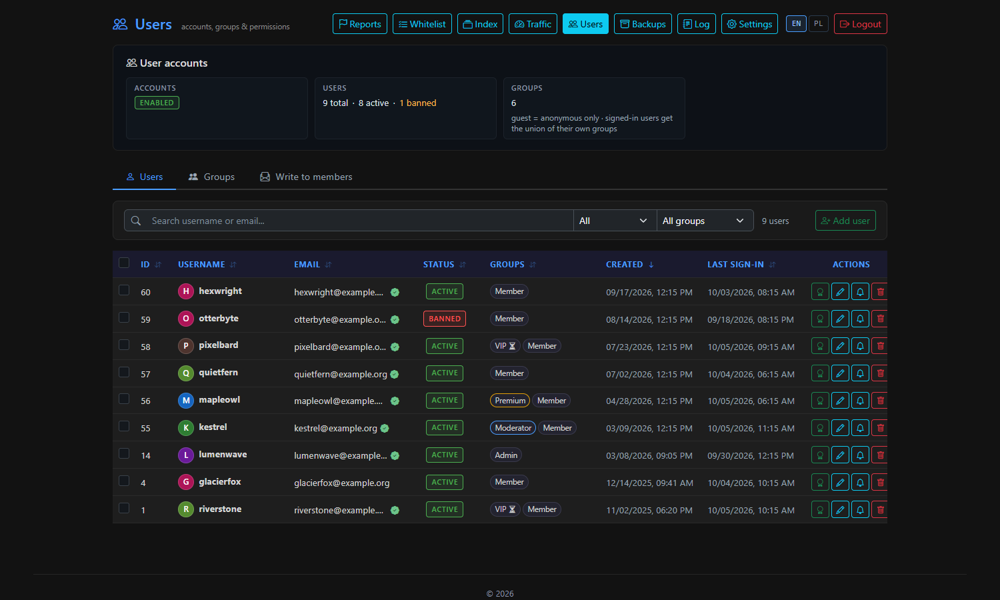</td>
  </tr>
  <tr>
    <td align="center"><em>Traffic — packet rates, the network limiter, kernel counters.</em></td>
    <td align="center"><em>Users, groups and permissions — with presets and the permission matrix.</em></td>
  </tr>
  <tr>
    <td width="50%" valign="top">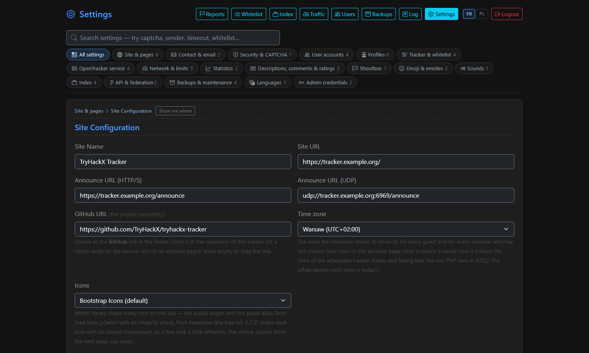</td>
    <td width="50%" valign="top">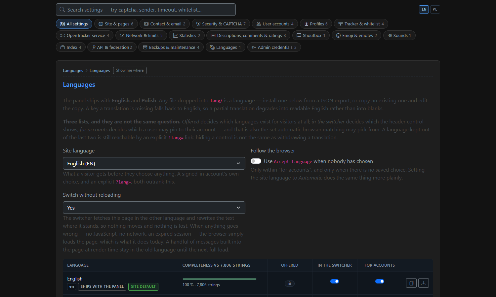</td>
  </tr>
  <tr>
    <td align="center"><em>Settings — searchable, grouped, every value explained.</em></td>
    <td align="center"><em>Languages — install a dictionary, pick the site default, switch one on or off.</em></td>
  </tr>
  <tr>
    <td width="50%" valign="top">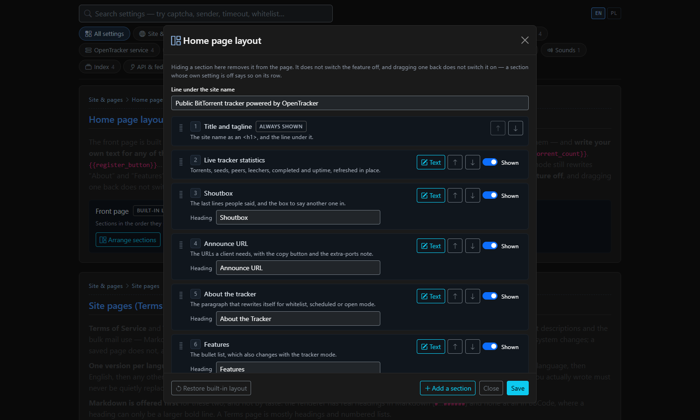</td>
    <td width="50%" valign="top">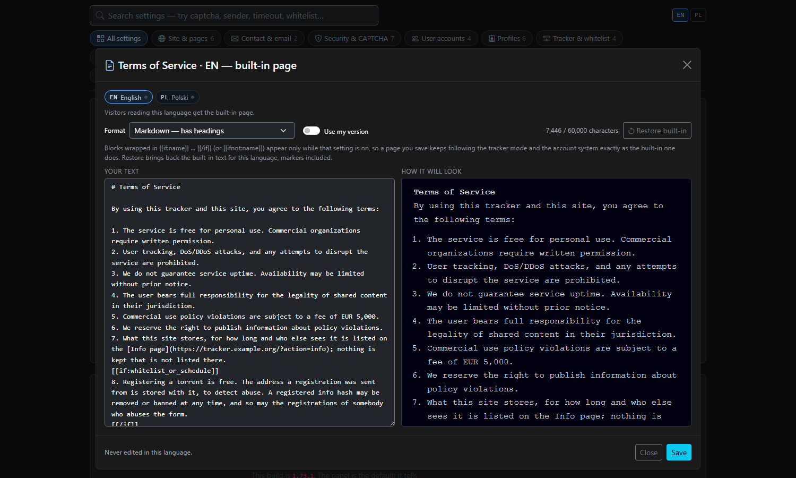</td>
  </tr>
  <tr>
    <td align="center"><em>Home page layout — drag sections, rename headings, add your own, edit any section's text.</em></td>
    <td align="center"><em>Page editor — Terms/Info per language, Markdown or BBCode, conditional markers, live preview.</em></td>
  </tr>
</table>

---

## Requirements

- **PHP 8.0+** (tested on 8.4 and 8.5) with `pdo_mysql`, `mbstring`, `curl` (the index's full scrape,
  the address lists), `gd` **with WebP** (pictures and profile covers), `xml`/SimpleXML (the tracker
  statistics), `json`, `zlib`, `ctype`; optional: `zip` (Font Awesome package import), `exif`
  (uploaded photos turned upright), `intl`, `apcu` (settings cached across requests). `exec`,
  `proc_open` and `shell_exec` must not be disabled — the root helpers, backups and the probe use them.
- **MariaDB 10.6+** (tested on 11.4 and 11.8). MySQL is not supported: a fresh install fails on it, and
  the site uses MariaDB's `max_statement_time`.
- **Apache 2.4** with `mod_rewrite` (required), `mod_headers`, `mod_setenvif`, and php-fpm through
  `mod_proxy_fcgi` — or nginx (see [Reverse proxy / Nginx notes](#reverse-proxy--nginx-notes)).
- **A local MTA** — mail leaves through PHP's `mail()`.
- **The janitor timer** (`tools/janitor.php` every minute) — the schedule, the index, the statistics
  timeline, backups, the mail queue, the digest and every retention period depend on it.
- *(Optional)* **Python 3.7+** with `python3-libtorrent` and `python3-pymysql` (the metadata worker and
  the federation importer); **nftables**, `systemd-run`, `mariadb-dump`, `gpg`, `tc` for the features
  that drive the machine; **sudo** for the root helpers.

The full list, and the path from a bare server: [INSTALL.md](INSTALL.md).

---

## The tracker itself

This is an admin panel for [opentracker](https://erdgeist.org/arts/software/opentracker/), and the
package ships the two builds it is developed against — `tools/opentracker/bin/opentracker.white` and
`opentracker.black` — together with the four patch files applied to them (three to opentracker,
one to libowfat), the exact commit and feature flags they were built from, and the recipe to
rebuild them yourself.

**Two binaries, because white or black is a compile-time choice in opentracker**, not a runtime one:
`WANT_ACCESSLIST_WHITE` and `WANT_ACCESSLIST_BLACK` are mutually exclusive `#ifdef`s. Switching modes
means switching which binary a symlink points at, which is exactly what the panel's mode switch does.

The patches are small and both fix something that bites in production: one stops `systemctl reload`
from **killing** the tracker (the UDP worker threads inherit an unblocked SIGHUP and die on it), and
one adds `access.udp_reject_interval`, which answers a rejected UDP announce with a real "no peers,
come back in N seconds" reply instead of the 8-byte packet clients read as a broken tracker and
retry for ever. On a whitelist tracker that inherited an open swarm, the second one removes more
traffic than everything else in this panel put together.

The third patch is to **libowfat**, the I/O library opentracker links: its `iob_send()` sends with
`MSG_ZEROCOPY` and frees the buffers before the kernel has read them, so a chunked `/scrape` read by
anyone slower than the tracker arrives with heap pointers where chunk headers belong. The panel's
full-scrape polls failed ten times in thirteen until the block was compiled out
(`tools/opentracker/libowfat-no-zerocopy.patch`, 1.33.0 found it, 1.34.0 put it in production).
The write-up meant for upstream is `tools/opentracker/UPSTREAM-REPORT.md`. The fourth file,
`opentracker-review-fixes.patch` (1.35.0), carries seven fixes from a source review — a forgeable
UDP connection-id secret, a use-after-free on accesslist reload, a `/stats` result delivered to a
reused socket, and four smaller ones — each adversarially reviewed and put through a lab before
it was shipped.

Built and tested on **Debian 13 (trixie)**, x86-64, gcc 14.2.0. Details, checksums, feature flags,
the build recipe and the install steps: **[tools/opentracker/README.md](tools/opentracker/README.md)**.

> ⚠ opentracker's `-h` **and** its `/stats` page report features it was not built with — one fixed
> usage string, printed whatever the flags were. Probe a binary by running it, never by reading its
> help. The panel does this for you.

## Installation

> **Setting up a Linux server from scratch?** [INSTALL.md](INSTALL.md) is the linear path — a bare
> Debian box to a running tracker, with opentracker, the janitor timer, the root helpers, the
> metadata worker, the firewall limits and backups, in the order that works. It also carries the
> handful of things that cost an afternoon if you meet them unwarned: opentracker's help text lying
> about its own build flags, a socket buffer that ignores a live sysctl until the service restarts,
> and one CPU core doing all of a VPS's packet processing.
>
> The steps below are the application on its own, which is all you need if the server is already set
> up.

### 1. Download

```bash
git clone https://github.com/TryHackX/tryhackx-tracker.git
cd tryhackx-tracker
```

Or download and extract the ZIP from GitHub releases.

### 2. Upload

Upload all files to your web server document root or a subdirectory.

> **Do not upload runtime state.** The app writes its state into `config/` while running — the
> database credentials, the admin password hash, caches, locks, rate-limit and sign-in-throttle state,
> `*.marker` files, installed icon packages (`config/iconpacks/`). These are machine-local; never copy
> them from a dev machine to production (a stale `stats_fetch.lock` will wedge the stats endpoint on
> "Syncing Swarms…" — see Troubleshooting). They are in `.gitignore`, so a `git`-based deploy skips
> them automatically; if you upload by FTP, upload `config/` with only `.htaccess` and `app.php` in it.
> Also delete any `*.orig`/`*.bak` backups (e.g. `hash.txt.orig` leaks the admin password hash).

### 3. Set Permissions

The `config/` and `lang/` directories **must be writable by the web-server user** — the app persists
its credentials, caches, locks and rate-limit/login-throttle state in `config/`, and writes a language
installed from the panel into `lang/`. If `config/` isn't writable, stats never refresh and rate
limiting silently fails open.

```bash
# Linux with Apache/Nginx + php-fpm (adjust user:group to your PHP process, often www-data)
sudo chown -R www-data:www-data config/ lang/
sudo chmod 775 config/ lang/
```

Find out which user PHP runs as with `<?php echo exec('whoami'); ?>` or check your php-fpm pool
config. On shared hosting where PHP runs as your account user, the files just need to be owned by
that account (typically `755` on the directory is enough). Avoid `777`.

### 4. Configure RewriteBase

Edit `.htaccess` and set `RewriteBase` to match your installation path:

```apache
# If installed at domain root:
RewriteBase /

# If installed in a subdirectory:
RewriteBase /tracker/
```

### 5. Run the Installer

Navigate to `https://your-domain.com/install.php` in your browser.

**Step 1 — Environment Check**
- Shows the PHP version, `pdo_mysql`, `json`, `openssl` and whether `config/` is writable (shown, not
  enforced — it does not check `mbstring`, `curl` or `gd`; see [Requirements](#requirements))

**Step 2 — Database**
- Enter the MariaDB credentials (the database is created if it doesn't exist, `utf8mb4_unicode_ci`)
- Creates the base tables

**Step 3 — Site & Admin Settings**
- Admin username (3+ characters) and password (min 10 characters, must include upper- and lower-case letters, a digit and a symbol)
- Site name, URL, and contact email; an optional From address on the site's own domain
- Tracker announce URLs (HTTP/S and UDP)
- CAPTCHA: reCAPTCHA v2 or v3, Cloudflare Turnstile or hCaptcha, and its two keys (optional — CAPTCHA is switched on only when both are given)
- Blacklist file path (with Test button to verify permissions)
- It then builds the schema by running the ordinary migration from version zero, and writes
  `config/installed.lock` only when the schema is complete

**Step 4 — Complete**
- Click **"Delete install.php"** to remove the installer for security — it cannot when the files are
  owned by root, so check that it is gone, and delete it by hand if not
- Once `config/installed.lock` exists the installer refuses to run again

### 6. Configure Your Tracker

Point your tracker at the list files the panel writes — for opentracker, in its config file
(`access.blacklist /path/to/blacklist`, or `access.whitelist …` for the whitelist build), and set both
paths in *Settings → Tracker & whitelist → Tracker mode & the accesslist file*. INSTALL.md §5 has the
whole opentracker setup: the two builds, their config files, the symlinks and the systemd unit the
helpers expect.

The application writes one info hash per line (lowercase hex, 40 characters). When you block a hash
through the admin panel, it's appended to the blacklist. When you unblock, it's removed.

---

## Configuration

All settings are managed through **Admin Panel → Settings** (`/?action=admin` → Settings icon).
Since 1.10.0 the page has a **group sub-menu** (Site & pages, Security & CAPTCHA, User accounts, …)
and a **search box** that ranks matching settings first and whole groups after them — it also matches
hidden synonyms ("bot", "smtp", "cron", "hidden url") kept in `includes/settings_catalog.php` and
served through `admin/settings_catalog`, so they never appear in the page text. Press `/` or `Ctrl+K`
anywhere on the page to jump into it.

Since 1.69.0 each group answers one question, and a section is filed where you would look for it
first: **Site & pages** (the site and its pages) · **Contact & email** (how mail goes out — the operator
digest included) · **Security & CAPTCHA** (how abuse is kept out — the public forms' hourly limits
too) · **User accounts** (who may have an account, how they sign in and reach each other) ·
**Profiles** (everything a member has and shows on a profile: the profile switch, favourites, the
picture and cover, the description, likes / ratings, lists) · **Tracker & whitelist** (the mode and
both accesslist files) · **OpenTracker service** · **Network & limits** (the UDP firewall and its address
lists, kernel buffers, database memory) · **Statistics** · **Descriptions, comments & ratings** (what
members add to a torrent; comments since 1.71.0) · **Shoutbox** (the room itself) · **Emoji & emotes** (1.71.0: the emoji picker and Font
Awesome in it, the emotes and stickers and their manager — for every text with the picker, not only the
room) · **Sounds** · **Index** · **API & federation** · **Backups & maintenance**
(backups, archiving of old reports / appeals / sent mail, the health check, the audit log) ·
**Languages** · **Admin credentials**. *All settings* reads group by group in that order; the
section ids did not change, so every `#section-…` link still opens — and since 1.71.0 a link to
anything inside a section (a sub-heading, a block such as `#admin-emotes`) opens that section too.


**Every group and its sections** (the section titles as the page shows them; the rows after this table
say more about the older ones):

| Group | Sections |
|---|---|
| **Site & pages** | Site Configuration (site name, URL, announce URLs, GitHub URL, time zone `site_timezone`, the icon library `icon_library` and Font Awesome's source and packages) · Donation Fields · Transparency Page · Home page layout · Site pages (Terms and Info) · Footer (incl. the build line, `version_display`) |
| **Contact & email** | Contact & Email · Operator digest |
| **Security & CAPTCHA** | CAPTCHA · Smart CAPTCHA · Anti-spam (and its ladders, new accounts, messages, duplicates) · Rate & length limits · Admin Access & Sessions · Transport security (cookies & HSTS) · Content-Security-Policy (what a page may load) |
| **User accounts** | User Accounts · Two-factor authentication for accounts · People: messages, friends, directory (the messages' Archive and Trash since 1.73.0) · Sign-in bridge |
| **Profiles** | Favourites and profiles · Pictures and profile covers · Profile description · Likes and ratings on profiles · Descriptions on profiles · Lists |
| **Tracker & whitelist** | Tracker mode & the accesslist file · Submissions must prove themselves · Whitelist upkeep · Scheduled tracker mode |
| **OpenTracker service** | OpenTracker Service · Live peer sync · OpenTracker — performance · OpenTracker instances |
| **Network & limits** | UDP traffic & rate limit (and its throttle and automatic limit) · Address lists (allow / block) · Stability probe · Kernel network buffers · Database memory (MariaDB / MySQL) |
| **Statistics** | Tracker Statistics · Statistics Timeline |
| **Descriptions, comments & ratings** | Descriptions & source links · Comments · Ratings |
| **Shoutbox** | Shoutbox (and its place in the navigation) |
| **Emoji & emotes** | Emoji in the picker · Emotes and stickers |
| **Sounds** | Sounds |
| **Index** | Index (observed hashes) · Metadata fetch order · Index file lists · File list loading |
| **API & federation** | Server-to-server API · Federation / Cluster |
| **Backups & maintenance** | Backups (what, when, how long, the tools) · Archiving & the e-mail log · Health check · Audit log |
| **Languages** | Languages |
| **Admin credentials** | Security & Credentials · Two-factor authentication |

| Section | Settings |
|---------|----------|
| **Site Configuration** | Site name, URL, announce URLs (HTTP/S + UDP), GitHub URL (point it at the project **repository** — it is the footer's GitHub link) |
| **Contact & Email** | Site email, **sender address** (local part + a domain picked from the Site-URL host and its parents — nothing else can align with SPF/DKIM/DMARC), contact visibility, email obfuscation, HMAC secret |
| **CAPTCHA** | Provider (reCAPTCHA v2 / reCAPTCHA v3 / Turnstile / hCaptcha) — **only the selected provider's keys are shown** (the others keep their values and reappear when selected, or when the search matches them), enable globally and per-context (report, login, status, appeals, block check); the whitelist registration page requires a CAPTCHA every time while registration is public (`whitelist_submit_mode` *public*) |
| **Tracker mode & the accesslist file** | `blacklist` / `whitelist`, whitelist file path (+ Test), blacklist file path (+ Test; under Security until 1.69.0), public registration on/off and who may register (`whitelist_submit_mode`: anyone with a CAPTCHA, or signed-in members holding `whitelist.add`), max hashes per submission, submissions per hour, per-IP and global daily caps, minimum seconds between tracker reloads, OpenTracker scrape URL, **require our tracker** (public registration accepts only magnets whose `tr=` list includes one of *Our tracker hosts* / the announce hosts; bare hashes refused) — see [Whitelist mode](#whitelist-mode) |
| **Server-to-server API** | Enable, ban length (days), exempt IPs, each key's requests a minute (`api_rate_limit_per_min`) and bytes a day (`api_rate_limit_bytes_day`) — clients and bans are managed on the Whitelist page |
| **Smart CAPTCHA** | Point threshold, grace period, points per action type |
| **Anti-spam** (Security & CAPTCHA, 1.71.0) | One layer for everything people write: on/off, a CAPTCHA after so many hits at a ladder's top, guests' CAPTCHA, staff exempt; per place (room, messages, comments, descriptions, reports, lists, profile description, emotes, votes) the free burst, the pauses and the quiet spell; new accounts (days, factor, links as words); new conversations an hour / a day; the duplicate window — see [One anti-spam layer](#one-anti-spam-layer-for-everything-people-write-1710) |
| **Archiving & the e-mail log** (Backups & maintenance; "Public Pages" before 1.69.0) | Auto-archive days for reports and appeals, how long the sent-mail log is kept |
| **Rate & length limits** (Security & CAPTCHA; "Rate Limits & Blacklist" before 1.69.0) | Reports/status-checks/block-lookups/appeals per hour (per IP), items per page, message length limits |
| **Admin Access & Sessions** | **Admin sign-in address** (the `?action=` value that shows the sign-in form &mdash; move it off `admin` to keep bots off the form), **what other admin URLs answer when signed out** (redirect to the front page / show the form / 404), session idle timeout, absolute session cap, login lockout attempts/window, trusted proxy IPs, client IP header &mdash; see [Moving the admin sign-in address](#moving-the-admin-sign-in-address-1100) |
| **Donation Fields** | Enable/disable, custom label+value fields (max 15), auto-detects URLs vs addresses |
| **Transparency Page** | Enable/disable, results per page |
| **Tracker Statistics** | Enable, source URL, home/page refresh intervals, **cache lifetime (TTL)**, request timeout, loading delays, peer-label style — see [Tracker statistics & caching](#tracker-statistics--caching) |
| **Statistics Timeline** | Enable, sample interval, retention (raw / 5-min roll-ups), public or admins-only, **which range buttons the chart offers**, **which range opens by default** and an optional **free "Custom" span slider** — see [Statistics timeline](#statistics-timeline--the-swarm-chart-150) |
| **OpenTracker Service** | systemd unit name, sudo toggle, blacklist auto-reload (SIGHUP), permission test buttons, restart-recommendation thresholds — see [OpenTracker service reload & restart](#opentracker-service-reload--restart) |
| **Footer** | Copyright year, brand/tracker software/OS elements with names and URLs |
| **Security & Credentials** | Admin username, password change, and the **email address of the admin's own account** — changed through the same two-step confirmation a member gets (current mailbox first, then the new one), with the pending change cancellable from the same block (separate form; the panel password is the gate) |

### Smart CAPTCHA

The CAPTCHA system uses activity points instead of showing CAPTCHA on every request:

1. Each user action adds configurable points to the session (e.g., submit report = 2 pts, status check = 1 pt)
2. CAPTCHA only appears when accumulated points reach the threshold (default: 6)
3. After solving, a grace period (default: 5 minutes) bypasses all CAPTCHAs
4. Failed admin login always resets grace and sets points to threshold
5. CAPTCHA renders in a modal overlay — form data is preserved

### Email Notification Preferences

Users receive a "Manage notification preferences" link in every email footer. The preferences page allows per-type control:

| Type | Description |
|------|-------------|
| Submission Confirmations | Confirmation after submitting a report |
| Under Review | Notification when admin starts reviewing |
| Status Updates | Changes to report status (reviewed, blocked, archived) |
| Admin Messages | Custom messages from the admin team |
| Appeal Notifications | Appeal confirmations and decision emails |

A master toggle disables/enables all at once.

### Tracker statistics & caching

The tracker stats (home widget + `/?action=stats` page) are fetched from an upstream OpenTracker
`stats` endpoint, which can be slow (tens of seconds under load). To keep this fast and to avoid
every visitor triggering their own fetch, the data is cached **server-side** and shared by everyone:

- **One shared cache** (`config/stats_cache.json`). The first visitor whose cache has expired
  triggers a single upstream fetch under an exclusive lock (`config/stats_fetch.lock`); everyone
  else is served the existing cached data and polls until the fresh copy lands. One fetch, many
  readers — even with 50 people on the page at once.
- **Cache Lifetime / TTL** (`tracker_stats_cache_ttl`, default **60s**) is the shared server-side
  lifetime of the data and is **decoupled** from the client refresh intervals. While the cache is
  younger than the TTL, reloads and polls are cheap cache hits and the upstream is **not** re-fetched.
  Set the TTL **≥ your real upstream fetch time** (often 90–120s) so slow fetches don't cause
  constant re-syncing.
- **Home / Stats-page refresh intervals** only control how often each browser re-checks the shared
  cache; they no longer decide when the upstream is fetched.
- **Request Timeout** (`tracker_stats_timeout`) bounds the upstream fetch. PHP's execution limit is
  derived from it automatically, so raising the timeout no longer causes the fetch to be killed
  mid-flight (the cause of the earlier "stats never load" behaviour).
- **Live Syncs counter** (`tracker_stats_livesync_mode`): OpenTracker's own `livesync` value is `0`
  on single-node setups. Set this to *"Count our cache refreshes"* (Admin → Settings → Tracker
  Statistics) to repurpose the **Live Syncs** stat as the number of times the cache has been
  refreshed since the tracker last started. It auto-resets to 1 when a tracker restart is detected
  (the reported uptime drops well below the previous reading). `upstream` (default) keeps the raw value.

> Optional: instead of relying on visitor traffic to refresh the cache, you can run a cron job that
> hits the endpoint periodically, e.g. `*/2 * * * * curl -s 'https://your-domain/api.php?endpoint=tracker_stats&source=home' >/dev/null`.
> Combined with a longer TTL this makes visitors *always* hit a warm cache.

### Statistics timeline — the swarm chart (1.5.0)

Admin → Settings → **Statistics Timeline** records the tracker statistics over time and draws a
stock-style chart (vendored [uPlot](https://github.com/leeoniya/uPlot), MIT, `assets/vendor/uplot/`,
no CDN) on the public `/?action=stats` page (under the counters) and on the admin **Whitelist** page
(collapsible card under the status card). Two synced panels: seeds / leechers / peers (left axis) with
torrents and whitelisted torrents (right axis), and request rates (UDP / HTTP announces, connects,
scrapes per second, derived from OpenTracker's cumulative counters; `null` across a restart or a gap).
Hours in OPEN (blacklist) mode are shaded, so a [scheduled mode](#5d-scheduled-mode--whitelist-hours-optional-140)
shows up as day/night bands. The same chart is mounted on the admin **Index** page. Ranges
**24h / 7d / 2w / 1m / 3m / All** (All = the whole recorded history, hourly rows thinned to
≤ ~5000 points) — since 1.10.0 the admin picks **which of those buttons exist** and **which one
opens by default** (Settings → Statistics Timeline), and can add a free **Custom** span slider
(1 h … 5 years; each stop is cached like a named range). A Binance-style **ranger** under the panes
pans / narrows the visible window within the loaded range; click a legend entry to hide a series,
drag to zoom (both panes + the ranger stay in sync), double-click to reset; the chart refreshes
itself every minute.

How it works (`includes/stats_timeline.php`):

- **Sampling** — one sample per `stats_timeline_interval` seconds (30–600, default 60) from two
  sources that share the same interval guard: the **janitor timer** (`tools/janitor.php`, the same
  minute timer whitelist mode uses — see [Switch over](#3-switch-over-zero-downtime-order); it reuses
  the shared stats cache when fresh and fetches the tracker otherwise) and, for free, **every upstream
  fetch the stats page makes**. A quiet site is sampled by the timer, a busy one samples itself. One
  parser (`parseTrackerStatsXml()`) serves both the stats page cache and the sampler.
- **Storage** — `stats_samples` (raw, `ts` = UNIX seconds, kept `stats_timeline_raw_days`, default 7),
  `stats_samples_5m` (5-minute roll-ups: avg/min/max of the gauges, last value of the counters, share of
  whitelist-mode samples; kept `stats_timeline_keep_days`, default 60) and `stats_samples_1h` (hourly,
  kept forever — ~9 k rows a year). Roll-ups and retention run from the janitor tick; the state (last
  sample, roll-up cursors, last error) lives in `config/stats_timeline_state.json`.
- **API** — `GET api.php?endpoint=stats_timeline&range=24h|7d|14d|30d|60d|90d|all[&series=seeds,udp_rps]`
  returns `{t:[…], seeds:[…], leechers:[…], peers:[…], torrents:[…], whitelist_count:[…], mode:[0|1…],
  udp_rps:[…], tcp_rps:[…], connect_rps:[…], scrape_rps:[…], step, table, points}`; the table is
  picked per range (raw → 5m → 1h so a payload stays below ~4 500 points) and each range is cached
  for 30 s in `config/`. Public while `stats_timeline_public=1`, otherwise admins only (the chart
  disappears from the public page too).
- **CLI** — `sudo -u www-data php tools/whitelist_cli.php timeline [--tick]` prints the state and row
  counts (`--tick` samples / rolls up right now). `tools/janitor.php -v` prints the tick result.

Requires *Tracker Statistics* to be enabled with a reachable Stats Source URL. Schema v5 creates the
tables on the first request after the upgrade; the janitor timer is the only new moving part.

### Observed-hash index — a catalogue of what's out there (1.5.0)

Admin → Settings → **Index (observed hashes)** turns on a catalogue of info hashes *seen on the
tracker* (mostly during OPEN hours, when the whole swarm is served), browsable at
`?action=admin-index`. **It is not a whitelist** — nothing in the index is ever served or written to
the accesslist; it is a read-only catalogue with metadata, seeders/leechers, search and a
*Promote → whitelist* action.

How it works (`includes/index.php`, all off unless `index_enabled=1`):

- **Poll** — the janitor timer fetches a full scrape (`GET index_source_url`, no `info_hash` =
  full scrape; gzip) every `index_poll_minutes`. A **streaming parser** reads it in bounded memory
  (a 1.7 M-entry / 56 MB-gzip scrape parses in ~3 s using ~30 MB), keeps only
  `complete >= index_min_seeders`, upserts in batches under `index_poll_budget` seconds (5–300; a poll
  that runs out of it is cut, and the next poll continues from the cursor — a pass walks the whole
  scrape, in more polls), and drops rows that are whitelisted or banned.
  OpenTracker's *modest fullscrape* limit already caps full scrapes to once per 5 min per IP.
- **Metadata** — the janitor promotes up to `index_meta_daily_budget` rows/day from *none* to *pending*
  (highest seeders first), with `meta_requested_at` spread across the next 24 h so the metadata worker's
  **second queue** (drained only after the whitelist queue is empty) doesn't flood the DHT. Set the
  budget to **0** to catalogue without any DHT metadata fetching. **Worker parallel fetches**
  (`meta_worker_concurrency`, 1.7.0): how many hashes the worker resolves at once (1–64, both
  queues); the worker re-reads the setting every ~60 s — no restart — when its DB user has
  `SELECT` on `settings` (see [worker/README.md](worker/README.md)); empty keeps the worker's own
  config-file value.
- **Lifecycle** — a new row lives until `grace_until` (`index_grace_days`) unless its metadata resolves;
  a resolved row lives until `protected_until` (`index_protect_days`), extended on every poll where it
  still has ≥ 1 seeder. The hourly pruner (also forced on the tick after a poll that overshoots the cap
  by > 5 %, or after `index_max_rows` itself is lowered — those are the only two things that can put the
  table over the cap from this side, and asking the state file is free where counting the catalogue is
  939 ms) drops expired rows and caps the table at `index_max_rows` (oldest unprotected `last_seen` first);
  it first backfills the protection window for rows whose metadata resolved since the last poll, and runs
  under a lock so two prunes can never over-delete. A 200 000-row cap is ~100–150 MB on disk.
- **Keep what people kept** (`index_keep_saved`, 1.45.1, **off** by default) — what the pruner does with
  a hash somebody has starred or put on a list: `off` leaves the lifecycle above exactly as it is,
  `forever` spares it while anybody still has it, `extend` gives it `index_keep_saved_days` (1–3650) on
  top of whatever protection it already had, measured from `protected_until` so a hash that reappears
  has both clocks restarted at once. It applies to the grace window, the protection window and the row
  cap — a starred hash evicted for being old is exactly the row the setting exists to protect.
- **Worker** — set `index_table = index_hashes` in `tracker-metadata.conf` and grant the `tracker_meta`
  user on the index tables (see [worker/README.md](worker/README.md)). Leave `index_table` empty to keep
  whitelist-only behaviour.
- **Bulk actions with a date window** (Whitelist and Index pages): *Fetch metadata* and *Refresh S/L* for
  rows added / first seen in the last 24 h / 7 d / 14 d or a custom from–to range (`scope=date` +
  `since_hours` or `from`/`to`); **Cancel queued** (`scope=cancel`) resets every queued metadata fetch
  back to *none* — the stop button for a backlog that would take days; the bulk *Refresh S/L* button turns
  into **Stop** while its loop runs.
- **CLI** — `sudo -u www-data php tools/whitelist_cli.php index [--poll] [--tick]` prints the status /
  forces a poll / runs one janitor tick.

**The file list (1.36.0, permission in 1.37.0).** On the public search page the list is paged —
2 000 files per answer by default, the next slice loaded when the reader reaches the end of the list
or presses *Load more files* — so a torrent with tens of thousands of files is readable without one
multi-megabyte reply. Whether a member may load past that first page is `index.files_all`: without
it the list stops where it stopped before and says so, the button is not shown, and a request for
the next page is refused by the endpoint, not only hidden by the page. The admin modals show 5 000
by default and offer *Load the whole file list*.

**How it loads is a setting (`index_files_*`, 1.38.0).** Settings → **File list loading**: three
questions — how the browser asks for more (*while scrolling* / *only after a click* / *everything at
once*), how many files one answer carries, and how many one page may add up to — asked twice, once
for the public search page and once for the panel's detail windows, because a stranger sharing a
per-IP rate limit with everyone behind their connection and the operator in the panel are not the
same visitor. The defaults are what 1.37.0 did (scroll + 2 000 on the search page, button + 5 000 in
the panel), so nothing changes until the operator asks. The **mode** only decides *when* the browser
asks; the two numbers are server rules, clamped on save, again on read (a settings row can also come
from a restored backup) and once more at the endpoint, so a hand-typed `?limit=` cannot outrank
them. One new rule is visible on upgrade: **`index_files_max` (20 000 by default and by ceiling)
ends a public list where before there was no end at all** — a member with `index.files_all` could
page a 500 000-file torrent to its last row. The reply says `capped` and the page prints why the
list stopped; `capped` and `truncated` are never both true, because *keep asking* and *the site
stopped you* together are a loop. Paging stays `LIMIT`/`OFFSET` on purpose: the permission gate is a
test on that offset, so a keyset cursor would have walked past it. The panel's own total
(`index_files_admin_max`, 1 000 000 as shipped, matching what the modal already did) is worth
lowering — it is one `fetchAll` and one `json_encode` in php-fpm on the same machine as the
database — and *Load the whole file list* is now hidden rather than dead when a list already stands
on it. The public file tree also stops drawing leaves past 5 000 (the panel's tree has always had
such a cap); the files are loaded, they are simply not all painted, and one line says how many.

**How long the list is at all is a different number (1.38.0).** The metadata worker stores only the
first `max_files` paths of a torrent (`[worker] max_files` in `/etc/tracker-metadata.conf`, 5 000 as
shipped) while recording the torrent's real file count beside them, so a big torrent has a 5 000-row
list under an 18 000-file heading — 620 catalogue entries on this production database are in that
state, each with exactly 5 000 stored paths, the largest claiming 27 260 files. Nothing is truncated
on the way out. Every file-list reply now carries the entry's own `files_count`: `api/index_files.php`
adds `stored_total` (filled in only on the page that ends the stored list) and `stored_short`, and the
two admin item endpoints add `files_short` beside `files_truncated` — separate fields, because
*Load the whole file list* should appear only where rows are genuinely waiting. The surfaces say
*Files (5 000 of 18 000)* and one line explaining that the catalogue keeps at most that many paths per
torrent.

**Raising the cap (`meta_max_files`, 1.38.0).** Settings → *Index file lists* → **Stored files per
torrent**. Empty — the default — keeps the worker's own `max_files`; a number from 1 to 50 000
overrides it and reaches the worker within ~60 s, no restart and no root, on the same settings read
the fetch order rides (it needs the same optional `GRANT SELECT ON tracker.settings`). One number
governs **both** queues, because `finish()` is shared; the torrent's real `files_count` is stored
unclipped either way. Out of range is clamped rather than discarded, empty means the config file,
and a database blip leaves the last known cap standing. It does nothing for index rows while *Keep
File Lists* is No, and it does **not** govern lists imported from a federation peer — those keep
federation's own limits (5 000 per row, 2 000 in the review queue), because shortening a list a peer
already sent whole helps nobody. The **Index** status card shows what the worker is actually storing
per torrent and warns when that differs from the setting, including the case of a worker still
running a pre-1.38.0 `worker.py` that ignores it entirely. Raising it applies only to torrents
fetched afterwards: stored lists keep the length they were written with (there is no backfill — see
the changelog for why), and the file-name search can only match a path that was stored.

**What a poll writes (1.35.0).** A row whose seeders, leechers and completed count did not move since
the last poll is not written at all, and `last_seen` / `seen_count` advance at most once per six
hours. Measured on production before the change: the download took 6 s, the parse 3 s and the
upsert 82 s — every other poll ran out of its budget — because 78 % of the 621 000 kept rows were
identical to the poll before and were rewritten anyway, four secondary indexes each. With the
conditional statement the same pass takes 43 s. Consequences to know about: **`seen_count` counts
six-hour windows the hash was seen in, not polls**, and *Last seen* on the catalogue page can lag
the truth by up to six hours for a swarm nobody joined or left. The protection window of resolved
rows is pushed forward once a day instead of on every poll, which changes nothing about when it ends.

> **Before enabling on a busy tracker, measure the full-scrape cost during OPEN hours.** During
> whitelist hours the full scrape only contains the whitelisted torrents (tiny); during OPEN it is the
> whole swarm. Poll from **localhost**, watch OpenTracker's single HTTP thread (`top`/`pidstat`), and
> start with `index_meta_daily_budget = 0` (catalogue only, no DHT) until the CPU cost looks safe.

### Which hash gets fetched next (1.23.0, expanded in 1.25.0)

**Settings → Metadata fetch order.** The metadata worker resolves a few hashes a second against an
index queue millions of rows deep, so the order of that queue is not a detail: it decides what the
tracker knows anything about for the next several months.

Queue order is fair, and it is also the reason a release added yesterday sits behind a million hashes
nobody has seeded since 2019.

| Mode | Takes next | Runs on |
| --- | --- | --- |
| **Queue order** (default) | as they were added to pending, admin priority first | `idx_index_meta` |
| **Newest** | the hash queued most recently | the same index, backwards |
| **Most seeders** | the biggest swarm right now | `idx_index_meta_seed` |
| **Seen most often** | the most persistent swarm across polls | `idx_index_meta_seen` |
| **Most completed** | the most downloaded of all time | `idx_index_meta_completed` |
| **Random** | a uniform sample of the whole queue | the primary key |
| **Balanced mix** | shares of the above, interleaved | all of them |

Every mode runs on an index that **already exists**, and that constraint shaped the list. A claim
happens on every fetch slot, several times a second, so a sort the database would have to compute —
by name, by size, by file count — means a filesort over three million rows at that rate.

That constraint turned out to have a sharper edge than "which columns are indexed". `meta_priority`
is `-1` for everything the daily budget queued and `0` or higher for the rows somebody asked for by
name — so the obvious query, *priority first, then whatever the mode says*, leaves `meta_priority`
free under a fixed `meta_status` and **no index can supply that order**. Measured on the production
table, per claim:

| Query | Time |
| --- | --- |
| `ORDER BY meta_priority DESC, meta_requested_at ASC` | **3 722 ms** |
| `ORDER BY meta_priority DESC, seen_count DESC` | **23 689 ms** |
| `ORDER BY meta_priority DESC, last_seeders DESC` | **54 448 ms** |

The fix is to ask the same question in two lanes. First the rows somebody asked for
(`meta_priority > -1`, forty-three thousand of them, where any ordering is affordable), and only if
that lane is empty, the bulk queue with `meta_priority` pinned to a single value — which makes both
leading index columns equalities, so the *next* column in the index supplies the order with no sort
at all. **66–99 ms, filesort gone**, and the meaning is unchanged: everything requested by a person,
then the rest in the chosen order. A third lane with no priority predicate runs only when the other
two are empty, so a row with an unexpected priority can never be stranded.

The panel lists what was left out of the mode list and why, rather than leaving it to look like an
oversight: *last seen* would
sort three million rows that are all stamped with the same poll time; *peak seeders* gives nearly the
same ranking as *most seeders* for the cost of another index on a table rewritten every poll; and
name, size and file count are not known until the metadata has been fetched, which is the thing being
ordered.

`ORDER BY RAND()` is the same trap and is not what **Random** does. Info hashes are SHA-1 digests and
therefore uniformly spread across the key space, so a random 20-byte point plus "the first pending row
at or after it" is an index seek — and uniform for exactly the reason the digests are.

Two of these need an index that a fresh upgrade builds out of band on a table of several million
rows. The panel asks the database which orderings it can serve before offering them, so a mode whose
index is still being built shows as *building* instead of quietly becoming a full scan.

#### The mix, and the whitelist share

The mix is where the useful setting is: mostly big swarms, with enough of new and random that nothing
is starved. The shares always add up to 100 — raise one and the others give up the difference in
proportion — and the rotation repeats over **100 claims, interleaved rather than blocked**. That
matters more than it sounds: the worker claims in waves the size of its parallel-fetch setting, so a
blocked plan (seventy of one kind, then fifteen of the next) makes each wave a single kind and the
"balance" only appears over hours. Interleaved, a single wave is already a proportional sample.

One percentage point is therefore one claim in a hundred — small, but never zero. Under each field
the panel says what that works out to at the parallel-fetch setting above (*"≈ 5 of every 32
fetches"*), and warns when a share is thin enough to be less than one per wave, because that is the
number that decides whether a share is worth having.

**Whitelist (registered)** is a share of the mix and deliberately not a mode. At **0 — the default —
the whitelist keeps absolute priority**: it drains completely before any index row, exactly as in
every other mode and every earlier release, because those rows are there because somebody asked for
them by name. Give it a number and it becomes a guaranteed slice of the rotation instead, which is
what you want when a bulk import has put fifty thousand rows in front of the index and you need both
to move. A slot whose queue turns out to be empty falls through to the other queue, so the share is a
floor for the whitelist and never a ceiling on throughput.

The worker re-reads all of this about once a minute — no restart. And because a worker started from
an older `worker.py` would ignore the setting entirely, the panel compares what it asked for against
what the worker's heartbeat says it is **doing**, and warns when they differ.

### User accounts, groups & permissions (1.6.0)

Admin → Settings → **User Accounts** turns on an optional member system (`users_enabled`, off by
default — with it off, everything behaves exactly like the classic single-admin site). What it adds:

- **Registration & sign-in** (`?action=register` / `?action=login`) — CAPTCHA-protected (registration
  *requires* a configured CAPTCHA; login uses the smart CAPTCHA `login` context), rate limited per
  IP, live-validated forms, and a **"Stay signed in for"** choice: *forever* (default; ~10-year
  remember cookie), *1 hour* (session-only, server-side deadline), *1 day* or *30 days* (remember
  cookie with that absolute expiry — only a token hash is stored, rotation keeps the original
  deadline, everything is invalidated on password change or ban). Email **password reset** plus
  **email verification** (1.7.0): registering with an address (or changing it) sends a 72-hour
  single-use confirmation link (`?action=verify`); the account page shows the verified badge with a
  resend button and the admin list marks verified addresses. With the **verification gate**
  (`users_require_email_verify`, default ON, 1.9.0) registration requires an address and group
  permissions only apply once the link is clicked — an unverified sign-in runs at guest level
  (admins exempt); registration also always requires accepting the **terms** (link to
  `?action=tos`, or a modal with admin-pasted text via `users_terms_text`).
  New passwords follow a **policy** (1.8.0: min 8 chars + lowercase + uppercase + digit + special,
  live two-column checklist on the forms; existing hashes keep working). **Changing the email is
  two-step** (1.9.0): confirmed from the OLD mailbox first, then the NEW one (24 h links,
  `?action=emailchange`); nothing is written until the second click, the new address arrives
  verified, and `users_email_change_cooldown_days` (default 30) blocks rapid flip-flopping.
  Account mails carry a CTA button + raw link. The account page's **Account mail** toggle
  (`user_email_prefs`) governs the groups' notices (access granted, about to end) and the copies of the
  operator's notices — those carry a preferences link and a one-click `List-Unsubscribe`; the password
  reset, an e-mail change's mails and the verification are transactional: always sent, whatever the
  address unsubscribed from, and with no unsubscribe at all (1.73.0). The menu links can be hidden
  (`users_links_visible=0`; the nav shows one **Account** entry). Signing in as an `admin`-group
  member also opens the **admin panel session** (no second login; the panel's own idle/absolute
  limits still apply, and panel logout leaves the site session alone). The mirrored owner account
  is protected — it cannot be deleted, banned or stripped of the admin group.
- **Groups with permissions** (Admin → **Users** → *Groups*): each group carries a set of
  permissions — `index.view` / `index.files` / `index.files_all` / `index.magnet` (the member search;
  `files_all` loads a file list past its first batch — `index_files_batch`, 2 000 rows as shipped —
  up to `index_files_max`, 1.37.0),
  `whitelist.view` (the public whitelist page + whitelisted rows in search), `whitelist.add`
  (registering hashes when `whitelist_submit_mode=users`), `stats.view` / `stats.timeline` /
  `home.stats` (the statistics surfaces). **Semantics (changed in 1.7.0 / schema v8):** the seeded
  **guest** group applies to **anonymous visitors only**; a signed-in user has **exactly the union
  of their own active groups** (guest is *not* inherited, so a group can be narrower than guest;
  priority only orders badges). The seeded **member** group is granted on registration
  (`users_default_group`) and on fresh installs starts with guest's classic permissions; the seeded
  system **admin** group passes *every* permission check — the panel admin is mirrored into the
  user list with it once (the two passwords do not stay in sync afterwards).
- **Presets and the matrix (1.34.0)**: the group editor offers *Start from:* **Moderator**
  (reports + whitelist), **Content reviewer** (descriptions and rewrites), **Whitelist curator**
  (hashes, bans, metadata), **Read-only auditor** (every page and the log, nothing writable),
  **Guest (anonymous visitors)**, **Site member** (the public features) and **Premium** (the paid
  extras). A preset fills the checkboxes and every one of them stays
  visible and editable — it is a starting point, not a lock — and the presets live next to the
  permission registry in `includes/users.php`, so one cannot name an id the other does not have.
  Under the groups table, a collapsible **permission matrix** shows groups across and permissions
  down, panel ids and site ids in two bands, a tick where the group holds it.
- **Recommended sets (1.72.0)**: every seeded group has one — *guest* the public statistics
  (`stats.view`, `stats.timeline`, `home.stats`), *member* the public features (its preset, 40 ids),
  *premium* the two paid extras, *moderator* the queue-working set every install's moderator holds
  (42), *admin* every registered id. It is the group's preset (`userGroupRecommended()` beside
  `userGroupPresets()` in `includes/users.php`), computed for admin, and contained in what a new
  install ships. The groups table's **Recommended** button shows what the group is missing and what
  a reset would take away; **Add what is missing** never removes anything, **Reset to recommended**
  asks a second time; what the window showed is what is written (a group changed meanwhile is left
  alone), one `group.recommend` audit line per change, owner-only like group editing. The same from
  the shell, as the web user: `php tools/groups.php list`, `diff [--group=slug] [--consent]`,
  `apply --group=slug|--all --mode=add|reset [--consent] [--dry-run]` and `user <id|name>` (which
  consent ids an account holds by a grant).
- **Capabilities and consent (1.72.0)**: five permissions say what OTHERS may see of an account —
  `content.public`, `favourites.public`, `lists.public`, `rating.public`, `uploads.public`
  (`userConsentPermissions()`) — and the Admin group's blanket does not count for them (an
  administrator appears on a public list only when their group grants the id). Every other id is a
  capability, which the Admin group passes by its blanket and — since schema 89 — also STORES, so the
  matrix is true: its capability boxes are ticked and disabled in the editor, its consent boxes are
  real choices, and the matrix marks the blanket's ticks and the consent rows. A migration never
  grants consent to the Admin group; `tools/groups.php apply --group=admin --mode=add --consent` (or
  the Recommended window's tick) does.
- **Timed access**: grant a group permanently or for **1 d / 1 w / 2 w / 1 m / 3 m / 6 m / 1 y**, or
  a custom **from–to** window. Duration grants *extend* an existing membership (repeat purchases
  stack). The janitor expires memberships, warns `users_notify_expiry_days` days before the end and
  posts in-app **notifications** (grant / revoke / expiry warning / expired; optional email copies;
  paginated on the account page with a *Delete read* button — read ones auto-prune after 90 days).
- **Member search** (`?action=search`): search everything the tracker has *seen* (resolved index
  metadata; with `whitelist.view` the live whitelist is folded in and badged `WL` — the admin can
  exclude it globally via `index_search_include_whitelist`, or kill the whole search regardless of
  grants via `index_search_enabled`) — ordered by **Best match** relevance (fulltext score,
  rarer/longer words weigh more) with multi-column header sorts, live-as-you-type with a loading
  state, match highlighting, a rows-per-page choice (15–200), and per-permission columns (file
  counts open a **folder-tree modal** with `index.files`; info hashes / magnet links with
  `index.magnet`). A reader who is not shown hashes does not search by one either (1.69.0): without
  `index.magnet` a hex term is searched as a name, here and on a profile's favourites, registered
  torrents and lists — a prefix matched first and blanked afterwards spelt the hidden hash out.
- **Selling group access** (1.65.0): create an API key with the **shop** scope — it opens exactly
  `v1/users/lookup`, `grant` and `revoke` — and call them from your shop after a purchase, with your
  own `order_id` on every grant: a repeated order id changes nothing and answers with the stored
  result (`user_group_orders`), and a refund with the same id takes back exactly that order's time.
  A `users` key can do the same and also create accounts (`v1/users/provision`) and run the sign-in
  bridge. The integration guide (`?action=apidocs&scope=shop`) and
  [tools/api_client_example.py](tools/api_client_example.py) show the calls. Grants made through the
  API notify the user in-app (and optionally by email) and extend like admin grants.
- **People** (1.45.0, `pm_enabled` / `friends_enabled` / `directory_enabled`, all off by default):
  private **messages** between accounts (the same BBCode/Markdown the descriptions use, per-day and
  per-message limits, an inbox with unread counts), **following and friendship** — one row, read two
  ways: a request that has not been answered *is* a follow, accepted it is a friendship — **blocks**
  that stop the messages and optionally hide the profile, and a **member directory**
  (`?action=members`) listing only the people who ticked "list me". **Who may write to me** is the
  reader's own setting, falling back to the site default (`pm_who`: all / friends / nobody) — NULL
  means "whatever the site says", so changing the default moves everybody who never chose and
  overrules nobody who did. A blocked sender is **told**; a message nobody will ever read is a worse
  answer than the truth. Reporting a message puts it in a queue on the panel's Reports page behind
  its own permission (`panel.messages.view`), and that queue carries **the reported line and the one
  before it — never the conversation**. `tests/people_test.php` walks the gate one fact at a time and
  checks that the panel query cannot widen. The directory is a **tab of the account page** since
  1.47.1 (`?action=members` redirects there), sorted by name or by the date people joined; the inbox
  filter searches the names of the people in it, and — with the box beside it ticked — inside the
  messages themselves, which is a `LIKE` over this reader's own conversations and therefore opt-in,
  debounced and rate-limited. **Live refresh** (1.48.0, `pm_live_seconds`, off by default) lets an
  open conversation ask every few seconds whether anything arrived — new rows only, nothing at all
  from a background tab, appended rather than redrawn so a half-written reply survives — and
  `pm_typing_enabled` adds the "…is writing" line, which is a row with an expiry rather than a
  "started" event waiting for a "stopped" that may never come. A moderator answering a report can
  (1.49.0) **silence an account's messages** or **ban the account** for a number of days or until
  somebody lifts it — both stored as dates, so a punishment with an end needs nobody to remember to
  end it, and neither can be applied from that card to an account that can open the panel. A message
  writes **no notification** beside itself (1.50.0): the unread message is the record, counted on the
  Messages tab, and the number on the account link is that count plus the unread notifications — so
  reading a conversation is what clears it. With live refresh on, the **inbox list** keeps up the
  same way an open conversation does, for two facts and no rows.
- **Lists** (1.44.0, `lists_enabled`, off by default): a **collection somebody makes on purpose** —
  a name, the torrents they put in it, and their own answer to who may see it. Useful in blacklist
  mode, where there is no whitelist to group anything by: a reader can still gather a pack and hand
  it to somebody. Cards on the account page (make, **edit**, publish, delete, manage the torrents
  inside), a section on the public profile, a **“put this in a list”** picker in the Info panel, and
  adding straight **by info hash or magnet link** — a hash this tracker has never seen still builds a
  working magnet, so it can still be collected. A list is visible to a stranger only when **five**
  answers agree: `lists_enabled`, `lists_public_enabled`, the owner's group holding `lists.public`,
  the owner's own “show my lists” flag and the list's own. `tests/lists_test.php` walks that table
  one flag at a time against the real query. **Who sees it** (1.72.0, schema 87): each list is
  **private**, **friends** or **public** — a friends list is seen by its owner and the members they are
  friends with (an accepted friendship, no block either way; the friends feature on and the owner's
  `friends.use` — no new permission) and by nobody else, on the profile, through its link, in its
  window and in “Who has this”; an unfriending takes it away on the next request. The state is the
  owner's business: their own cards show it (a lock, people, a globe), nobody else's page does, and
  the endpoints tell it to the owner alone. **A description** (1.70.0): a card's **Edit** opens a window
  with the name and the description — BBCode or Markdown in the site's editor, with the emoji picker's
  emoji, emotes and stickers — saved in one request; the card shows a line or two of it as plain text,
  and the list's window draws it under the name. Its limit (`lists_desc_max`, 1000) counts what a
  reader sees, not the tags; it shows no pictures from other sites (only the site's own emotes and
  stickers), because unlike a torrent's description nobody reviews it before it is read.
- **Abuse reports from a rights holder** (1.43.0): an API key with the **abuse** scope may call
  `v1/blacklist/submit` — the same claim the public *Report* page files, in batches, from their own
  system. A report lands in the Reports queue labelled with the partner that filed it, and **nothing
  about the torrent changes until somebody decides**: `api_clients.abuse_auto_block` defaults to
  **0**, the opposite of the whitelist's `auto_approve`, because registering a hash and taking a
  torrent away from everybody who has it are not the same act. Per key, the operator can demand a
  title, an evidence URL, a reason, the reporter's identity and a good-faith declaration; an item
  missing one is refused on its own with the field named. The guide to send a partner is
  `?action=apidocs&scope=abuse&…`, built by the panel when the key is made.

### Federation / cluster — a shared metadata catalogue (1.6.0)

Multiple tracker operators can **exchange resolved index metadata** (Settings → *Federation /
Cluster*, `fed_enabled`, off by default) so each node builds a big searchable catalogue without
re-fetching everything from the DHT — any OpenTracker + this web app can join. The exchange is
**pull-based and additive**:

- **Export** — `v1/federation/export` serves cursor-paged (optionally gzip-compressed) JSON with
  only *resolved* rows (name, size, S/L, seen dates, optional file lists), authenticated with an
  API key carrying the **federation** scope and inheriting the whole S2S ban machinery.
  `fed_export_enabled` and `fed_export_files` control what leaves the node; `v1/federation/ping`
  lets a peer sanity-check its key.
- **Import** — [`worker/federation.py`](worker/README.md) (a systemd **timer**, not PHP web time)
  pulls from every peer with *Pull* enabled, validates everything (hashes, sizes, sanitized file
  paths) and merges: a hash this tracker has **observed** but not resolved gets the peer's metadata
  (`meta_source 'fed:<peer>'` — no second DHT fetch); an unknown hash is inserted only when
  **Accept new hashes** (`fed_import_new`) is on, under the index row cap. Locally resolved rows
  and whitelisted/banned hashes are never touched.
- **Peering flow** — each admin adds the other as a peer, clicks **grant inbound access** (creates
  a federation-scope API key shown once) and sends that bearer to the other side, who pastes it
  into *Their bearer* and enables *Pull*. **Test** verifies the outbound direction; per-peer status,
  cursor and imported-row counters are visible in the peers table.

Four things the exchange needs once the partner is somebody else's machine (1.12.0):

- **Where the description came from, not when it arrived** — `index_hashes.meta_origin_at` records
  when metadata was first resolved *anywhere*, and the export carries it as `mo` beside the cursor's
  `mf`. Without it a row imported at each hop looks brand new to the next node, so the panel calls
  month-old metadata fresh and nobody can tell a newer resolve from the same one coming round again.
  A clock ahead of ours is clamped to now; a peer that sends no `mo` falls back to `mf`.
- **Split horizon** — a peer is never handed back the rows it gave us. Importing re-stamps the
  arrival time, which would otherwise put every borrowed row into our own export window and have two
  nodes trade the same catalogue back and forth for ever.
- **Quarantine** (`fed_import_mode = review`) — the peer's answer waits in `fed_review` and reaches
  the catalogue only when an admin accepts it, from the queue under the peers table. Accepting runs
  the same merge the normal path does; rejecting leaves a mark, because a peer offers its whole
  catalogue on every pull and a decision that does not persist is not a decision. Accepting a whole
  peer's backlog asks for the admin password; single packages do not.
- **Undo import** — one button per peer returns everything it contributed to unresolved. The hashes
  and their local history stay: `first_seen`, `seen_count` and the seeder peaks came from this
  tracker's own swarm and were never the peer's. Sliced at 2000 rows per request;
  `worker/federation.py --purge <peer>` (with `--dry-run`) does the same from the shell for the
  cases that run into millions.

### OpenTracker performance — the knobs, and the measurement that decides the next one (1.11.0/1.12.0)

**Admin → Traffic → OpenTracker — performance** (settings in Settings → *OpenTracker performance*)
exposes what any systemd box already has: UDP worker threads (`listen.udp.workers`), `Nice`,
`CPUWeight`, `CPUAffinity` and `LimitNOFILE`. Everything the panel writes goes into **one file it
owns**, `90-tracker-panel.conf`; `override.conf` and `limits.conf` are never touched, and **Reset**
deletes the panel's file and nothing else. Saving a setting changes nothing — a password-gated
**Apply** puts it in force, after showing the exact file. Where `/etc` is read-only for php-fpm
(`ProtectSystem`), the Apply is queued and the janitor writes it within the minute.

The card also **measures the tracker's own threads** and answers the question that gates building
anything bigger. The helper reports raw counters — CPU ticks per thread, plus machine-wide busy and
idle from the same clock — and the card subtracts consecutive polls, so nothing has to sleep inside a
web request. Threads rather than the process, because four UDP workers at 25% each and one worker
pinned at 100% look identical in `top` and mean opposite things.

The verdict names the one case that justifies a second tracker instance — busiest worker at the
ceiling with one thread per core — and otherwise says what is actually limiting the tracker instead.
On the reference deployment (6 vCPU, 60 000 pps inbound budget) that is **≈90–104% of 600%, busiest
worker 23%**: one sixth of the machine, so extra instances would add the one thing that is not short.

Two numbers on this card are diagnoses rather than knobs, and both are easy to miss:

- **`net.core.rmem_max`** — opentracker asks the kernel for a socket buffer and the kernel clamps it
  to this. When it fills, the packet is discarded *after* the machine has paid to receive it: the
  worst place to lose an announce, unlike a firewall drop, which costs nothing. The panel reports it
  and gives the command; it does not write sysctls, because they are system-wide.
- **the socket's own drop counter** (`ss -ulnpm`, the `d<N>` in skmem) — how many announces were
  thrown away for exactly that reason.

### Ratings (1.18.0, star mode 1.19.0)

**Settings → Ratings.** An opinion on a torrent, in the Info panel and optionally as a column in the
search results. **Off by default**, and signed-in accounts only unless you open it further. Ratings
apply to **any hash the catalogue knows**, whitelisted or not — an opinion about a torrent is not a
statement about whether this tracker serves it.

Two modes. **Up or down** is a percentage and a bar. **Five stars** shows five and stores ten, so
half a star is a real value somebody cast rather than one inferred from a percentage; hovering
previews what a click would set, and leaving puts back what is actually stored.

**A vote can be taken back** (1.71.0). The thumb you pressed, or the half star at your rating, is
shown pressed — and pressing it again removes your vote: from the counts, from your likes or ratings
on your profile, from "Who has this". It is an operation of its own (`rate_hash` with `op: 'remove'`),
not a guess from the value sent, behind every gate a vote passes and paid for like one — the hourly
budget, the CAPTCHA points — and it only ever deletes the caller's own vote. Opening the Info panel
costs nothing from that budget; only casting and taking back do.

Counting is the easy part. A public voting button is the easiest thing on a site to automate, so four
things stand in the way and none of them is sufficient alone: **one vote per identity enforced by a
UNIQUE key in the database** (a check in PHP is a race two requests walk through), the shared rate
limiter, the CAPTCHA points scheme this site already uses, and a weight that makes an anonymous vote
worth a quarter of an account's. Below a configurable number of votes no percentage is shown at all —
"100% from one vote" and "100% from four hundred" are different facts.

**On IP addresses:** `REMOTE_ADDR` comes from the TCP connection and cannot be forged over the
internet. Headers can be, and this panel only reads one when the request arrived from an address you
listed as a trusted proxy. What none of that fixes is one person with a VPN and a phone — IPv6 is
bucketed to a /64, and the panel says anonymous votes are a weak signal rather than implying
otherwise.

### The operator's digest (1.46.0)

Everything a person has to *decide* waits silently in the panel: a partner's submission held for
review, a description waiting to be read, an abuse report nobody has opened, a message somebody
reported. The tracker runs itself; the queues do not. **Settings → Operator digest** sends one mail
saying what is waiting — from the janitor timer, never from a page view, through the same mail
configuration and logged in `sent_emails` like everything else.

`digest_hours` is a **floor between mails, not a timetable**: a tick that finds nothing waiting does
not stamp the clock, so the first thing to arrive after a quiet week is reported at once rather than
at the end of an interval that started while there was nothing to say. `digest_min` is the other
half — an operator who does not want to hear about one held submission can ask for five. `digest_to`
is empty by default and falls back to the site contact address; a value that is **not** an address
stops the mail rather than quietly redirecting it, and the janitor prints `skipped=no_address`.

### A health check an uptime monitor can act on (1.46.0)

A monitor pointed at the home page proves that Apache answers. It does not notice that the database
is a schema behind the code, that the accesslist has not been written since a failed reload three
hours ago, that the metadata worker died with a queue behind it, or that the panel says WHITELIST
while the tracker is actually running open. Each of those is a tracker that looks healthy from
outside and is not doing its job.

**Settings → Backups & maintenance → Health check** sets `health_token` (16 characters minimum — a shorter one counts as
empty, because a guessable token is not a smaller secret but a public endpoint). Then:

```
GET /?action=health&token=<token>            # or the X-Health-Token header, which keeps it out of the access log
→ 200 {"ok":true,"status":"ok","version":"1.73.0","schema":{"version":91,"expected":91,"ok":true},
       "mode":{"panel":"whitelist","actual":"whitelist","match":true},
       "accesslist":{"entries":159,"file_bytes":6519,"written_age":48,"regen_needed":false,
                     "pending_reload":false,"last_reload_ok":true,"fail_count":0},
       "worker":{"heartbeat_age":21},
       "queues":{"partners":0,"descriptions":0,"abuse":0,"messages":0,"meta_pending":0},
       "problems":[],"server_time":1789067048}
→ 503 {"ok":false,"status":"fail","problems":["schema 51, expected 52"], …}
```

The levels come from the panel's own status card, so the endpoint and the dashboard cannot disagree
about what healthy means: a `danger` warning there is `fail` here (HTTP **503**, so a monitor that
only understands up/down still tells you), a `warn` is `warn` (still 200 — keyword-match
`"status":"ok"` in Uptime Kuma to catch those too). Without a token the address does not exist, and
a **wrong** token gets exactly what no token gets — the ordinary page — so a probe cannot learn there
is a secret to find. Rate-limited to 120 requests a minute per address; the mode comparison reads the
janitor's cached answer rather than forking `sudo` on every poll.

### Account security — a second factor, and where you are signed in (1.47.0)

Two switches on the account page, both about the same question: *who else can be me?*

**Two-factor authentication for member accounts** (`user_2fa_enabled`, off by default). The panel has
had its own since 1.14.0 and this does not touch it — that one is the operator's sign-in, this is a
feature the site offers its members. A member turns it on for themselves: the page asks for their
password, draws a QR **with this project's own encoder** (a hosted QR service would be handed a
secret as good as the password), takes one code to prove the phone received it, and hands back ten
recovery codes, once. After that, signing in asks for the password and *then* the code — a second
request, so a form that always showed a code box would not be telling every visitor that this site
wants one.

A code works **once**. TOTP digits are valid for a 30-second step plus one either side, so the same
six digits would otherwise work for up to 90 seconds; the accepted step is stored and anything not
newer is refused. A recovery code works once too, and the list gets shorter rather than being marked.

`user_2fa_required` is `off` | `panel` | `all`. **Requiring it never refuses a sign-in.** An account
that has not set one up still works — what is withheld is the admin panel, and the account page says
so and offers the switch. A rule that can lock somebody out of their own account is a rule that gets
switched off again after the first support mail.

**Signed in on N devices**, with *sign out everywhere else*. What the site can enumerate is
remember-me tokens — one per browser that asked to be remembered, now carrying the address and user
agent it was handed to — and the page says that rather than implying it can see every open tab.
Ending them is not limited that way: `users.sessions_valid_from` is stamped, and every session older
than that instant stops being honoured on its next request, including one opened without a cookie.
The browser doing the asking stays signed in. A **password change** does the same sweep, and so does
a password **reset** — that one keeps nothing, because a reset is what somebody does when they
believe the account is not only theirs any more.

### The panel's log (1.22.0)

**Log** in the panel navigation, behind its own `panel.audit.view` permission. Who did what, when,
and whether it worked — settings changes with a before/after per key, moderation decisions, machine
actions, failed sign-ins.

Written in one place: `jsonResponse()` is the single exit every endpoint takes, so a **new** endpoint
is logged by default rather than forgotten. Credentials never appear: the settings diff matches on the
key *name*, so one added later is covered without anybody remembering, and a match is recorded as
"changed" with no value either side. There is no delete and no edit — a log the panel it records can
rewrite is not evidence. Retention is a setting; the janitor enforces it.

### The emoji picker: every emoji, a search, variants, and Font Awesome's faces (1.69.0)

The shoutbox's picker offers **every emoji Unicode has up to Emoji 16.0** — the newest set Windows 11,
Android and iOS all draw (17.0 is still reaching Windows) — on Unicode's own nine pages, after a
**Recently used** page kept by the browser, with a **search** box at the top that reads names and
keywords in the reader's language, accents or not, and English after them. **Hold an emoji down** (a
finger or the mouse), right-click it, or press Shift+Enter or the menu key, and its variants open over
it, as on a phone: the five skin tones — the one chosen last is remembered and drawn in the grid — and,
for Font Awesome's faces, the styles the site loads. A plain click inserts at once; a corner mark shows
which cells have variants. Nothing is loaded until the picker first opens: the emoji are a file per language
(`assets/emoji/emoji-en.json`, `emoji-pl.json`, about 50 KB compressed each), generated by
`tools/emoji_data.php` from an unpacked `emojibase-data` package (`npm pack emojibase-data`; `php
tools/emoji_data.php <package> [--cap=16.0]` rewrites both files). Windows draws no country flags at
all — it shows their two letters, everywhere, not only here.

With a **Font Awesome Pro package** as the site's icon source (Settings → Site), **Settings → Emoji & emotes
→ Emoji in the picker** (under Shoutbox until 1.71.0) offers its faces — the `emoji` category of the package's own index, 113 in 7.3.1
— **instead of** the ordinary emoji or **mixed** with them (`shout_emoji_fa`: off / fa / mixed, off as
shipped), drawn by default in a style you choose (`shout_emoji_fa_style`, else the site's own). A face
travels in a shout as a token, `:fa-face-grin-tears:` or `:fa-face-grin-tears/duotone-light:` with a
style of its own; the server draws it wherever `:shortcode:` emoji are drawn, as the face when the
package and that style load, and as the ordinary emoji it stands for anywhere else (Font Awesome off,
the package gone, a style no longer loaded, an e-mail). The package importer reads the index a download
carries — Font Awesome's own `icon-families.json`, or the compact `icons-search-vX.Y.Z.json` of the
owner's download script — and keeps what the site needs of it beside the package.

**How much more of the package the picker offers** (1.70.0, `shout_emoji_fa_scope`, shown while the
faces are on): the faces alone (as shipped); the faces, and a search that also finds **any icon** of the
package, in a "Font Awesome" group after the emoji; or **every icon**, on one more page navigated by Font
Awesome's own categories — a strip of chips, from 1.71.0 each the category's own icon (the alphabet A B C,
the numbers 1 2 3; `assets/emoji/fa-categories.json` names them), its name in the reader's language in the
tooltip and for a screen reader. Held down, every icon offers the
styles it is drawn in among those the site loads, and any icon travels as the same token —
`:fa-rocket:`, `:fa-rocket/sharp-solid:` — drawn in the colour of the words, or as `[Rocket]` where Font
Awesome cannot draw it. The icons beyond the faces are found by their English names and words, or by
their category's name in English or Polish. All of it comes from the package's **catalogue**
(`catalog.json` beside it: 4,349 icons, 133 KB compressed, for Pro 7.3.1), which the picker fetches only
when the scope needs it and the browser keeps; a package installed before 1.70.0 gets its catalogue the
first time it is needed, or at once with `php tools/iconpack.php reindex <id>|--all` or the package
table's "Read the index again".

**The picker in every editor, and the emotes beyond the room** (1.70.0, `emotes_everywhere`, on): the
message composer, a torrent's description editor (a first description and a proposed rewrite), the
whitelist form and the profile's description each have the picker's button at the end of their toolbar
(`assets/js/emoji-picker.js`, the room's own picker, shared). What is picked goes in at the caret as text;
the room's `:code:` emotes and stickers are then drawn where the text is read — in a message the sticker
at the room's size, in a description or a list's bounded to 96 px, in a profile's description as an emote
(no stickers there), in an e-mail as its code. Approved, switched-on emotes only, from the same image
address. Each editor asks for the picker's data as its own context (`for` = message | description | bio |
list), under the permission that writes that text. The emotes are the room's: with the shoutbox or its
emotes off, or `emotes_everywhere` off (Settings → Emoji & emotes → Emotes and stickers, "Beyond the
shoutbox"), a code there is its text again and those pickers offer the emoji alone. Since 1.71.0 the
picker's settings and the emote manager are a group of their own in Settings, **Emoji & emotes**, beside
Shoutbox — they serve the whole site — with the setting keys they always had.

### The shoutbox in the bar, a pinned line, and lines from the site (1.60.0)

`shout_nav` adds a **Shoutbox** link to the navigation with a counter of its own — separate from the
badge beside the account name, which counts notifications and messages and goes on meaning only
that; it clears when the reader opens the room. A moderator pins one line (`shout.moderate`) and it
sits above the list, outside its scroll: **at most one at a time**, pinning a second unpins the
first. `shout_live_seconds_guest` gives readers with no account their own refresh interval, 0 being
"do not poll at all" — most of a public tracker's traffic reads and never writes.
`shout_system_lines` (off) lets the tracker announce a registration itself, one line per batch,
naming the submitter only where `wl_submitter_public` says they are public; those lines belong to
nobody, count as nobody's unread and make no sound. Settings → Shoutbox also shows a read-only
matrix of the six `shout.*` permissions of the room (view, post, edit_own, delete_own, edit_any, moderate) across your groups, and **Shoutbox** and **Sounds** are now
chips of their own on the settings page.

### Emoji, emotes and stickers in the shoutbox (1.59.0)

The composer's picker holds common Unicode emoji (drawn by the device's own font), the site's custom
emotes as images, and stickers on their own tab; an emoji or emote lands at the caret, a sticker is
sent at once. The owner manages emotes in Settings → Shoutbox (Settings → Emoji & emotes from 1.71.0); members with `shout.upload_emote` add
their own on the Emotes page. Custom emotes are SVG/PNG/GIF/WebP up to 64 KB and 128 px, sniffed by
their bytes — an SVG with a script or an event attribute is refused, and every emote is served with
`nosniff` and a policy of its own. Settings → Sounds was tidied in the same release: the uploads are
a table with rename, names must be unique across the whole library, and the selects group shipped
clips and your own.

### A shoutbox (1.58.0)

Off as shipped (`shout_enabled`). A line of talk on the front page (a block of the home layout) and/or
its own page, for members with `shout.view` / `shout.post` / `shout.delete_own`; moderators
(`shout.moderate`) remove anyone's line, the owner purges from Settings behind the panel password. The
widget asks only for what is newer, appends without redrawing, and scrolls only when you were at the
bottom; Enter sends, Shift+Enter breaks a line; BBCode by default with Markdown a switch away; `@name`
mentions link the profile and count for that person; retention by count and by age. The pulse carries
how many shouts are new (and how many from friends, and how many mention you) so the sounds have three
more events while the shoutbox is on. Emoji, stickers and the navigation counter follow.

### The audit of 1.45–1.56 closed, and the charts without gaps (1.57.0)

Every finding of the internal audit of 1.45–1.56 (not shipped) is fixed (see CHANGELOG 1.57.0). The
janitor's slow half — the index poll and prune, the whitelist upkeep and probes — runs as a
transient unit of its own (`tracker-janitor-heavy`, through the root helper's `janitor-heavy-start`
verb), so the minute tick that samples the timeline and the traffic never waits behind it; the
prune's protection backfill looks only at rows resolved since its last pass. A panel session opened
through an account ends with that account's sessions; the panel's own second factor is not bypassed
by the account sign-in; a timed ban ends when its date says so; the browser installer finishes.

### A sound when something arrives (1.56.0)

A member picks a short sound for a notification and another for a message on the account page's
**Sounds** tab; everyone starts muted. The tab sets the volume, the choice per event (site default,
silence, or one of the library) and a **wake-up before the sound** — the stream is opened up to 3 s
earlier with silence or a quiet low tone, for amplifiers and HDMI receivers that swallow the first
second of a stream or stand by until they sense a signal. The library is the clips shipped under
`assets/sounds/` plus the owner's uploads from **Settings → Sounds** (MP3/Ogg/WAV, 512 KB, 15 s, 40
at most; kept in the database, sniffed by their bytes). Browsers allow a sound only after a click:
a small muted-speaker chip beside the account link says so until then. Permission: `sounds.use` (members).

### The number on the account link stays current (1.55.0)

Every page a signed-in reader has open asks `api/user_pulse.php` for the two counts behind the badge,
at **Settings → Account badge refresh** (60 s as shipped, 0 = off). Hidden tabs ask nothing; one tab
asks for all of a reader's tabs; the answer is numbers, never content.

### The reporter hears back (1.54.0)

On a reported message's card, beside the note for the log, **an answer to the reporter** — delivered
as a notification with the outcome (closed, the message removed, or handled) and the moderator's
words when there are any. The author of a removed message is told that one of theirs was removed.

### Describing a torrent from the Info panel, in either mode (1.53.0)

**Info panel → Add a description / Propose a rewrite**, for a reader with `content.submit` /
`content.propose`. Words about a *registered* torrent stay on its whitelist row; words about a
torrent the tracker has only *seen* live in `hash_content` — never on a whitelist row, because a
whitelist row is a registration and describing something must not register it. Both go through one
door (`includes/content.php`), one review queue (**Whitelist → To review**, where an index-only row
is marked), and one set of switches. The author is recorded and shown (*Description by …*) and is
told when their words are published, turned down, or replaced. Reading descriptions is
`content.view` (members as shipped); a reader without it is told there is a description for members.

### Delete, Edit, co-authors, and "Descriptions" on the profile (1.70.0)

- **Delete description** in the Info panel, two clicks: its author with `content.delete_own` (members),
  anybody's published one with `content.delete_any` (moderators). The text and its source link go as the
  panel's Clear takes them, the proposals waiting on it are withdrawn, one `content.delete` audit line is
  written, and the author is told when it was somebody else.
- **Edit**, beside *Propose a rewrite*: the editor opens with the text, its format and its link as they
  stand, and files an **edit**. Applied, a rewrite makes its proposer the author (and starts the credits
  again); an edit keeps the author and credits the editor with the share of the text it changed — the
  words of the two versions compared when the moderator applies it (their longest common subsequence;
  `share = round(100 × max(taken out, put in) / the longer text)`, at least 1% for any change) —
  so the line under the description reads *Description by TryHackX (first) → dominikk26 (25% edit) →
  Majkel (6% edit)*. The **Rewrites** tab says which kind each proposal is and, for an edit, the share
  before it is applied.
- **Your name**: *Show my name on the descriptions I write and edit* (Privacy, on). Off, every credit
  of yours reads "a member", with no picture and no link; moderators still see who it is. Every editor
  says, before anything is sent, that a description is public and whether your name goes with it.
- **Descriptions**: a tab of the account page and — with *Show the descriptions I wrote on my profile*
  ticked, your name shown and your group granted `content.public` — a section of the profile, right
  after Likes / Ratings: each torrent you wrote or co-wrote, your role in it, the date; sortable,
  searchable, paged. Settings → Profiles → *Descriptions on profiles* switches it off everywhere.

### Comments on a torrent (1.71.0)

The Info panel has a **Comments (N)** section — since 1.72.0 at the panel's very end, after the files, and
folded until it is opened (Settings says where it stands and whether it opens unfolded). The thread is asked
for when the section is open; it reads oldest to newest and opens on its newest page, `comments_per_page` to a
page (*Show earlier comments* above it, a button, loads the page before). Each comment
shows its author's picture and name (a link to the profile), the time in the reader's zone, "edited" — "by a
moderator" when it was one —, and the author's **Edit** and **Delete** as icon buttons. The composer is the
site's editor with a comment's toolbar — **[b] [i] [u] [s]**, **[url]** while links are allowed, **[quote]**
(one level), **[spoiler]**, **[code]** — the emoji picker (emoji, Font Awesome's icons, the site's emotes, a
sticker drawn as an emote), a Preview and a counter of the characters a reader will see; **Ctrl+Enter**
sends and **@** offers members' names. No pictures, tables, sizes or colours: the renderer is a comment's own
allow-list (`includes/comments.php`), everything else stays the text that was typed, and a link carries
`rel="nofollow noopener noreferrer ugc"` and asks before leaving the site. A comment by somebody you blocked
is folded away until you open it; an account silenced by a moderator reads but does not write.

- **Who** (Users → Groups): `comment.view`, `comment.post`, `comment.reply` (1.72.0), `comment.edit_own`,
  `comment.delete_own` (members as shipped) and `comment.moderate` (moderators: edit anybody's — marked,
  audited, the author told — and remove it with a reason the author is shown, one `comment.delete` audit
  line). Asked of the account, never of a panel session. With accounts off there are no comments.
- **Told**: the member who registered the torrent, the author of its description, the members who commented
  before, whoever a comment @-mentions and (1.72.0) the author of the comment a reply answers — once each, in
  their own language, never the author, never across a block, and only for the kinds they left on (account
  page, under the notifications: five switches). A notification has a **Show** button that lands on the
  comment. Sounds of their own — *a comment where I am told of one*, *a comment that mentions me* and
  (1.72.0) *a reply to my comment* — with site defaults in Settings → Sounds and a choice on the account's
  Sounds tab; a comment plays its sound, not the notification's as well.
- **Guests**, only if you grant the guest group `comment.post` (off as shipped): signed "Guest #4f2a" — a keyed
  hash of the day and the address group, never the address — a CAPTCHA every time (no provider set up, no
  guest comments), no links, and held for a moderator's *Let it through* while `comments_guest_review` is on
  (as shipped). A guest cannot correct, delete, be told or be @-mentioned.
- **Settings → Descriptions, comments & ratings → Comments**: on/off (`comments_enabled`, on), the length in
  visible characters (`comment_max_chars`, 500; 20–5000 — the text with its tags may be four times that),
  links (`comment_links`, on), how long a member may correct (`comment_edit_minutes`, 15) or delete
  (`comment_delete_own_minutes`, 60; 0 = no limit) their own, comments to a page (20), where the section
  stands (`comments_position`: after the files — the default —, before them, or after the rating; 1.72.0),
  whether it opens unfolded (`comments_expanded`, off; 1.72.0), how deep replies may go
  (`comments_reply_depth`, 3; 0 = no replies; 1.72.0), comments an hour per
  account (`comment_rate_per_hour`, 30), smart-CAPTCHA points per comment (`captcha_pts_comment`, 1), the
  guests' review; and every group's comment permissions, read-only. Every comment write passes one function,
  `commentFloodCheck()`, which asks the site's anti-spam layer (below) before the hourly limit.
- **Data**: `hash_comments` (schema 83; soft-deleted rows keep who removed them and why), `users.comment_notify`
  and `user_notifications.link`. Deleting an account deletes its comments (1.72.0: one that others answered
  stays as a "[deleted]" tombstone, below). Endpoints: `comment_list`, `comment_post`, `comment_edit`,
  `comment_delete`, `comment_approve`, `comment_prefs`.

**Replies (1.72.0).** A comment can be answered in place — the **Reply** icon button, first among a comment's
actions, opens the composer under it ("Replying to @name", the same editor, an x or Esc to put it away, its words
kept) — and the answers answered, each level a step further in with a rule down its left edge, one **Hide replies**
fold per thread. **Reply depth** (`comments_reply_depth`, 3; 0–8) is the deepest reply level: 3 is a comment, a reply,
a reply to it and a reply to that; 0 is no replies. The server refuses a reply past it; lowered later, the deeper
replies already written stay, drawn at the deepest level allowed and saying whom they answer, and only new ones are
refused. Who may reply is `comment.reply` (members and moderators as shipped; a guest group granted it replies
under every guest rule). Each top-level comment brings its first ten replies, **Show N more replies** 25 more; a
comment that goes while it is answered stays as "[deleted]" / "[removed by a moderator]" (no author, no words) —
so does one of a deleted account's that others answered. The comment a reply answers tells its author (a fifth
switch, *…that replies to one of my comments*; never across a block) with a sound of its own, `comment_reply`
(no site default until you pick one). Data: `hash_comments.parent_id` / `root_id` / `depth` and
`idx_hc_thread` (schema 88).

### Reporting comments, descriptions and shouts; warnings (1.71.0)

A **flag** beside somebody else's comment, under a torrent's description and on a line of the shoutbox opens a
small box in place — a reason, *Send* — and turns into **Reported** once sent (on every page after, too). Only
the moderators read a report; the author never learns who sent it. One open report per member per thing; a
member's reports an hour are limited; `content.report` (members as shipped).

- **Reports page → Comments / Descriptions / Shouts** (each while its feature is on, each with its count of
  things waiting): one card per reported thing — its words (and, when they changed or went, the words as
  reported), where it lives, its author and what the account already is (banned, silenced, staff, reported and
  warned how often, the latest warnings), and every report about it. Filters: status, reported member,
  reporter, a date range, text. The page opens for any of its queues and shows only the tabs a person may see.
- **Actions**: Close / Reopen (with an answer to the reporters and a note for the log), **Remove** the words
  (each kind through its own delete), **Warn** the author, **silence** or **ban** the author for a length, and
  lift either — never an account that can open the panel, never your own, never a ban without a date.
- **Silent or loud**, for everything that reaches the author: silently, they are told nothing; as a warning,
  they get one notification in their own language with your reason (required), kept on their account in
  `user_warnings`. The count and the latest warnings are on every reported author's card and in **Users** (the
  member's window); the member sees them among their notifications, nowhere public. The **message card** has the
  same choice and a Warn of its own.
- **Who** (Users → Groups): `panel.reports.comments.view` / `.handle`, `panel.reports.descriptions.view` /
  `.handle`, `panel.reports.shouts.view` / `.handle` — the moderator group's as shipped. The message queue
  (`panel.messages.*`) is still nobody's until you grant it. The reporters hear the outcome (closed, removed,
  handled) in their language; every action is in the audit log's Reports group.
- **Data** (schema 84): `content_reports` (beside `message_reports`, which is unchanged), `user_warnings`.
  Endpoints: `content_report`, `admin/content_reports`, `admin/content_report_action` (`includes/reports.php`).
  Every report passes one limit function, `contentReportFloodCheck()` — the anti-spam layer, then the hour's limit.

### One anti-spam layer for everything people write (1.71.0)

Every place people write asks one place before anything is written (`includes/antispam.php`): a line in the
shoutbox and its correction, a sticker or an emote upload, a message and a message report, a comment and its
correction, a torrent's description (the Info panel's and the whitelist form's), a list's name and description,
the profile's description, a report, a vote. The answer is one of three — go; **wait this long** (the Send button
counts it down on itself, the sentence beside it, and comes back by itself at zero with the words kept); or
**prove you are a person** (the site's CAPTCHA box opens there and then, drawn on pages that had none, and the
same words go again). A member is known by the account, a guest by the address group (an IPv4 address, an IPv6
/64).

- **A ladder per place**: a few writes free, then growing pauses, all forgotten after a quiet spell. The room
  ships with three lines free, then 5, 15, 30 and 60 seconds, two quiet minutes; messages count the conversations
  a member STARTS (3 free, then 30 s, 1, 2, 5 min; 10 minutes), not the lines of a chat; comments 2 free (15 s …
  2 min; 5 minutes); descriptions 2 (1 … 30 min; an hour); reports 3 (30 s … 15 min; 30 minutes); lists 3 (10 s …
  2 min; 10 minutes); the profile's description 3 (30 s … 5 min; 15 minutes); emote uploads 3 (30 s … 5 min; 30
  minutes); votes 10 (2 … 30 s; 2 minutes). Every number is a setting.
- **CAPTCHA**: at the top of a ladder — whoever keeps hitting its last step (3 times, `antispam_captcha_after`) is
  asked on the next write, and solving it takes the pauses back to the first step. **Guests** solve one every time
  they write (`antispam_guest_captcha`). With no provider set up, nobody can be asked: the pauses work alone, and
  Settings says so.
- **Messages**: new conversations an hour and a day (8 / 20; a new account 2 / 4); the same words to more than two
  people refused; `rate_limit_pm` (240 an hour per address, Settings → People) is the send's own ceiling.
- **New accounts** (the first `antispam_new_days`, 3): pauses and quiet spells × 2, their own conversation limits,
  and links written then drawn as words — in the room, a comment, a list's description, the profile's description
  — for good: it is decided from when the words were written.
- **The same words twice** within ten minutes are refused in the room, a message to the same person, a comment and
  a description (under eight characters never counts). **Corrections** are not laddered: a gap between two, that
  is all (the room's `shout_flood_seconds`, which with the layer switched off is the room's old wall again).
- **Staff** (`panel.access`) are not paced, not asked, and not new, while `antispam_staff_exempt` is on; the
  duplicate rule is everybody's.
- **Never open**: the check and the reservation are one locked step (`antispam_state`, the database's clock), so two
  requests at once are served one after the other; a database that cannot answer is a refusal, not a pass. The audit
  log hears of a subject refused three times in a row (`antispam.refuse`), at most once an hour each.
- **Settings → Security & CAPTCHA → Anti-spam**: the switch, the CAPTCHA and staff rules, one row per place (burst,
  pauses as a list, quiet spell), new accounts, messages, the duplicate window. Data (schema 85): `antispam_state`,
  pruned by the janitor after two days.

### "Who has this": favourites, likes / ratings, lists (1.70.0)

The Info panel's **Who has this** opens three sections, each loaded twenty at a time when it opens (all
three at once), each with its own count, its own search by name past one page, and *Show more*:
**Favourites** (as before), **Likes** or **Ratings** — by the rating mode: each name with its thumb up or
down, or with its stars, half stars included — and **Lists** (the public lists the torrent is on, by their
owners, each opening the list on the owner's profile). Somebody appears only when every gate says yes, and
a gate that says no takes them out of the count too: for the likes, *Show my likes on my profile* **and**
the new *Let my name, with my thumb, appear in a torrent's "who has this"* (Privacy, right under it, off
until ticked), a group that grants `rating.public` (not the administrator's blanket), an active account,
verified where the site asks for it, no block hiding their profile from the reader; only votes cast from
an account, only values the current mode has. A list is shown exactly where it is public on its owner's
profile. Settings → Profiles: *Likes and ratings in "Who has this"* (in the likes' section) and *Lists in
"Who has this"* (in the lists'); the favourites' own switch is where it was. The button appears whenever
any section can show the reader something. `api.php?endpoint=hash_who&hash=…&section=fav|votes|lists`
answers one section a page (20, at most 50); `hash_favourites` still gives the 1.69.0 answer.

### What does this tracker know about a hash? (1.52.0)

**Status page**, for a reader with `status.hash_check` (members, as shipped). Paste an info hash,
a base32 hash or a magnet link and get one card of answers: registered here (and whether it is live,
waiting for review, waiting for its first peer, rejected, never seen, or since banned), banned or
blacklisted, seen in the swarm (when, how often, how big), metadata and files. A hash the tracker
has never met gets one sentence saying so. That last answer is why the form is a grant and not a
public page, and why it is rate-limited per address (Settings → Accounts → *Hash checks / hour*):
unbounded, it is an oracle for walking the catalogue one hash at a time.

### The stability probe (1.22.0)

**Settings → Stability probe**, off by default; the card appears at the bottom of **Traffic**.

The Traffic page can suggest a limit from a formula over past traffic. It cannot answer the question
an operator on a shared machine actually has — *if I raise this, does anything else here start to
hurt?* The probe answers it by trying: it moves the limit through a few steps, holds each for a few
minutes, and watches the drop counters of every other UDP socket on the machine while it does.

- The way back is written down **before** the first change, so the settings return even if the run is
  killed or the machine reboots — the janitor restores them. The revert does not depend on the
  program surviving.
- Harm stops the run, not you. It never needs watching.
- It suggests, it does not apply. A run ends exactly where it started, and the report only offers
  values the machine actually held.

It can move the receive limit, the reply budget, or both. It deliberately does **not** ramp kernel
buffers: a socket's buffer is fixed when the socket is created, so testing one means restarting the
tracker at every step.

**How it is started (1.50.1).** The janitor does not run it in the background itself: the janitor is
a oneshot systemd service, and a oneshot service kills every process left in its control group the
moment it exits — which is exactly what happened to the probe, one second after every start. Instead
the janitor asks the netlimit helper for `probe-start`, and the helper runs `tools/tuner.py` through
`systemd-run` as **`tracker-probe.service`**, as the web user. The card's *Runs as* line says which
way it went. `systemctl stop tracker-probe` is a valid Stop — the probe restores on its way out. On a
machine without `systemd-run` the helper says so and the janitor falls back to a background job, which
is fine under cron; under a systemd timer with a helper older than 1.50.1 the card reports the failure
and names the file to reinstall.

### Writing to members, with formatting (1.19.0)

**Users → Write to members.** Plain text, Markdown or BBCode, with a toolbar and Ctrl+B / Ctrl+I /
Ctrl+K in the box. The preview is a round trip to the same function the janitor uses to build the
mail — a preview drawn by different code is a guess about what will arrive. Mail clients drop
`<style>` and usually `class`, so the renderer's output has its classes swapped for inline styles;
change a rule on the site and the mail follows. The format is stored on each queued row, so a batch
written in Markdown and sent after Markdown was switched off still arrives as its author saw it.

Nothing is sent from the panel. Queueing writes rows; the janitor sends a few a minute, because this
server has no relay in front of `mail()` and a burst from an address that normally sends a handful a
day is what gets a domain filed under bulk.

### Reviewing what people write (1.17.0, rewrites screen 1.19.0)

**Whitelist → To review.** Two lists. **Submissions** are source links and descriptions waiting to be
published — searchable by hash, name, link or a word from the text, and filterable to what was
published or rejected, so "why is this public" can be answered without reading the database.
**Rewrites** are proposed replacements for text that is already published, shown side by side with
the current version, both rendered: a rewrite that reads tamer in source and worse on screen is the
whole risk of accepting one. Applying keeps the version it replaces — the newest ten per description
(1.70.0: the older ones of a description are deleted when a proposal on it is applied), as rows of
`wl_content_edits` marked `replaced by a later proposal` — but nothing in the panel reads them back or puts one back:
an old text returns only by being copied out of the database and proposed again.

Everything is shown **rendered**, never as source. Reviewing markup means waving through whatever an
image tag turns out to point at.

A link the **importer** recorded (`whitelist.source_ref`, written when the forum posts a magnet) is
shown in the same place as one typed into the form, marked as automatic — but only when it points at
your own site. It never passed this queue, and an API client is not necessarily yours.

### Making a submission prove itself (1.18.0)

**Settings → Tracker & whitelist → Submissions must prove themselves.** A new registration must show that its metadata
resolves *and* that a scrape finds at least one peer — the torrent exists, is alive, and names this
tracker. **It is served while it tries** — a tracker in whitelist mode refuses the announces of a hash its
list does not carry, so a peer could not show up here otherwise — for at most the probe's timeout, and it
leaves the accesslist the moment it fails, deleted or kept (1.73.0: until then a full regeneration in the
probe's minutes dropped it, and a failure stayed served until the next one). Existing rows count as
already accepted, so turning it on never unpublishes anything. A partner's submission held for a
person's review is different: never served before it is approved.

It reuses the metadata worker rather than adding a second queue, but jumps the queue: somebody is
watching this one. The form shows a line per hash, and a failure says which half failed, because
"nobody is sharing this" and "we could not read the torrent" need different fixes.

### Whitelist upkeep (1.18.0)

Two janitor jobs, both off: **refresh** re-scrapes rows whose numbers are stale, oldest first; the
**dead-row rule** finds rows with no peers for N days. Its default is to **mark, not delete** — an
automation that removes other people's registrations should be chosen deliberately. A row that has
never been scraped is never called dead: no data is not no peers, and the difference matters most
when the scrape path is broken.

### Source links and descriptions on registered torrents (1.17.0)

**Settings → Descriptions, comments & ratings → Descriptions & source links.** Two optional fields on the
registration form: where the torrent came from, and what it is. They show on the Whitelist and Index
detail panels and in the public search. **Both off by default.**

- **The renderer is written here** (`includes/richtext.php`), not imported. Every general-purpose
  Markdown/BBCode parser passes raw HTML through by design, and the ones that filter it use a
  blacklist that has to stay ahead of whoever is trying — the wrong shape for text typed into a
  public form. Here the input is escaped **in full before a single rule runs**, so the only tags in
  the output are the ones the file itself writes.
- Both syntaxes, admin enables each, the writer picks. `[code]` is handled first and restored last,
  so a description explaining BBCode does not get its own example rendered.
- **A review queue** (Whitelist → To review). The torrent registers immediately; only the words wait.
  The moderator sees the description rendered, because reviewing the source is how an image tag gets
  waved through without anybody seeing where it points.
- **Off-site links ask first**, naming the URL and saying the site has not checked it. Domains in
  `link_trusted_domains` skip that — warning about your own site teaches people to click through.
- The source link must be **https**. Plain HTTP is refused rather than upgraded; so are credentials
  in the URL, private addresses, and hosts with no domain.
- The public search gains an **Info** panel: link, description, first/last seen, swarm, peak
  seeders, size, and the file list at the bottom. Optionally a *Refresh seeders* button — off by
  default and rate-limited per hash across all visitors, since it turns a click into a tracker
  request.

### Writing to members (1.17.0)

**Users → Write to members**, with a tick box on every row. A message to a selection, a group, or
everyone; as an in-app notification, an email, or both.

Nothing is sent from a web request. The panel writes rows and the janitor sends a few a minute:
this server sends through `mail()` with no relay in front of it, and a burst from a domain that
normally sends a handful a day is what gets the *password-reset* mail filed as spam. The panel shows
who would be excluded and why (no address, opted out, unsubscribed) before anything is queued, and
again at the moment of committing. Members opt out of announcements on their account page; every
bulk message carries an unsubscribe link. **Transactional mail is never affected.**

### Live peer sync between two machines (E7, 1.17.0)

**Settings → Live peer sync.** opentracker gossiping live peers to another opentracker: who is in
which swarm, right now. Not federation — that moves metadata between panels over HTTPS with a key.
On a single machine this does nothing; there is nobody to sync with.

**The protocol has no authentication and no encryption.** Anything that can reach the port can inject
peers into every swarm the tracker serves. So:

- the helper **refuses** to arm unless the address is on a tunnel interface, with **no override
  flag** — an override is the only feature anybody would regret adding here;
- after arming it checks the port is actually listening, *and on the tunnel address only*, and undoes
  its own change if not;
- the panel does **not** configure WireGuard. Generating a private key and writing it into `/etc` is
  a bigger claim on the machine than anything else here makes, and it would be doing it without being
  able to see the other end. Press **Test** and it prints the commands.

**Before any of this can work the binary must have been built with `-DWANT_SYNC_LIVE`.** The
opentracker shipped on this project's own server was not, and rejects `-s` outright — while its help
text advertises `-s livesyncport` and `/stats` shows a `<livesync>` section, because opentracker
prints both regardless of how it was compiled. The panel's **Test** therefore runs the binary with
the flag rather than reading either, and says `-DWANT_SYNC_LIVE` when it is missing.

**Livesync is multicast.** A livesync build joins 224.0.23.5; the peer address you configure is an
*admin blessing*, not a destination. A tunnel needs `ip route add 224.0.0.0/4 dev <tunnel>` at both
ends, which Test prints. And **"on" is not proof that peers are flowing** — watch the
`<livesync><count>` counter on the Traffic card; it must climb.

opentracker takes livesync only from the command line, so the helper overrides `ExecStart` in its own
drop-in — the most invasive thing the panel does anywhere. It therefore records the command line it
copied and reports when the unit's own has changed underneath it, because a stale copy runs the old
command for ever while looking perfectly healthy. Undo is deleting one file.

### Guessing the confirmation password (1.17.0)

Every dangerous action asks for the password again, and that check now lives in exactly one place.
Wrong answers cost progressively more time from the first one; after `admin_reauth_max_attempts`
(default 5) **the session is destroyed**, so getting back in means the sign-in page with its CAPTCHA
and address lockout — and the failures count against that lockout too, so guessing here poisons the
way back in rather than being a side door around it.

The same prompt now guards the *definitions* of those actions, not only their triggers. Saving a
different helper command (`*_cmd`), interpreter or script path (`tuner_python`,
`backup_script_path`), the tracker's service name or sudo switch, the reverse-proxy trust pair
(`trusted_proxy_ips`, `client_ip_header`) or the `hmac_secret` asks for the owner's password —
an admin-group account holds a panel session too, and on that session alone it could quietly change
what www-data runs on the next schedule tick. Only a value that differs from the stored one triggers
the prompt; an untouched field never does.

The session gate keeps strangers out of the panel. This is for whoever is already sitting at the
machine: a borrowed laptop, an unlocked screen, a stolen cookie — which is the case the password
prompt existed for in the first place.

### Two-factor authentication for the panel (1.14.0, QR added in 1.15.0)

**Settings → Two-factor authentication.** A six-digit TOTP code (RFC 6238) on top of the password,
from any authenticator app. **Off by default.**

- **Setup is two-step.** The secret is *pending* until a code generated from it verifies, so a
  mistyped key cannot lock you out of your own panel.
- **Ten single-use recovery codes**, shown once, stored as SHA-256, with regeneration behind the
  password and a code. Fewer than three left and the panel says so without being asked.
- **A code works once.** It is valid for its 30-second step plus one either side; the last accepted
  step is recorded and never accepted again — including the code that confirmed the setup.
- **Turning it off needs the password AND a code.** This exists for the case where somebody else has
  the password, so the password alone must not be able to switch it off.
- The password step **grants nothing on its own**: no session exists until the second factor is done,
  and a correct password does not clear the brute-force counter (that would let someone holding it
  reset the lockout and then guess six digits freely).
- **A QR code, drawn here.** The panel carries its own QR encoder (`includes/qr.php`:
  Reed-Solomon over GF(256), byte mode, error correction level M, versions 1–10, the standard's own
  mask-penalty rules). Nothing is sent to a QR service and no CDN library is loaded, because either
  would be handed a secret that is as good as the password. The typed key and the `otpauth://` URI
  stay on screen underneath for anyone who would rather not scan.

  Writing an encoder is only worth it if it is *right*, so `tests/qr_test.php` checks it three ways:
  every symbol is compared module for module against an independent encoder, read back as the
  codewords that went in, and — the one that matters — put through a real decoder (`zxing-cpp`) and
  required to come back as the exact string. That found two real bugs a self-consistency check could
  never have: the format-information bits were written in reverse order, and the reservation loop
  blanked the dark module. Both were invisible to the encoder's own reader and fatal to a scanner.

The secret lives in `config/admin_2fa.json`, beside the password hash, in a directory the web server
is denied and no deploy overwrites — not in the settings table, which every backup dumps.

**Locked out?** `php tools/twofa_cli.php off` from a shell. Reaching that shell already proves more
than six digits could.

### Extra opentracker instances (E6, 1.14.0; announce URLs completed in 1.16.0)

**Settings → OpenTracker instances**, with a roster card on the Traffic page. For a machine whose UDP
workers are genuinely saturated — check the performance card first, which says outright whether that
is you. **Off by default.**

**Read this before enabling it: separate ports do not share traffic.** The kernel does not split one
UDP port across processes, and opentracker itself scales by running several threads on a *single*
socket (`listen.udp.workers`) — on this project's own server that is one process, ten threads, one
socket on 6969. So a second instance on 6970 answers exactly the announces whose magnet names 6970,
and nothing else. It is not a load balancer sitting behind the main port; there is no main port doing
any distributing.

That makes the announce URLs the entire mechanism, which is why `announceUrls()` feeds the magnet
builder, the home page, the whitelist page, the search form and the submit response. A client that
is only ever handed `:6969` will only ever talk to the primary. An instance the roster reports as not
listening is never advertised, so stopping one takes it out of the magnets rather than sending
clients at a dead port.

**Which means: for most operators this is the wrong knob.** More threads, a nicer priority and a
bigger socket buffer are worth nearly all of the available gain at nearly none of the risk. The
performance card says outright which of those is short on your machine, and on this one the answer is
the receive buffer, not the CPU. Extra instances earn their keep when the worker threads are actually
saturated — and when you are prepared to publish more than one announce URL.

The installer's `opentracker.service` is never touched; extras are added beside it, share its
accesslist, its white/black mode and its binary, and differ only in ports. The panel keeps no roster
of its own: systemd and the filesystem hold it. `tracker-mode.sh --all` switches every instance with
the primary last, an instance that cannot be switched is stopped rather than left serving the wrong
list, and the reload fan-out runs from the janitor — never from a web request, and in blacklist mode
too, where the whitelist path returns immediately and an extra would otherwise serve a hash banned an
hour ago.

```bash
sudo install -m 0755 tools/opentracker/tracker-cluster.sh /usr/local/sbin/tracker-cluster.sh
echo 'www-data ALL=(root) NOPASSWD: /usr/local/sbin/tracker-cluster.sh' | sudo tee /etc/sudoers.d/tracker-cluster
sudo chmod 0440 /etc/sudoers.d/tracker-cluster && sudo visudo -c -f /etc/sudoers.d/tracker-cluster
# tracker-mode.sh must be reinstalled too, or the nightly schedule will not understand --all:
sudo install -m 0755 tools/opentracker/tracker-mode.sh /usr/local/sbin/tracker-mode.sh
```

Remove every trace: `tracker-cluster.sh remove <name>` per instance, which takes the systemd template
with the last one.

### The database engine's memory (1.37.0)

**Traffic → Database memory** (switch and helper command under Settings → *Database memory*).
One card for the buffer pool and the other memory limits of MariaDB or MySQL: what runs now, what
the drop-in says, a field for the new value, and a badge per row saying whether *this* engine and
version changes it live or needs a restart — the helper decides that, not the page. The counters
that say whether any of it matters sit above the table: buffer-pool fill, page reads from disk,
temporary tables spilled to disk, connections against the limit.

| key | what it is | live? |
| --- | --- | --- |
| `innodb_buffer_pool_size` | the cache for table and index pages — how much of the database lives in RAM | MariaDB ≥ 10.2, MySQL ≥ 5.7 (MariaDB 11 up to the ceiling) |
| `innodb_buffer_pool_size_max` | MariaDB 11's ceiling for growing the pool at runtime | startup only |
| `innodb_log_file_size` | the redo log; bigger means fewer checkpoints under write load | MariaDB ≥ 10.9; MySQL restart |
| `max_connections` | each connection can take several MB | live |
| `tmp_table_size`, `max_heap_table_size` | in-memory temporary tables spill to disk above the smaller | live |
| `table_open_cache` | open table handles kept ready | live |

*Apply* asks for the password, sets what it can live, reads the result back, and writes
`70-tracker-panel.cnf` in the engine's drop-in directory (bytes, with the human form in a comment)
so a restart keeps it. When php-fpm cannot write `/etc` (it cannot, under `ProtectSystem=full`)
the write is deferred to the janitor, exactly like the kernel buffers. *Restart the database* is
its own button with its own acknowledgement and password: the database is shared with every other
service on the machine. The helper, `tools/opentracker/tracker-dbmem.sh`, manages those seven keys
and nothing else, with floors and ceilings narrower than the engines accept, and reports other
`.cnf` files that set the same keys as conflicts. It asks the running server whether a key exists
rather than trusting a version table (a drop-in naming a variable the engine lacks would stop it
from starting), bounds every call to the client and the restart with `timeout`, refuses a second
restart within two minutes, and caps the redo log at a quarter of the free space on the data disk.

### What the machine's own processes cost (1.36.0)

The Traffic page's machine-load card also lists **MariaDB, opentracker, php-fpm and the metadata
worker** with their CPU (of one core, like `top`) and resident memory, read from `/proc` by
`includes/procstat.php`. CPU is a rate, so it is measured over the interval since the previous
poll — the previous reading is kept in `config/proc_usage.json` — and the first reading after a
restart shows memory only. It answers the question machine load never does: *who* is busy.

### Addresses the rate limit never drops (1.26.0)

**Settings → Network & limits → Trusted addresses.** A rate limit cannot tell which packets matter.
If the machine also runs a game server, is monitored from a fixed address, or you reach it over SSH
from one place, those sources should not be collateral damage of a swarm shouting at the tracker.

IPv4 or IPv6, plain or CIDR, separated by commas, spaces or newlines. Each entry becomes an element
of an nftables set — one hash lookup whatever the size — placed **after** the arrival counter and
**before** the drop rule, so a trusted packet still appears in the arrival rate on the Traffic page
and simply never meets the budget.

The cap of 256 is a cap on judgement rather than on performance. This is an exemption from the
machine's own protection: a source listed here can send at any rate it likes, and a list nobody
reviews is a hole. The addresses are validated in the panel **and again** in the root helper that
writes them into the firewall — it runs as root, and a caller is not a reason to skip a check.
Anything unrecognised is dropped with a note rather than failing the apply, so one mistyped address
cannot leave the tracker unprotected.

### Address lists — whole networks, whole countries (1.28.0)

**Admin → Traffic → Address lists**, master switch in **Settings → Network & limits → Address
lists** (under Tracker & whitelist before 1.69.0). Trusted addresses above is a box you type a handful
of addresses into. This is the same idea
at the scale an operator actually needs: import a country zone file from
`https://www.ipdeny.com/ipblocks/data/countries/cn.zone`, upload a blocklist, paste a range.

**Three kinds, and the order they are applied in is the feature:**

| Kind | What happens | When you want it |
|---|---|---|
| **Allow** | never dropped, whatever else says | a peer network you never want throttled |
| **Block** | dropped always | a source that has no business here at all |
| **Block under pressure** | dropped **only when the machine is busy** | traffic you tolerate but would sacrifice first |

"Under pressure" is not a mood — nftables rules share no state, so there is no way to say "drop this
if some *other* rule is currently dropping". It is written as a **tighter budget**: those addresses
get a fifth of the general limit. At rest they are nowhere near it and nothing happens to them; as
arrivals climb they are the first thing to hit a budget. That is the honest description, and it is
what the card says on the row.

**Precedence, stated once:** your manual trusted addresses beat every list. They are matched first,
so a country file somebody downloaded can never shut out a host you typed in yourself. The card says
so out loud when it spots an address on both sides, because otherwise you would work it out by
wondering why a block "does not work". Within blocks, always beats under-pressure.

**Sources.** A URL list is re-downloaded on its own timer (12 h by default, per list). A failed
download **changes nothing**: the last good copy stays loaded and the failure is shown on the row —
a zone file that 404s must not silently open a door that was closed. A manual list is a file you
upload or text you paste; comments (`#`, `;`), blank lines, CRLF, and a trailing note or country code
after the address are all handled, because that is what published lists actually look like.

**Nothing reaches the firewall until you press "Push to firewall"**, and that is the one action that
asks for the admin password. Everything before it — creating, importing, enabling, deleting — writes
to the panel only, so you can build a list, see what it parsed to, and decide afterwards. After that
the janitor keeps URL lists fresh and reloads the firewall **only when the content actually changed**.

Bounded on purpose: 250 000 entries across every enabled list, 100 000 in one, 8 MiB per upload. The
whole ruleset loads as a single nftables transaction, and that is what bounds it. 60 000 entries
parse and syntax-check in about 1.2 s.

Turning the master switch off clears the sets from the firewall without deleting anything you
imported.

### Addresses blocked by hand — the exception a list cannot express (1.29.0)

**Settings → Network & limits → Blocked addresses.** Allow lists and block lists cannot express
*allow all of Poland, except these three hosts*: the allow list is matched first, so nothing later can
stop a host inside it. This box can, because it is matched before every list and after nothing except
Trusted addresses.

The full order, which the Traffic page also states: **trusted → blocked by hand → allow lists → block
lists → block-under-pressure → the inbound limit.** An address in both boxes is trusted, and the page
says so rather than leaving you to work it out. Same cap of 256, same validation here and again in the
root helper, whole countries belong in a list rather than in this box.

The Traffic page also reports **containment**, not string equality: a trusted `5.188.1.7` sitting
inside a blocked `5.188.0.0/16` is named, because otherwise the only symptom is one host that keeps
getting through a block that looks correct.

### Scrape coverage — how much of the tracker each poll actually saw (1.29.0)

**Admin → Index → Scrape coverage.** The index is built from one file the tracker hands over every
half hour, and until this chart the only visible fact about it was the last poll's line of text — so a
poll that quietly started arriving truncated looked exactly like a healthy one.

One row per poll, kept for `index_poll_keep_days` (90 by default; at a 30-minute poll that is 48 rows
a day). The chart draws what each poll **delivered**, what it **kept**, and the **coverage** against
the tracker's own torrent count, over six hours to a month.

**Delivered is not the same as entries.** A poll that resumes at a cursor walks past everything an
earlier pass already handled and counts all of it, so raw entries would show a resumed poll as a
triumph and the fresh one after it as a collapse. Delivered is entries past the cursor. Where the
tracker's own count was unavailable the coverage line has a gap, not a zero.

**Coverage is counted per pass (1.72.0).** When the scrape takes longer to walk than
`index_poll_budget` allows, a poll is *cut* at the budget and the next one continues from the cursor —
the two together are the whole scrape. A **pass** is a poll that starts at the first entry (or a
download that ended early, which is always read from the start) plus the polls that continue it,
until one ends un-cut; a failed poll ends it; a pass whose newest poll was cut is *in progress* and is
never a number in the summary. The average and the worst are per pass, a cut is called a cut and a
short download keeps its own words, and the chart draws one bar per pass with its polls stacked in it
— every part says on hover or tap what it did ("continues the previous poll from entry 1 586 043 —
together 100 %"). **Settings → Index → Poll time budget** (5–300 s, 45 by default) shows under the
field what the budget means for this scrape: the newest complete pass's pace, the current tracker
count, and how many polls a pass takes at the budget typed.

### The metadata worker's CPU (1.29.0)

**Admin → Traffic → UDP traffic**, beside the machine load. Load says the box is busy and never says
who; on this machine the metadata worker is the heaviest thing after the tracker itself.

The server returns raw cumulative counters and deliberately refuses to compute a percentage — the
second reading would mean sleeping inside a web request — and the browser subtracts two polls, the
same arrangement the OpenTracker card uses. The process is identified by its systemd unit in
`/proc/<pid>/cgroup`, not by a substring of its command line, so an editor with `worker.py` open is
never mistaken for the worker.

### Kernel network buffers — the eight knobs, armed rather than applied (1.13.0)

**Admin → Traffic → Kernel network buffers** (helper and window in Settings → *Kernel network
buffers*; both **off** by default). The card above it can prove that announces are being thrown away
because the UDP socket's queue was full; this is the only thing in the panel that can do something
about it, and the only thing that changes a setting belonging to the whole machine rather than to the
tracker.

Eight keys, named literally in the helper, nothing else reachable:
`net.core.{rmem_max,wmem_max,rmem_default,wmem_default,netdev_max_backlog}` and
`net.ipv4.{udp_mem,udp_rmem_min,udp_wmem_min}`.

**Units are the way this breaks a machine**, so they are never the operator's problem: the four
buffers are a number plus a `B / KiB / MiB` selector, the queue is packets *per CPU* with the
multiplication shown, and `udp_mem` is typed in MiB and displayed in pages, bytes and share of RAM at
once. Pages are shown everywhere and typed nowhere — a `3145728` copied from a tuning guide is 3 MB
if you think it is bytes and **12 GB** because the kernel reads it as pages.

**A change is armed, not applied.**

1. **Apply for a while** (admin password) — the values take effect and a countdown starts. Nothing is
   written to `/etc`, so a reboot is also a complete undo.
2. **Keep it** (admin password) — writes `/etc/sysctl.d/99-tracker-panel.conf` and cancels the undo.
   It asks for the password because it destroys the escape hatch, not because it changes anything.
3. **Put it back** (no password) — restores the captured values. Deliberately ungated: demanding a
   password over a session that is already stuttering is the failure the protocol exists to prevent.

If nobody confirms, **the machine repairs itself**. The undo is scheduled through `systemd-run`
*before* the change is made, so it needs neither this panel, nor PHP, nor MariaDB, nor an
administrator who can still open a session; the janitor is a second, coarser layer behind it. Both
were verified end to end on the reference deployment.

**The panel writes nothing.** php-fpm here runs with `ProtectKernelTunables=yes`, which makes
`/proc/sys` read-only inside its mount namespace — for root too, `sudo` included, because it is a
namespace and not a permission bit. The endpoint records what was asked for and the janitor performs
it, which also means the process that will undo a change is the one that made it.

**Nothing is suggested that a counter on the machine does not support.** The queue length is not
offered while `/proc/net/softnet_stat`'s dropped column is flat; `udp_mem` is not offered while the
pool is nowhere near its pressure threshold; the send side says outright that no measurement points
at it. And the card makes the comparison nobody makes by hand: the kernel stores
`sk_rcvbuf = 2 × min(request, rmem_max)`, so a socket sitting at exactly `rmem_default` never called
`setsockopt(SO_RCVBUF)` — **opentracker does not** — which means raising the *ceiling* alone changes
nothing at all, and only the *default* reaches that socket.

```bash
sudo install -m 0755 tools/opentracker/tracker-sysctl.sh /usr/local/sbin/tracker-sysctl.sh
echo 'www-data ALL=(root) NOPASSWD: /usr/local/sbin/tracker-sysctl.sh' | sudo tee /etc/sudoers.d/tracker-sysctl
sudo chmod 0440 /etc/sudoers.d/tracker-sysctl && sudo visudo -c -f /etc/sudoers.d/tracker-sysctl

sudo /usr/local/sbin/tracker-sysctl.sh check     # can the panel reach the kernel from here
sudo /usr/local/sbin/tracker-sysctl.sh status    # every value, the counters, and what else sets them
sudo /usr/local/sbin/tracker-sysctl.sh revert    # undo everything the panel ever changed
```

Undo without the panel and without the script: `sudo rm /etc/sysctl.d/99-tracker-panel.conf && sudo reboot`.

### OpenTracker service reload & restart

OpenTracker reads its blacklist file **only at startup**, so a blocked/unblocked hash doesn't take
effect until the tracker re-reads it. OpenTracker's own docs say: *"To make opentracker reload its
white/blacklist, send a SIGHUP unix signal."* This app can do that for you. Set **Admin → Settings →
OpenTracker Service → Service name** to your systemd unit (e.g. `opentracker` or `opentracker.service`).
When set:

- **Automatic reload (default on).** After every panel action that changes the blacklist file —
  accepting a report (block), accepting an appeal, unblocking, restoring a report to active, or a
  permanent delete — the app runs `systemctl reload <name>`, which delivers **SIGHUP** so OpenTracker
  re-reads its white/blacklist **without any downtime**. On success the pending-change tracking is
  cleared. It's best-effort: if it can't run (no permission, `exec()` disabled) the action still
  succeeds and the restart hint below stays as a fallback. Toggle it with **Auto-reload blacklist**.
- A **Reload** button in the Dashboard header does the same thing on demand (password-confirmed,
  SIGHUP, no downtime), and a **Restart tracker** button runs `systemctl restart <name>` (full
  restart, brief downtime). Both clear the pending-change tracking on success.
- **Smart recommendations** appear as a warning chip next to the buttons. Hover (or tap on mobile)
  to see the full list; the buttons' glow and the chip colour reflect the highest active severity.
  Warnings stack and are configurable:
  - **Blacklist changed since last start** — orange once pending changes reach *Blacklist → orange*
    (default **1**), red at *Blacklist → red* (default **5**). "Pending" is measured against the
    tracker's boot time (from the stats cache uptime), so it self-clears the moment the tracker
    restarts — whether from the panel or from the shell. (Auto-reload clears it on each successful
    reload too.)
  - **Long uptime** — orange at *Uptime → orange* days (default **14**), red at *Uptime → red*
    (default **30**). Requires Tracker Statistics to be enabled (that's where uptime comes from).

Leave the service name empty to hide the buttons and chip entirely.

**Server permission (required).** php-fpm runs unprivileged, so grant it permission to run just those
commands via sudo (keep **Run via sudo = Yes**). Add both the restart and the reload rule:

```bash
# adjust the user (php-fpm user, often www-data) and unit name to match your box
cat <<'EOF' | sudo tee /etc/sudoers.d/tracker-restart
www-data ALL=(root) NOPASSWD: /bin/systemctl restart opentracker
www-data ALL=(root) NOPASSWD: /bin/systemctl reload opentracker
EOF
sudo chmod 440 /etc/sudoers.d/tracker-restart
```

For **Reload** to work, the systemd unit must define an `ExecReload` that sends SIGHUP. If your
`opentracker.service` doesn't already have one, add it and reload the daemon:

```ini
# /etc/systemd/system/opentracker.service  (in the [Service] section)
ExecReload=/bin/kill -HUP $MAINPID
LimitNOFILE=65536
```
```bash
sudo systemctl daemon-reload
```

> **`LimitNOFILE` matters.** systemd's default soft limit is 1024 open files. A busy public tracker
> keeps more HTTP (TCP) connections than that in flight; once the limit is hit `accept()` fails,
> OpenTracker's main thread spins at 100 % CPU, the accept backlog fills up and **every HTTP
> announce / scrape times out** (the panel shows "Tracker did not answer", S/L stay empty) while UDP
> keeps working. Check with `ls /proc/$(pidof opentracker)/fd | wc -l` vs `grep 'open files'
> /proc/$(pidof opentracker)/limits`.

Use the **Test restart permission** / **Test reload permission** buttons in Settings to verify the
sudoers rules — they run a read-only `sudo -n -l` check (they never restart or reload anything) and
print copy-paste fix instructions if a rule is missing. The service name is validated against a
strict systemd-unit whitelist and passed through `escapeshellarg`, so it can't be used to inject a
second command. If PHP's `exec()` is disabled the buttons are greyed out with an explanatory note.
On failure the exact `systemctl`/sudo output is shown so you can fix the sudoers rule.

### Whitelist mode

Since 1.2.0 the app can drive OpenTracker in **whitelist** mode: the tracker answers only for
info hashes present in its accesslist file. This is the answer to datacenters/bots hammering a
public tracker with millions of foreign torrents — after the switch the tracker only tracks *your*
catalogue (forum magnets + registered hashes), memory drops from hundreds of MB to a few MB and the
outbound peer-list traffic disappears. (It does **not** reduce the inbound UDP swarm — see
*What whitelist mode does NOT fix* at the end of this section for the measured egress-budget fix.)

#### 1. Build OpenTracker with whitelist support

Black- and whitelist are compile-time exclusive. The package ships both builds
(`tools/opentracker/bin/opentracker.white` / `.black`, with all four patches); to build them yourself,
the canonical recipe — the pinned upstream commit, libowfat with its patch, the three opentracker
patches, the flags — is INSTALL.md §5 and **[tools/opentracker/README.md](tools/opentracker/README.md)**:

```bash
P=/path/to/tryhackx-tracker/tools/opentracker
wget http://www.fefe.de/libowfat/libowfat-0.34.tar.xz && tar -xf libowfat-0.34.tar.xz && mv libowfat-0.34 libowfat
(cd libowfat && patch -p1 --forward < $P/libowfat-no-zerocopy.patch) && make -C libowfat
git clone git://erdgeist.org/opentracker && cd opentracker && git checkout 1c7fac4cc23801ac81a2abd7d3110683831c4811
for p in sighup-udp-workers udp-reject-interval opentracker-review-fixes; do patch -p1 --forward < $P/$p.patch; done
F="-DWANT_FULLSCRAPE -DWANT_COMPRESSION_GZIP -DWANT_RESTRICT_STATS -DWANT_MODEST_FULLSCRAPES"
make clean && make FEATURES="$F -DWANT_ACCESSLIST_WHITE" LIBOWFAT_HEADERS=../libowfat LIBOWFAT_LIBRARY=../libowfat && cp opentracker ../opentracker.white
make clean && make FEATURES="$F -DWANT_ACCESSLIST_BLACK" LIBOWFAT_HEADERS=../libowfat LIBOWFAT_LIBRARY=../libowfat && cp opentracker ../opentracker.black
strings ../opentracker.white | grep -E 'access\.whitelist|deflate|access\.stats_path'   # all three must appear
```

Keep **both** binaries around (`/home/tracker/opentracker` is a symlink to the active one, and
`opentracker.conf` to its config): the Whitelist page's **Switch the tracker now** swaps both links and
restarts the service through `tracker-mode.sh`. The *Tracker mode* setting alone only tells the web
app what to believe — the page says loudly when the two disagree.

> `make FEATURES=...` on the command line **overrides** the Makefile's `include Makefile.gzip`,
> so `-DWANT_COMPRESSION_GZIP` must be listed explicitly. Keep `-DWANT_RESTRICT_STATS` — without it
> `/stats` (including `mode=statedump`) is public.

> **`tools/opentracker/sighup-udp-workers.patch`** — upstream spawns the `listen.udp.workers`
> threads before it blocks SIGHUP, so `systemctl reload` (SIGHUP) can hit a worker thread and
> **kill the tracker** instead of reloading the list. The one-line patch blocks the signals first.
> Apply it whenever you use `listen.udp.workers`.

> **`tools/opentracker/udp-reject-interval.patch`** (optional, recommended for a busy public IP) —
> upstream answers a UDP announce for a hash the accesslist rejects with a truncated 8-byte packet;
> clients treat that as a broken tracker and keep retrying (libtorrent backs off to 1 h at most), so
> the old swarm never calms down. With `access.udp_reject_interval 86400` in the conf the tracker
> answers with a **well-formed "0 peers, come back in 24 h"** reply instead and compliant clients go
> quiet for a day (HTTP keeps the explicit "not authorized" failure). Pairs with
> `egress-budget/ottrack.nft`, which recognises that reply (interval 86400) and does not count it as
> a whitelisted-client reply.

`/home/tracker/opentracker.conf` (no `listen.*` line = default dual-stack bind on 6969):

```
listen.udp.workers 4
access.whitelist /home/tracker/accesslist/whitelist
access.udp_reject_interval 86400         # optional, needs udp-reject-interval.patch
access.stats 203.0.113.10                # your web server's IP (requires -DWANT_RESTRICT_STATS)
access.stats_path stats-8f3a1c2d9e0b     # random path instead of /stats — put it in "Tracker stats URL"
tracker.redirect_url https://tracker.example.org/?action=whitelist   # HTTP GET / → registration page
```

#### 2. Whitelist file location

The file is **replaced by rename()** as the web user, so the *directory* must be writable by PHP;
OpenTracker (user `tracker`) only needs to read it:

```bash
sudo install -d -o tracker -g www-data -m 2770 /home/tracker/accesslist
```

Set **Settings → Tracker & whitelist → Tracker mode & the accesslist file → Whitelist file path** to
`/home/tracker/accesslist/whitelist` and press **Test**. Do not create the file by hand — the panel's
**Regenerate file** (or the first addition) creates it as `www-data`, mode 0644. The path is
validated: absolute, outside the web root, no `.php`/`.htaccess` names, no symlinks.

#### 3. Switch over (zero-downtime order)

1. Deploy the app (schema upgrades itself on the first request: tables `whitelist`,
   `whitelist_files`, `banned_hashes`, `api_clients`, `api_bans`; it was `settings.schema_version = 2` then — 91 in 1.73.0).
2. Bootstrap the whitelist while still in blacklist mode, e.g. from a file of hashes:
   `sudo -u www-data php tools/whitelist_cli.php add --source=forum < hashes.txt`
   (or paste them into **Whitelist → Add hashes**).
3. **Import blacklist → bans** (Whitelist page) so previously blocked hashes stay unservable.
4. Settings: `Tracker mode = whitelist`, then **Regenerate file** and check
   `grep -cE '^[0-9a-f]{40}$' /home/tracker/accesslist/whitelist` equals the active count.
5. Install the new binary + config, `systemctl start opentracker`, and verify with
   `journalctl -u opentracker` (**no** "Can't open accesslist file") and one HTTP announce for a
   whitelisted hash (bencoded `interval`) vs a random one (`failure reason ... not authorized`).
6. Rollback = restore the previous binary/config and set `Tracker mode = blacklist`.

Install the janitor timer so pending reloads fire even when nobody visits the site (there is no
cron dependency otherwise):

```ini
# /etc/systemd/system/tracker-whitelist-janitor.service
[Unit]
Description=Tracker whitelist janitor
[Service]
Type=oneshot
User=www-data
ExecStart=/usr/bin/php /var/www/tracker.example.org/tools/janitor.php
```
```ini
# /etc/systemd/system/tracker-whitelist-janitor.timer
[Timer]
OnBootSec=2min
OnUnitActiveSec=60s
[Install]
WantedBy=timers.target
```
`sudo systemctl enable --now tracker-whitelist-janitor.timer`. The sudoers rule from
[OpenTracker service reload & restart](#opentracker-service-reload--restart) is all the web user needs.

#### 4. Public registration

`?action=whitelist` — one magnet link or 40-hex hash per line (max **Max hashes per submission**),
CAPTCHA **always** required (registration is disabled when no CAPTCHA provider is configured —
fail closed), **Submissions per hour** per IP (v6 counted per /64), **New hashes per day** per IP
and globally. Every row stores the registrant IP; hashes on the ban list are refused. The response
lists each item as *registered / already registered / banned / invalid* and tells the user in how
many seconds the tracker will pick the new hashes up.

**Require our tracker** (1.2.1, off by default): when on, a submission is accepted only as a magnet
link whose `tr=` parameters include one of **Our tracker hosts** (hostnames / IPs; the hosts of the
configured announce URLs always count) — a hash whose torrent never announces to this tracker would
just occupy the whitelist. Bare hashes are refused with an explanatory error; admin adds and the
S2S API are not affected (the forum extension has the same option on its side).

**Who can register hashes** (`whitelist_submit_mode`, 1.7.0): `public` (default — anyone, CAPTCHA
always required) or **`users`** — only signed-in accounts holding the **`whitelist.add`**
permission may register (no CAPTCHA; the account is the abuse gate). In users mode the hourly
submission limit applies per account *and* per IP, each submission stores
`source_ref = {"user":"…","id":…}` next to the registrant IP, and the whitelist page shows a
sign-in prompt to everyone else. Needs the account system ON — otherwise it falls back to public.

#### 5. Server-to-server API

Create a client on **Whitelist → API clients** — the bearer token `key_id.secret` is shown **once**
(only `sha256(secret)` is stored). Enable the API in Settings (`api_enabled`).

```
POST /api.php?endpoint=v1/whitelist/submit
Authorization: Bearer 0123456789abcdef.<64 hex>
Content-Type: application/json

{"items":[{"magnet":"magnet:?xt=urn:btih:...","name":"optional","ref":{"post_id":12,"discussion_id":3,"url":"https://forum/d/3/1"}},
          {"hash":"<40 hex>"}],
 "source":"forum"}
→ 200 {"ok":true,"results":[{"index":0,"hash":"...","status":"added|exists|banned|invalid","error":null}],
        "summary":{"added":1,"exists":0,"banned":0,"invalid":0},"active_in_seconds":37,"server_time":1755500000}

GET  /api.php?endpoint=v1/whitelist/ping   → {"ok":true,"server_time":..,"mode":"whitelist","whitelist_count":159,"api_version":1,"client":"label"}

GET  /api.php?endpoint=v1/whitelist/status&hash=<40 hex>[,<40 hex>…]
POST /api.php?endpoint=v1/whitelist/status   {"items":["<40 hex>","magnet:?xt=urn:btih:…"]}
→ 200 {"ok":true,"results":[{"index":0,"hash":"...","status":"live|pending|rejected|banned|unknown|invalid",
        "served":false,"mine":true,"name":"...","review_note":"Duplicate of an earlier post",
        "reviewed_at":"2026-09-10T11:20:00+00:00","submitted_at":"2026-09-10T09:05:00+00:00"}],
       "summary":{"unknown":0,"pending":0,"rejected":1,"live":0,"banned":0,"invalid":0}}
```

Rules (deliberately strict — "very restrictive"):

- ≤ 500 items per call, body ≤ 512 KB, additive-only (there is no remove endpoint — removal is a
  moderation decision made in the panel).
- **Any failed authentication with an `Authorization` header present** (malformed header, unknown
  key ID, wrong secret) → **the source IP is banned for `api_ban_days` (30)** and the full request
  (headers without secrets, body up to 256 KB) is stored — review, lift or add bans on
  **Whitelist → API bans**. Requests without any `Authorization` header get 401 and are not banned
  (crawler noise); a *disabled* key gets 403 without a ban (admin action).
- IPs in **API ban exempt IPs** (seeded with `127.0.0.1, ::1` and the server's own address — keep
  your forum's outbound IP there) are never banned nor blocked. Test new keys from an exempt IP.
- `tools/api_client_example.py` is a stdlib-only client; the Flarum extension
  [flarum-homepage-blocks](https://github.com/TryHackX/flarum-homepage-blocks) ≥ 2.6.0 uses this API
  to register every magnet posted on the forum (live + "scan whole forum").

#### 5a. Per-key approval and required fields (1.42.0)

Two settings live on the **key**, not on the site, because a partner is not a policy: one feed is
trusted enough to publish straight to the tracker and another is not, and the operator decides that
when they hand out the key. Both are on **Whitelist → API clients → ⚙**.

- **Approval** — *Publish immediately* (the default, and what every key made before 1.42.0 does), or
  *Hold for review*. A held submission is created with `review_status = 'pending'` and **the
  accesslist generator does not write it**: the tracker serves nothing until somebody approves it on
  the Whitelist page. The reply says `pending` instead of `added`, so the partner's own dashboard can
  show the truth. Approving regenerates the accesslist; turning a submission down never deletes it.
- **Required with every item** — any of `name`, `ref.url`, `ref.post_id`. An item missing one is
  refused **on its own**, as `invalid` with `missing_<field>`; the rest of the batch still goes
  through. A review queue of unnamed hashes cannot be reviewed.

**Asking what happened** (`v1/whitelist/status`, 1.46.0) is the other half of holding a submission.
A held row comes back as `pending` and, until this endpoint existed, the partner never heard another
word: a person here approved it or turned it down with a note written *for them*, and that note went
nowhere. Ask with one hash in the query string or a batch in the body, and each answer says what
state the row is in, whether the tracker is serving it, and — **only for the key that submitted the
row** — the moderator's note and when it was written. Any key with the `whitelist` scope may ask
about any hash (`v1/whitelist/submit` already answers `exists`), but `mine: false` comes back without
a note: the status is a fact about the tracker, the note is a message to one partner.

The review queue is the ordinary whitelist table with a **Review** filter (waiting / approved /
turned down / not reviewed), Approve and Turn-down over a selection, and the **partner's name against
every row they sent**. It is behind `panel.whitelist.content` — the same permission as approving a
description, because it is the same act by the same person.

**The integration guide is the configuration.** `?action=apidocs&scope=…&approve=…&fields=…` renders
from its query string, and the panel builds that address beside the key when the key is made — the
link redraws as you change the answers, so you can see what you are about to send. It carries no
secret, only which choices were made, so it travels in the same mail as the key. It is unlisted
(`noindex`) rather than locked: a partner cannot read how to use the thing until they have already
worked out how to use it.

#### 5b. The sign-in bridge — one community, two sites, one account (1.42.0)

A tracker usually sits next to a forum, and the forum is where the community already is. With
**Settings → Sign-in bridge** on, a key with the `users` scope can sign its people in here — and
somebody signed in here can be sent to the forum already signed in.

| | |
|---|---|
| `v1/auth/login` | find, link or create the account behind one of their users; returns a one-time `handoff.url` |
| `v1/auth/logout` | they signed out over there — end the bridged session here |
| `v1/auth/verify` | redeem a ticket **this** tracker minted, and learn whose it is |
| `v1/auth/merge` | attach one of their users to an account that already exists here, or detach them |
| `v1/auth/status` | linked or not, when they last came through, whether they signed out here |

```
POST /api.php?endpoint=v1/auth/login
{"external_id":"412","username":"kasia","email":"kasia@example.org"}
→ 200 {"ok":true,"created":true,"user":{"id":7,"username":"kasia"},
       "handoff":{"url":"https://tracker.example/?action=bridge&token=…","expires_in":120}}
```

Redirect the browser to `handoff.url`. That is the whole integration — a session cookie belongs to
the browser, so the browser has to visit us to receive one. Only the SHA-256 of a ticket is stored,
redemption is a single `UPDATE … WHERE used_at IS NULL` (two browsers racing the same ticket cannot
both win), and it lives `auth_bridge_ttl` seconds (120). The other direction is the mirror image:
`?action=bridge_out` sends a signed-in visitor to `auth_bridge_return_url` with `?thx_token=…`, which
the partner's **server** posts to `v1/auth/verify`.

Things it deliberately will not do:

- **Match people by email address.** A key that can assert an address can assert the administrator's.
  `auth_bridge_merge` ships `none`; `email_verified` is for the install that really has that shape,
  and even then a second identity reaching for an account somebody already holds is refused as
  `merge_ambiguous` rather than resolved by guessing.
- **Open the admin panel.** The login form opens it for an admin-group member because it has just
  checked their password; the bridge has checked a partner's key. An admin arriving through the
  bridge is signed in to the site and signs in to the panel the usual way.
- **Call out to the forum.** Two-way sign-out works by marking the link — a webhook to an address out
  of a settings field is this server fetching whatever that field points at. The far side sees it on
  its next `v1/auth/status`; a bridged session here ends on the next page the person opens.
- **Handle a password, in either direction.** An account the bridge creates keeps an unusable hash
  until the person sets one through the ordinary reset flow — which is why they can still sign in
  here if the forum disappears.

Where an account signs in from is **shown**: on the person's own account page, and beside their name
in the panel's user list. The provider label is copied when the link is made, so a profile still says
where an account came from after the key is deleted.

#### 5d. Scheduled mode — whitelist hours (optional, 1.4.0)

Run whitelist mode only during configured hours (per weekday, in a timezone) and the open blacklist
mode the rest of the time — e.g. whitelist Mon–Fri 10:00 → 02:30 next day and all weekend, open
at night. Because black- and whitelist are compile-time exclusive builds, the switch swaps the binary
and config **symlinks** and restarts the service through a tiny root helper:

```bash
# layout: /home/tracker/opentracker.{white,black}, opentracker.conf.{white,black},
#         opentracker -> opentracker.white (symlink), opentracker.conf -> opentracker.conf.white
sudo install -m 0755 tools/opentracker/tracker-mode.sh /usr/local/sbin/tracker-mode.sh
echo 'www-data ALL=(root) NOPASSWD: /usr/local/sbin/tracker-mode.sh' | sudo tee /etc/sudoers.d/tracker-mode
sudo chmod 0440 /etc/sudoers.d/tracker-mode && sudo visudo -c -f /etc/sudoers.d/tracker-mode
sudo /usr/local/sbin/tracker-mode.sh status     # white | black
```

Then **Settings → Tracker & whitelist → Scheduled tracker mode**: On, timezone, the switch command
(`sudo -n /usr/local/sbin/tracker-mode.sh`; leave empty to only flip the web setting), and one row
per weekday: *Whitelist all day* / *Whitelist window from–to* (`to ≤ from` = ends the next day) /
*Blacklist (open) all day*. Settings keys: `tracker_schedule_enabled`, `tracker_schedule` (JSON
`{"mon":{"from":"10:00","to":"02:30"}, …, "sat":"all", "sun":"all"}`), `tracker_schedule_tz`,
`tracker_mode_switch_cmd`.

The janitor timer (`tools/janitor.php`, every minute — never a web request) compares the desired
mode with `tracker_mode` and, when they differ, runs the helper with `white`/`black`, flips the
setting and keeps bans consistent: switching to blacklist appends every banned hash to the blacklist
file; switching to whitelist imports the blacklist file into the ban list and regenerates the served
whitelist file first. `tools/whitelist_cli.php mode [--apply]` shows current / desired / next change
or forces a switch. While a schedule is on, the public whitelist page stays available in both modes
(registration works; hashes are served during the next whitelist hours) with a notice showing the
hours and the next change; the status card shows the schedule state and the last switch result.
Without a schedule everything behaves as before (blacklist mode hides the whitelist page).

#### 6. Metadata worker (optional)

See [`worker/README.md`](worker/README.md): a small `python3-libtorrent` daemon that resolves torrent
name / size / file list for whitelisted hashes (DHT + trackers, upload mode — never downloads
payload) into `whitelist` / `whitelist_files`, where the panel shows and searches them. Runs as the
`tracker` user with column-level database grants (worker/README.md); the panel shows its heartbeat.

#### CLI

```bash
sudo -u www-data php tools/whitelist_cli.php status
sudo -u www-data php tools/whitelist_cli.php add [--source=admin|api|forum|web] [--meta=0] < hashes.txt
sudo -u www-data php tools/whitelist_cli.php regen [--reload]
sudo -u www-data php tools/whitelist_cli.php import-blacklist
sudo -u www-data php tools/whitelist_cli.php reload
```

#### What whitelist mode does NOT fix — the inbound UDP swarm (optional, measured on tryhackx.org)

Whitelist mode does not reduce **inbound** traffic: every client that ever had this tracker in a
torrent keeps sending `connect` + `announce` (measured on tryhackx.org: **90–210k packets/s from
~60 000 distinct IPs per 5 s**, the busiest single IP ≈ 70 pkt/s, 99.4 % of packets from IPs below
60 pkt/s — i.e. a diffuse BitTorrent swarm, *not* a few attackers). Two consequences and one lever:

- **Per-source-IP rate limits are useless** against this pattern (they catch < 1 % of packets and a
  dynamic nft set of that many addresses overflows within a minute); they only help against a
  *concentrated* flood. Measure first: `tcpdump -nn -i any -c 200000 udp dst port 6969 | awk
  '{print $3}' | sort | uniq -c | sort -rn | head`.
- **The tracker answers every packet.** On a VPS its ~90k pps of replies saturated the virtual NIC's
  transmit path and the hypervisor then dropped ~50 % of **all inbound** packets for the VM (TCP SYNs,
  SSH, the game server on the same box) — with zero RX drops visible in the guest. Bigger socket
  buffers (`net.core.rmem/wmem_default`) made it *worse* (more tracker packets queued ahead of
  everyone else's).
- **Lever = an egress budget for the tracker**, in [`tools/opentracker/egress-budget/`](tools/opentracker/egress-budget/):
  - `ottrack.nft` — nftables OUTPUT table: replies to clients that recently received a real
    announce/scrape reply (whitelisted torrents; `udp length >= 28`) always pass and mark the client
    "good" for 3 h; connect replies + 8-byte "not authorized" replies to everyone else share one
    packet budget (`limit rate over 50000/second`, tune it). Rollback: `nft delete table inet ottrack`.
  - `tracker-egress-prio.sh` (+ `.service`) — `tc prio` root qdisc: everything except UDP sport 6969
    leaves first. Rollback: `tc qdisc replace dev ens3 root fq_codel`.

  Result on tryhackx.org: TCP connects from outside 20/40 delayed → 0/40, ICMP loss 66 % → 0 %,
  downloads 0 → 6 MB/s, while the tracker still serves every whitelisted client (≈ 3 500 "good"
  addresses within 30 s). The unregistered swarm only decays when its clients give up; a proper way
  to speed that up is a UDP reply that makes them back off (long `interval`), which is a policy /
  patch decision, not a config one.

#### 7. UDP traffic monitor + inbound rate limit (optional, 1.11.0)

The egress budget above protects the *machine*. The other half of the same problem is the **CPU** the
tracker burns answering a swarm it will refuse anyway — and a packet dropped by the firewall costs
nothing at all. **Admin → Traffic → UDP traffic** measures both and can set the inbound limit,
**Settings → Network & limits → UDP traffic & rate limit** configures it. Off by default: a fresh
install never calls the helper, never writes a firewall rule and renders no extra card.

```bash
sudo install -m 0755 tools/opentracker/tracker-netlimit.sh /usr/local/sbin/tracker-netlimit.sh
echo 'www-data ALL=(root) NOPASSWD: /usr/local/sbin/tracker-netlimit.sh' | sudo tee /etc/sudoers.d/tracker-netlimit
sudo chmod 0440 /etc/sudoers.d/tracker-netlimit && sudo visudo -c -f /etc/sudoers.d/tracker-netlimit
grep -q '/etc/nftables.d' /etc/nftables.conf \
  || echo 'include "/etc/nftables.d/*.nft"' | sudo tee -a /etc/nftables.conf   # so it survives a reboot
sudo /usr/local/sbin/tracker-netlimit.sh check           # JSON verdict; the panel's Test button runs this
sudo /usr/local/sbin/tracker-netlimit.sh monitor 6969    # counters only, drops nothing
sudo /usr/local/sbin/tracker-netlimit.sh status | head -c 400
```

Everything the panel writes lives in **one file** (`/etc/nftables.d/ottrack-in.nft`) inside **its own
nftables table** (`inet ottrack_in`, hook `input`, `priority filter - 5`, `policy accept`). That priority puts it
**before** the distribution's filter table, so what it counts is the raw arrival rate on the port —
if another rule limits the same port further down the chain, the tracker receives less than the
"past our rules" figure, and the card says so. Your
distribution's `inet filter` table is never read for writing and never flushed, so a rule you added
there by hand keeps working — the card lists any such rule it finds on the same port, together with
the exact `nft delete rule …` line to remove it yourself once you no longer want it. The ruleset is
loaded as one `nft -f` transaction (create-if-missing → delete → recreate), so the port is never left
unprotected while the limit changes. Undo is one button, or:

```bash
sudo nft delete table inet ottrack_in && sudo rm /etc/nftables.d/ottrack-in.nft
```

**Picking a number.** Nobody knows their tracker's packets-per-second by heart, so the panel works it
out. Turn the **traffic monitor** on and the janitor samples the nftables counters once a minute into
`net_samples` (three series: arriving / served / dropped, plus the egress counters). After an hour or
two the card draws them and annotates the slider with the **median, P95 and peak** of the last week,
and says in words: *"median 22 000 pps, P95 38 000 pps, peak 61 000 pps. A limit at 40 000 pps
(P95 + 5 %) would essentially never trigger; below roughly 24 000 pps you start dropping packets that
are currently arriving."*

It is careful about one thing in particular: on a tracker whose old swarm keeps calling, those
arrivals are **not** demand — measured here, 52 000–168 000 pps arrive while the tracker serves a
fraction of it — so matching the peak would mean no limit at all. When the panel can see that (nothing
is being dropped by us, or another rule is dropping downstream) it says so and reframes the choice as
what you are *willing to hand* OpenTracker, since packets above that cost nothing: the firewall drops
them before the tracker sees them.

Those counters live **in the firewall**, so measuring needs a table loaded — with none, every sample
would be a zero and the suggestion would be meaningless. That is what **"Start counting"** is for: it
loads the same table with the three counters and **no drop rule at all** (the chain accepts by default
and contains nothing that can discard a packet — a meter, not a valve). Measure with it for a day,
then press **Apply limit** to add the rule. The card says which of the two is loaded at all times, and
`tracker-netlimit.sh status` reports it as `"mode":"count"` or `"mode":"limit"`.

| Setting | Default | What it does |
|---|---|---|
| `net_monitor_enabled` | `0` | record packets/second into `net_samples` (needs a table loaded — "Start counting" or the limit itself) |
| `net_sample_seconds` / `net_keep_days` | `60` / `14` | sampling interval and retention (~1 440 tiny rows a day) |
| `net_limit_enabled` / `net_limit_pps` / `net_limit_burst` | `0` / `30000` / `100` | the throttle itself (1 000–1 000 000 pps) |
| `net_limit_port` | `6969` | the only port the rule touches |
| `net_limit_cmd` | `sudo -n /usr/local/sbin/tracker-netlimit.sh` | the root helper; same character rules as the mode switch command |
| `net_auto_enabled` | `0` | move the limit automatically (see below) |
| `net_auto_min` / `net_auto_max` / `net_auto_target` | `10000` / `80000` / `30000` | the band it may move inside, and the packets/second you are willing to hand the tracker |
| `net_auto_target_cpu` | `70` | 1-minute load per core above which the automatic mode tightens anyway |

**Automatic mode** (off by default) compares the rate that actually reached the tracker with your
target once a minute and moves the limit by ±10 % inside the band — but only after **three**
consecutive samples on the same side, with a two-minute cool-down between moves, so one spike changes
nothing. **"Throttle hard"** clamps the port to 10 000 pps for 15 minutes and the janitor restores the
previous setting automatically (including switching the limit back *off* if it was off), so the panic
button cannot be left on by accident.

**What the card says about the limit in force (1.72.0).** *Who loaded it*, in words — "set 24 d 11 h ago,
when the IP lists were switched off — the janitor loaded the same limit without them" rather than the
code `lists-off` (every source has words; one without prints as itself). *A burst too small for the
limit*: `burst` is the depth of the rule's token bucket, and the network card hands packets over in
bursts — when, over the last hour, under 95 % of the limit got through while more than 5 % was dropped,
the card says so and suggests about 22 ms of the limit (2 000 at 90 000 pps), set in **Settings →
Inbound limit → Burst** and loaded with **Traffic → Apply limit**; the limit itself stays where it is.
*Handshakes per announce* (with the statistics timeline on): UDP connects against announces over the
last hour and the last day — about one is normal, well above one is clients repeating the handshake
because their packets or the replies were dropped.

Applying, removing, throttling hard and restoring all require the **admin password**;
**Preview ruleset** does not, because it only renders and `nft -c`-checks the file without loading it.
The **Test** button in Settings is read-only too: it checks `exec()`, the sudoers rule (`sudo -n -l`,
which lists the permission without running anything), `nft`, `/etc/nftables.d/` and the `include` line
that makes the rule survive a reboot, and prints copy-paste fixes for whatever is missing. When
`nft` is absent the card simply says so — nothing errors.

The card also **shows** the egress budget's counters next to the inbound ones and can change its rate
(`nft replace rule` on that one rule, so the table's 262 144-entry "good client" sets are not flushed);
it never installs or removes `ottrack.nft` — that stays a manual, documented step.

#### 8. Backups from the panel (optional, 1.11.0)

**Admin → Backups** (`?action=admin-backups`) makes, schedules, rotates, verifies, downloads and
restores archives; **Settings → Backups & maintenance → Backups** holds the policy. Everything is off
by default.

This backs up **the tracker**, and by default that means its database. Where `Backup-serwera.sh` —
the server toolkit that lives outside this repo — is installed, the panel **steers that instead of
duplicating it** through one root helper, so the machine has one backup program and not two, and the
profiles gain its granular items (`tracker-db`, `tracker-db-lekka`, `tracker-config`,
`tracker-listy`, `tracker-opentracker`, `tracker-worker`, `tracker-janitor`, `tracker-siec`,
`tracker-sudoers`, …) together with its `MANIFEST.txt` and `SUMY.sha256`:

```bash
sudo install -m 0755 tools/opentracker/tracker-backup.sh /usr/local/sbin/tracker-backup.sh
echo 'www-data ALL=(root) NOPASSWD: /usr/local/sbin/tracker-backup.sh' | sudo tee /etc/sudoers.d/tracker-backup
sudo chmod 0440 /etc/sudoers.d/tracker-backup && sudo visudo -c -f /etc/sudoers.d/tracker-backup
sudo install -d -m 0700 /var/backups/tracker
sudo /usr/local/sbin/tracker-backup.sh check /var/backups/tracker   # JSON verdict; the Test button runs this
```

Where the toolkit is not installed the helper dumps the tracker database with `mariadb-dump`
instead. That is a **scope, not a fallback**: backing up a whole machine — mail, the forum,
certificates — is a different job for a different tool, and this page does not try to be it. The card
says what an archive covers and leaves it there.

**Nothing heavy runs inside a web request.** "Back up now" starts the real work detached
(`systemd-run` with `Nice=` and idle I/O priority where available, a background job otherwise) and
returns immediately; progress is a JSON state file the page polls, log tail included, so a backup
shows what it is doing instead of spinning silently. A worker that is killed, runs out of memory or
is lost to a reboot is reported as **failed**, not left saying "running" for ever.

| Setting | Default | What it does |
|---|---|---|
| `backup_enabled` | `0` | lets the schedule run (manual backups work either way) |
| `backup_dir` | `/var/backups/tracker` | created `0700 root`; any path the web server could serve is refused |
| `backup_profile` / `backup_items` | `tracker-lekki` | light (without `index_hashes` / `index_files`, which rebuild themselves from the swarm), full, database only, or a custom item list |
| `backup_schedule` / `backup_schedule_tz` | — | weekdays plus a time, fired by the janitor timer |
| `backup_keep` / `backup_keep_days` / `backup_max_size_gb` | `7` / `30` / `20` | rotation, oldest first; the last archive standing is never deleted |
| `backup_verify_after` | `1` | checksum and read the archive back after writing it |
| `backup_gpg_recipient` | — | public-key encryption of the finished archive |
| `backup_nice` | `15` | so a dump does not fight the tracker for CPU and disk |
| `backup_cmd` / `backup_script_path` | see above | the root helper, and where `Backup-serwera.sh` lives |
| `backup_db_name` | `tracker` | dumped by the fallback, and the name you type to confirm a restore |

**Two things the toolkit deliberately refuses to do without a person at a terminal, and why the
panel does not work around either of them:**

1. It will not overwrite a **database** unless somebody types its name on a TTY. That guard is right,
   so the panel does not feed it a fake terminal. Restoring the database is its own action: it asks
   for the admin password **and** the exact database name, and the helper dumps the database it is
   about to overwrite (`before-restore-<db>-<stamp>.sql.gz`, next to the archives) before importing a
   single byte — refusing outright if that dump fails. Restoring **files** goes through the toolkit as
   normal, which keeps a `.bak-<stamp>` copy of everything it replaces.
2. Its encryption is `gpg --symmetric` with an interactive passphrase, which cannot work from a web
   request — it detects the missing TTY and silently skips encrypting. So the panel always passes
   `--no-gpg` and, when `backup_gpg_recipient` is set, encrypts with a **public key** instead
   (`gpg --batch --encrypt --recipient`): no passphrase, non-interactive by construction. Import the
   key as root first (`sudo gpg --import backup.pub`).

**Security.** Archives are `0600` inside a `0700 root` directory, so the web user cannot read one at
all — everything the panel shows comes back through the helper. Downloads are streamed in chunks
(constant memory whatever the size) behind a token that is bound to one archive, expires after 300
seconds and is burned on first use; minting it needs the admin password, because an archive contains
every database password on the machine. Every run, restore, download and deletion is logged in the
backup directory.

> **Keep a copy off this server.** A backup on the same disk as the thing it protects survives a bad
> migration and nothing else.

### Server-side integrations — what runs as root, and how to undo it

None of these are required: the tracker runs fine without any of them, and removing one leaves the
system exactly as it was before. Each is a **single script** allowed through `sudoers` with `NOPASSWD`
— never a shell, never `nft`/`systemctl` called straight from PHP — and each validates its own
arguments independently of the panel.

| Helper | Installed as | Sudoers line | What it touches | Undo |
|---|---|---|---|---|
| `tools/opentracker/tracker-mode.sh` | `/usr/local/sbin/tracker-mode.sh` | `www-data ALL=(root) NOPASSWD: /usr/local/sbin/tracker-mode.sh` | the `opentracker` / `opentracker.conf` symlinks + `systemctl restart opentracker` | point the symlinks back and restart; delete `/etc/sudoers.d/tracker-mode` |
| `tools/opentracker/tracker-netlimit.sh` | `/usr/local/sbin/tracker-netlimit.sh` | `www-data ALL=(root) NOPASSWD: /usr/local/sbin/tracker-netlimit.sh` | `/etc/nftables.d/ottrack-in.nft` + table `inet ottrack_in`; the rate of `inet ottrack` on request | `nft delete table inet ottrack_in && rm /etc/nftables.d/ottrack-in.nft`; delete `/etc/sudoers.d/tracker-netlimit` |
| `tools/opentracker/tracker-backup.sh` | `/usr/local/sbin/tracker-backup.sh` | `www-data ALL=(root) NOPASSWD: /usr/local/sbin/tracker-backup.sh` | reads and writes `backup_dir` (default `/var/backups/tracker`), runs `Backup-serwera.sh`, and on an explicit database restore imports a dump | delete `/etc/sudoers.d/tracker-backup`; the archives are plain files you can remove yourself |
| `systemctl restart/reload <unit>` | — | `www-data ALL=(root) NOPASSWD: /bin/systemctl reload opentracker` | the tracker service only | delete the sudoers line; the panel's buttons then just report the failure |

Everything else the panel does to the system it does as the web user: writing the accesslist file,
reading `/proc`, and running the janitor from a systemd timer.

### Moving the admin sign-in address (1.10.0)

By default the panel's sign-in form lives at `/?action=admin`, and that is the **only** address that
shows it. **Admin → Settings → Admin Access & Sessions** can move it anywhere
(`admin_login_path`, e.g. `/?action=admin123yzxadminxxx` — letters, digits, `-` and `_`; a value that
collides with a public page falls back to `admin`), and decides what a signed-out visitor gets on the
*other* panel URLs (`admin_hidden_behavior`):

| Mode | A signed-out visit to `?action=settings`, `?action=admin-users`, … |
|------|-------------------------------------------------------------------|
| `home` *(default)* | 302 redirect to the front page — no login form anywhere but your own address |
| `login` | the sign-in form, on every panel URL (the behaviour before 1.10.0) |
| `404` | a site-styled **404 Not Found** page with a 404 status |

Once signed in, the panel keeps its classic addresses (`?action=admin`, `?action=settings`,
`?action=admin-index`, `?action=admin-traffic`, `?action=admin-users`, `?action=admin-whitelist`, `?action=admin-backups`,
`?action=admin-audit`), so bookmarks, in-panel links
and the **Logout** button keep working; the sign-in address itself just redirects to the dashboard.

What this does and does not buy you: it keeps crawlers and drive-by bots away from the form, and while
a custom address is set the (unmovable) `api.php?endpoint=admin/login` endpoint additionally refuses
any sign-in from a session that never opened the sign-in page. It is **not** a replacement for a strong
password: brute-force protection is the lockout (*Login lockout attempts / window*) plus
*CAPTCHA → On Admin Login*. **Write the new address down before saving it.**

### Reverse proxy / Nginx notes

The bundled `.htaccess` files (URL rewriting, directory `deny`, security headers) are **Apache only**.
On **Nginx** you must replicate two things in your server config:

```nginx
# 1. Never serve the private directories (the deny-all .htaccess files, plus what Apache leaves to the vhost)
location ^~ /api/ { rewrite ^/api/(.*)$ /api.php?endpoint=$1 last; }   # ^~: before the deny regex below
location ~ ^/(config|includes|templates|api|tests|tools|worker|lang|scratchpad)/ { deny all; return 404; }
location ~ /\. { deny all; return 404; }                                     # .git, .htaccess, .env …
location ~* \.(orig|bak|old|sql|log|lock|marker|sh|ini|env)$ { deny all; return 404; }

# 2. Front-controller routing
location / { try_files $uri $uri/ /index.php?action=$request_uri; }

# 3. TELL PHP THE REQUEST WAS ENCRYPTED. Without these two lines $_SERVER['HTTPS'] is unset in
#    php-fpm even though nginx terminated TLS, and the panel then sets its session, language and
#    remember-me cookies WITHOUT the Secure flag on a site served entirely over HTTPS. Goes in the
#    same `location ~ \.php$` block as the other fastcgi_param lines.
fastcgi_param HTTPS $https if_not_empty;
fastcgi_param REQUEST_SCHEME $scheme;
```

Also port the security headers from `.htaccess` into an `add_header … always;` block —
`X-Content-Type-Options nosniff`, `X-Frame-Options SAMEORIGIN`, `Referrer-Policy
strict-origin-when-cross-origin`, `Permissions-Policy "geolocation=(), microphone=(), camera=()"`: PHP
sends only the policy and HSTS itself — and **delete `install.php`** after setup. Two of them are
exceptions and must **not** be added there:

* **`Strict-Transport-Security`** — manage HSTS from the panel (below), or the two would both fire.
* **`Content-Security-Policy`** — the app sends this itself now, with a per-request nonce a static
  `add_header` cannot mint. A second copy is not an override: a browser **intersects** every policy
  on a response and applies the strictest of each directive, so an `add_header` here would silently
  narrow (or, with `always`, duplicate) what the panel sends. If you already have one in your vhost,
  delete it, and use *Settings → Security & CAPTCHA → Content-Security-Policy* instead.

*Settings → Security & CAPTCHA → Transport security* prints, for the request rendering that page, whether PHP
sees it as HTTPS and **which** signal said so. If it says plain HTTP while your site address is
`https://`, the two `fastcgi_param` lines above are what is missing.

**Behind Cloudflare / a reverse proxy:** by default the app uses the raw connection IP
(`REMOTE_ADDR`), which will be the proxy — so all visitors would share one IP for rate limiting. Set
**Admin → Settings → Admin Access & Sessions → Trusted proxy IPs** to your proxy addresses and
**Client IP header** to the header it sets (e.g. `CF-Connecting-IP` or `X-Forwarded-For`). The
forwarded header is trusted **only** when the request actually originates from a listed proxy, and a
comma-separated `X-Forwarded-For` is read from the **right** (skipping listed proxies) — the left-most
entry is whatever the client sent. Prefer a header the proxy *overwrites* (`CF-Connecting-IP`,
`X-Real-IP`) when you have one; the API bans / exempt list and the registration limits are keyed by
this IP.

Trusted proxy IPs accepts **CIDR ranges** as well as single addresses, separated by commas, spaces
or new lines — which is the only way to configure a CDN, since Cloudflare publishes about thirty
ranges and no single addresses (`173.245.48.0/20, 103.21.244.0/22, …, 2400:cb00::/32`). Two rules
are enforced on every request, not only when you press Save: a malformed entry is ignored, and so is
a block wider than **/8** (IPv4) or **/16** (IPv6) — `0.0.0.0/0` there would let anybody set their
own address in a header and defeat every rate limit, lockout and ban in the panel. The Settings page
names any entry it is ignoring.

#### Secure cookies

**Settings → Security & CAPTCHA → Transport security → Secure cookies** adds `Secure` to the session, language
and remember-me cookies.

| Value | What it does |
|---|---|
| `Automatic` (default) | Asks each request: TLS to this server, `REQUEST_SCHEME`, or a trusted proxy saying `X-Forwarded-Proto: https` (also `X-Forwarded-SSL`, RFC 7239 `Forwarded`). A proxy header can only ever *add* HTTPS, never take it away from a connection that really is encrypted. |
| `Always` | For a proxy setup that cannot be detected. **On a panel really served over plain HTTP this locks everybody out**, you included: the browser refuses the session cookie, so every sign-in succeeds and the next click returns to the form, because the CSRF token minted at sign-in is never the one checked at submit. |
| `Never` | Escape hatch for a plain-HTTP install on a LAN. |

`Always` can only be saved from a request that already is HTTPS, and it asks for the owner password.
If you get locked out anyway (someone edited the row, or TLS broke afterwards), the way back is one
statement on the tracker's own database:

```sql
UPDATE settings SET value = 'auto' WHERE `key` = 'cookie_secure_mode';
```

Turning this on logs **nobody** out. `Secure` is a rule about sending a cookie, not about keeping
one, and PHP only re-emits the session cookie when it creates or regenerates an id — existing
sessions keep working and take the flag at their next sign-in. Anyone reaching the site over plain
HTTP after the flag flips silently loses auto-login and has to sign in again; the sign-in page still
works.

#### HSTS

**Settings → Security & CAPTCHA → Transport security → HSTS** sends `Strict-Transport-Security`, telling every
browser that has once seen this site to refuse plain HTTP to this hostname. It is **off by default**,
it is never sent over a plain-HTTP request (RFC 6797 §7.2), and it cannot be switched on from a
request that is not itself HTTPS.

* **`max-age` starts at 86400 (one day)**, not the year every guide recommends, because that is what
  you get the moment you flip the switch and a mistake then costs a day. Raise it to `31536000` once
  a week has passed with nothing broken.
* **`max-age=0` is not "off" — it is the retraction.** Switching HSTS off merely stops sending the
  header; browsers that already hold the pin run to the age they were given. To release them, set
  the age to 0 and leave the switch **on** until they have all come back.
* **The pin covers the hostname and ignores the port.** If you publish an `http://` announce URL on
  the panel's own hostname, that link stops working in browsers for the length of `max-age`.
  BitTorrent clients implement no HSTS and are unaffected. The settings page warns before the switch
  when it detects this configuration.
* **includeSubDomains** pins every name under this host, including ones that do not exist yet. Safe
  on a dedicated subdomain; on an apex it also pins your mail, forum and file hosts.
* **preload** is effectively irreversible — once the host is accepted onto the browser preload list
  it is compiled into releases and removal takes months. It is refused unless *includeSubDomains* is
  on and `max-age` is at least a year (the list's own requirement), it asks for the owner password,
  and setting it does nothing by itself: you still have to submit the host at hstspreload.org.

#### Content-Security-Policy

**Settings → Security & CAPTCHA → Content-Security-Policy.** The policy is built per request in
`includes/csp.php` and sent by PHP. That is not where it used to live, and the move fixed something
real: the old policy was a line in `.htaccess`, **which nginx never reads** — so unless the operator
had hand-copied it into the server block, production was serving no policy at all. It is also the
only place a **nonce** can come from, because a nonce has to change on every response and a static
`add_header` cannot mint one.

Every inline `<script>` this application emits carries that request's nonce, and `script-src` has
**no `'unsafe-inline'` and no `'unsafe-eval'`**. An injected `<script>` — in a description, in a
whitelist submission, in anything a visitor can write — is then inert text: it has no nonce, so the
browser refuses to run it.

* **Mode: report-only, enforce, off.** New and upgraded installs ship **report only**, which sends
  `Content-Security-Policy-Report-Only` and blocks *nothing*: it cannot break a page. Leave it for a
  few days, read the violations list, then switch to **Enforce**.
* **What enforcing actually changes.** An inline `<script>` without the nonce stops running, and so
  does any `onclick="…"` attribute — **a nonce does not rescue an attribute handler**, which is why
  the shipped pages contain none.
* **What this does NOT protect.** `style-src` keeps `'unsafe-inline'`, and will until descriptions
  stop building `style="…"` out of author BBCode (`includes/richtext.php`) and the ~100 `style=""`
  attributes in the templates move into stylesheets. This is a defence against injected *scripts*,
  not against injected styling. `img-src` likewise keeps `https:` so images in descriptions load.
* **The panel and the public site get different policies.** The panel adds jsDelivr to `script-src`
  (Bootstrap's bundle, with SRI) and `frame-ancestors 'none'`; a public page gets neither — it loads
  only icons and fonts from that CDN, so telling every anonymous visitor's browser that a CDN may
  run scripts would be paying the whole price of a third-party script origin for nothing. A JSON
  response from `api.php` gets `default-src 'none'`.
* **Only the CAPTCHA provider you configured.** The `.htaccess` list allowed all four providers on
  every install, because a static file cannot read a setting. `captchaCspHosts()` adds the hosts of
  the one that is actually switched on.
* **Extra allowed hosts** is for an analytics script or a CDN of your own. A host there may run
  scripts on every page of this site, in every visitor's session, so it asks for the owner password;
  the value goes into a response header verbatim, so anything that is not a plain host name (with an
  optional `https://` and one leading `*.`) is refused both on save and on read.
* **On Apache**, `.htaccess` still ships the old permissive policy as `Header setifempty` — it fills
  in only when the app sends nothing (mode *Off*), and during the report-only phase it keeps
  enforcing under its own header name. No Apache install loses protection on the upgrade.

**Violation reports.** *Collect violation reports* adds `report-uri` to the policy, and browsers then
POST every violation to `csp-report.php`. It is **off by default and that is deliberate**: report-only
still reports, that endpoint is a public unauthenticated write into the database, and browser
extensions injecting their own scripts are the largest source of CSP reports on any site — none of it
about you. Switch it on for a day when you want evidence, then off again.

What is stored is bounded and dull on purpose: one row per **kind** of violation (scope + directive +
blocked origin) with a counter, so the table grows with the number of real problems and not with page
views; only the **origin** of a blocked URL (never its path or query, which routinely carries a
token); only the `?action=` of the page it happened on; nothing at all for extension URLs or for a
report whose document belongs to another site. Once the table holds *Violation kinds to keep* rows a
new kind is **refused rather than inserted**, so nobody can grow it by inventing origins, and the
janitor trims it to that ceiling once a minute. *Clear the list* empties it and is recorded in the
audit log as `csp.clear`.


---

## Site pages (Terms & Info)

**The built-in pages (1.73.0).** `?action=info` and `?action=tos` ship written for this version: what
the tracker does with an announce (peers in memory only, dropped 45 minutes after their last announce,
never logged, never in the site's database), the whitelist, its hours and how to register, the
catalogue and how long an entry lives, accounts, devices and groups, profiles, favourites and lists,
friends, blocks and messages, comments, descriptions and ratings, the shoutbox, reports and what
moderation can do, the anti-spam layer, **everything the site keeps and for how long**, the cookies and
what the browser loads from elsewhere — and in Terms the rules for what people write, what moderators
may do (remove, warn, silence, suspend — silently or as a warning) and the anti-spam rules. Every
paragraph about an optional feature stands under that feature's own condition, so an install with a
feature off never promises it, and every retention period is read from the setting that decides it.
The home page's **Features** list follows the same conditions.

Both pages are **data**: `pageContentSpec()` in `includes/pagecontent.php` lists their blocks — a
heading, a paragraph of parts, a list, a question — each under an optional condition; the templates
print that list (`pageContentHtml()`), and the editor's *Restore built-in* writes the same list out as
text with the conditions as markers (`pageContentDefault()`). The words are
`tools/lang_src.d/info.py` and `terms_of_service.py`, in English and Polish. `tests/pagecontent_test.php`
holds the two renderings together: every block the spec shows is in both, in as many lists, and every
condition, value and key the spec names exists in both languages.

**Settings → Site & pages → Site pages** replaces either page with your own text, in the same editor
the descriptions use — Markdown or BBCode, with a preview rendered **by the server** through the very
`richtextRender()` call the public page makes. A page can be kept as a **draft** (stored but not
live), an empty page can never be published, and *Restore* is a delete so the shipped page comes back
by itself.

**One version per language (1.32.0).** The editor has a language rail with a dot per language —
live, draft, or nothing written — and *Restore* only touches the language you are editing. A visitor
gets, in order: their language → the site's default language → English → any other version that
exists → and only if *nothing* is written at all, the built-in page. Terms somebody actually wrote
must never be quietly replaced by boilerplate because one translation is missing. The default text is
built from the same dictionary keys the pages render, so *Restore* while editing Polish gives back
Polish — and there is one source for the wording rather than two. Its links to the site's own pages
are absolute (from `site_url`): the renderer keeps only `http(s)` links.

**Conditional markers (1.34.0, 1.73.0).** The built-in text is not flattened when it reaches the
editor: a clause that only applies in whitelist mode arrives as `[[if:whitelist]] … [[/if]]`, one that
only applies without accounts as `[[ifnot:users]] … [[/if]]` (both close with `[[/if]]`), and a block
may nest another. The markers are resolved against the live configuration just before rendering — for
the built-in page and for a saved one alike — so a page you have edited **keeps following the
settings** instead of freezing the clauses that were true the day you saved it. The editor lists every
name with its current state, the preview resolves them the same way the page does, and an unknown name
is reported rather than silently dropped (an unknown condition is false). A hidden block that stands on
lines of its own takes its line break with it, so a hidden list item leaves neither an empty number nor
a blank line that would split the list in two.

The names (`pageContentConditions()`), each asking the feature's own switch:
`whitelist`, `open`, `schedule`, `whitelist_or_schedule`, `registration` (public registration open),
`registration_members` (only signed-in members may register), `users`, `signup`, `email_verify`,
`twofa`, `email_cooldown` (a wait between two e-mail changes), `index`, `index_kept`, `search`, `stats`,
`donations`, `contact`, `transparency`, `languages`,
`profiles`, `pictures`, `bio`, `favourites`, `lists`, `lists_public`, `lists_friends`, `saved`
(favourites or lists), `friends`, `directory`, `messages`, `trash`, `archive_returns`, `people` (friends, the directory or
messages), `comments`, `guest_comments`, `descriptions`, `ratings`, `writing` (comments, descriptions or
ratings), `shoutbox`, `sounds`, `community` (anything members write that others read), `reportable`,
`report_words`, `antispam`, `antispam_new`, `api`, `bridge`, `federation`, `audit`, `audit_members`,
`backups`, `backup_days`, `csp_reports`, `captcha`, `icons_cdn`, `images`.

**Values (1.73.0).** `[[value:name]]` is replaced by what a setting holds when the page is shown, read
through the helper its feature clamps with (`pageContentValues()`). A number of days comes **with its
noun** in the reader's language — `[[value:pm_trash_days]]` is "30 days" / "30 dni", and "1 day" /
"1 dzień" the day it is one — so write "kept for [[value:pm_trash_days]]", not "… days": `index_grace_days`,
`index_protect_days`, `shout_keep_days`, `pm_trash_days`, `antispam_new_days`, `audit_keep_days`,
`backup_keep_days`, `email_change_days`. `shout_keep_rows` is a bare number, and `schedule_hours` the
whitelist hours in words, in the reader's language. An unknown name is removed and reported like an
unknown condition.

Markdown is offered first for these two and not by taste: the renderer has real headings in
Markdown and **no heading tag at all** in BBCode, where a heading can only be a larger bold line.

Saving and the preview check what the renderer makes of the text (`pageContentValidate()`) — its link
rules, the operator's image limit, at most 100 links — but not a description's length: a page's own
limit is 60 000 bytes (the built-in Info alone is about 19 000 characters). Owner-only: there is no permission id, so an existing admin does not silently
gain the ability to rewrite the terms.

---

## Home page layout

**Settings → Home page layout.** The front page is built from eight sections — title and tagline, the shoutbox,
live statistics, announce URLs, About, Features, donations, contact. They can be dragged into any
order, hidden, and their headings renamed; the line under the site name is editable too.

Every section still renders where it always did, into a buffer; `includes/homelayout.php` only
decides which order the buffers are emitted in. That is why the sections keep their own logic —
tracker mode still rewrites About and Features, the statistics widget still needs its setting, its
permission and its cache file. Since 1.73.0 every Features bullet stands under the same condition
Terms and Info use for that feature (`pageContentConditions()`), and About's "running on … since …"
is the footer's own two settings (`footer_os_name`, `footer_os_since_year`) — absent when the footer
does not show them.

**Hiding a section is not switching its feature off**, and dragging one back does not switch it on.
A section whose own setting is off says so on its row, and names the setting.

Reordering works three ways — drag, and ↑ / ↓ on every row. Native HTML5 drag-and-drop fires no
events on a touch screen and cannot be driven from a keyboard, so the buttons are not a convenience.

The stored layout is repaired against the catalogue on every read: every known section appears
exactly once, unknown keys are dropped, and a section added in a later version lands where the
catalogue puts it. `home_layout` is written only by `api/admin/home_layout.php` and is deliberately
absent from the settings allow-list, so an unrelated settings save cannot blank it.

**Your own sections, and your own text in the built-in ones (1.34.0).** *Add a section* creates a
custom section (up to six; keys are assigned server-side, removing one deletes its text), and every
row has a **Text** button that opens the page editor — Markdown or BBCode, one version per
language, the same conditional markers as Terms and Info — for that section only. A saved text
replaces the section's built-in body under the section's heading; an empty one brings the built-in
body back. Inside the text, **placeholders** are filled at render time, after the markup has been
rendered so they cannot be escaped away — `{{block:announce}}` and the other built-in bodies,
`{{torrent_count}}` and the other live numbers, `{{announce_http}}`, `{{register_button}}`,
`{{site_name}}` and the rest. The editor lists every placeholder as a chip above the text; the
preview resolves them; an unknown one is reported. `includes/homeblocks.php` builds every built-in
section into a string, and `templates/pages/home.php` only assembles — the page, the editor preview
and the placeholder engine read one source.

---

## Languages

**Settings → Languages.** English and Polish ship with the panel. Any `lang/<code>.php` is a
language — install one from a JSON export, or copy an existing language and edit the copy.

**Resolution order**, highest first:

1. `?lang=xx` — an explicit choice, remembered for the rest of the **browser session**
2. that session cookie — it has no expiry, so closing the browser forgets it (1.34.0)
3. the signed-in account's own setting (so the language follows it to another browser)
4. `default_language` — the site default
5. `Accept-Language`, when the site default is *Automatic* (or *Follow the browser* is on)
6. English

The session cookie outranks the account setting on purpose: someone who clicks **PL** in the
header means *now*, and the account page is where they say *always*. The switcher sits in the
public header, the admin header and the account page (1.34.0). On the Settings page — the one long
enough for the header to be a scroll away — a copy of the switcher fades into the sticky toolbar
while the header is out of view (1.36.0).

**Three lists, and they are different questions:**

| setting | what it decides |
| --- | --- |
| `enabled_languages` | which languages exist for visitors at all |
| `switcher_languages` | which the header switcher offers |
| `user_languages` | which an account may pin — and what automatic browser matching may pick |

A language kept out of the last two is still reachable by an explicit `?lang=` link: hiding a
control is not withdrawing a translation. Each list is stored as a **positive allow-list** and an
empty list means *no restriction* — so the endpoint refuses to empty one, because the failure would
look like "everything is offered" rather than like an error. The two shipped languages can never
leave `enabled_languages`: they are the end of every fallback chain.

**Installing a translation.** Export English from the table, translate the values, keep the keys,
and upload the JSON. Uploads are JSON and never PHP on purpose — a `lang/*.php` is `require`d on
every request, so accepting one as an upload would be a way to put code on the include path.
The payload is parsed as data, every pair is checked to be a flat `string => string`, and the file
is written from `var_export()`; what lands on disk is a literal array the app generated. A new
translation starts **switched off** so it can be finished before anyone sees it.

The values are checked as well. Templates print strings unescaped on purpose — the shipped
ones carry `<strong>`, `<code>` and `<a href>` — so a translation is HTML that reaches every page.
An uploaded or copied value may use `a`, `strong`, `em`, `b`, `i`, `code`, `kbd`, `br`, `span`,
`small` and `sup`, with no attribute except an `<a>`'s `href` (`http:`, `https:` or a relative
path). Anything else — a `<script>`, an `onerror=`, a `javascript:` link, an unknown tag — gets
that **key dropped**, and the reply names the dropped keys so the translator knows what to fix.
The two shipped dictionaries are vetted with the code and are not measured against this rule.

The two shipped languages are never replaced by an upload (a partial file would hollow out the
fallback for every other translation) — copy one to a free code and edit that.

`lang/` must be writable by the php-fpm user for installs to work; the panel says so if it is not.
On Debian: `sudo chown www-data lang` (INSTALL.md §4).

**Editing the shipped two.** They are generated from one source so a key cannot exist in one
language and be missing from the other. The source is split into one module per area under
`tools/lang_src.d/` — every string an (English, Polish) pair; adding an area is adding a file, and
nothing lists them, so two people can work on different areas without touching the same file:

```bash
python tools/lang_src.py .            # rebuild lang/en.php and lang/pl.php
python tools/lang_src.py --check .    # exit 1 if the files on disk differ from the sources
```

`tests/lang_test.php` checks the two files still agree — same keys, same `:name` placeholders,
nothing blank — and that they match the sources, so a string written into the generated files alone
fails the same day.

**What is translated (1.35.0).** Everything: the public site, every admin template including the
settings page (nearly 6 000 lines), and every browser script. Scripts get their strings through a small
bridge — `langJsBridge()` in `includes/lang.php` writes a JSON bundle of every `js.*` key for the
active language into the page head, and `assets/js/i18n.js` defines `t('js.area.key', {n: 5})`,
which reads it and replaces `:n` placeholders the way `__()` does. Only the `js.` prefix is sent, and a public page only the areas its own scripts read (the nineteen
prefixes of `LANG_JS_PUBLIC`), so a visitor never downloads the panel's dictionary; a script string lives under `js.` by
definition; the source module is `tools/lang_src.d/js.py`. The settings sub-menu group names come
from the catalogue in `includes/settings_catalog.php` and are translated at the output point
(`settingsGroupTitle()`), so the keyword index and the tests keep the English source.
A missing key falls back to English, so a partial translation reads as English rather than as
blanks — which is also what happens to any language installed from a JSON file that is not yet
complete.

**Switching without a reload (1.40.0).** With `lang_swap_enabled`
[1] the switcher fetches the same page in the other language and rewrites the text of the living page
(`assets/js/lang-swap.js`) — nothing typed is lost, and a plain navigation is the fallback whenever the
swap cannot be planned. The place on the page is kept either way (by the element nearest the top, not
by pixels), in `sessionStorage` for the one navigation.

---

## Project Structure

```
tracker/
├── index.php           # the page router: public pages, the panel's pages, ?action=health, the sign-in bridge
├── api.php             # the API router: every endpoint name → its file, and each admin endpoint's permission
├── install.php         # the web installer (delete it after setup)
├── csp-report.php      # where browsers send Content-Security-Policy violation reports (when collection is on)
├── iconpack.php        # serves an installed Font Awesome package from config/iconpacks/
├── .htaccess           # URL rewriting, security headers, the fallback CSP, what the web may not reach
├── README.md · INSTALL.md · CHANGELOG.md · LICENSE (MIT)
│
├── api/                # one file per endpoint, reachable only through api.php (api/.htaccess denies them)
│   ├── *.php           # public and member endpoints (reports, status, whitelist, search, the account, people,
│   │                   #   messages, lists, favourites, comments, descriptions, the shoutbox, sounds, pictures…)
│   ├── admin/          # the panel's endpoints (each with its permission in api.php)
│   └── v1/             # the server-to-server API (bearer keys): whitelist, blacklist, users, auth, federation
├── includes/           # the code — one file per area (users, people, comments, shout, index, whitelist,
│                       #   netlimit, backup, pagecontent, lang, csp, schema…); web-denied
├── templates/          # layout.php, nav.php, footer.php, maintenance.php; pages/ (public), admin/ (panel),
│                       #   partials/ (the Info panel, the shoutbox widget, lists, votes, descriptions); web-denied
├── assets/
│   ├── css/            # style.css (public), admin.css (panel), detail-panel.css (the three hash panels),
│   │                   #   media-editor.css (the picture and cover editor)
│   ├── js/             # vanilla JS, no build step: app.js, people.js, comments.js, shoutbox.js, lang-swap.js,
│   │                   #   i18n.js, icons.js, emoji-picker.js, and admin-*.js for the panel
│   ├── vendor/uplot/   # uPlot (MIT) — vendored, no CDN
│   ├── emoji/          # the picker's emoji data (generated by tools/emoji_data.php; see its LICENSE.txt)
│   ├── emotes/         # the example emotes seeded once into the database
│   ├── sounds/         # the shipped notification sounds (see assets/sounds/README.md)
│   └── img/            # favicons, screenshots for this README
├── config/             # generated and runtime state — credentials, the admin hash, caches, locks, state files,
│                       #   installed icon packages; only app.php and .htaccess are in git; web-denied
├── lang/               # en.php and pl.php (GENERATED from tools/lang_src.d/), and any language installed from the panel
├── tools/
│   ├── janitor.php     # the minute timer's work (and, with --heavy, its slow half)
│   ├── groups.php · iconpack.php · whitelist_cli.php · twofa_cli.php · backfill_fetched.php   # CLI tools (INSTALL §15)
│   ├── tuner.py        # the stability probe's engine
│   ├── api_client_example.py  # an example partner client
│   ├── lang_src.py + lang_src.d/  # the dictionary's source, one module per area
│   ├── emoji_data.php  # regenerates assets/emoji/
│   └── opentracker/    # the shipped builds (bin/), the four patches, the root helpers (tracker-*.sh),
│                       #   egress-budget/, and the build notes (README.md, UPSTREAM-REPORT.md)
├── worker/             # worker.py (metadata over DHT), federation.py (the peer importer), their systemd
│                       #   units and the example conf — see worker/README.md
└── tests/              # PHP and Python tests against a local database — never on a production box
```

Runtime files in `config/` (all regenerated as needed): `database.php`, `hash.txt`, `installed.lock`,
`admin_2fa.json`, `stats_cache.json`, `stats_fetch.lock`, `rate_limits.json`, `login_attempts.json`,
`blacklist_changes.json`, the whitelist, index, statistics-timeline, network, backup, database-memory,
probe and accounts state files (`*_state.json`), `proc_usage.json`, caches and locks, `*.marker` files
and `iconpacks/`.

---

## Database Schema

The installer builds every table by running the migrations from version zero — the same path an
upgrade takes (`includes/schema.php`, schema **91** in 1.73.0):

| Table | Purpose |
|-------|---------|
| `settings` | Key-value store for all site configuration |
| `reports` | Active abuse reports |
| `archives` | Archived (closed) reports |
| `appeals` | Active appeals (block/unblock requests) |
| `appeal_archives` | Archived (resolved) appeals |
| `sent_emails` | Log of the report e-mails sent (`sent_emails_retention_days`, 0 = kept) |
| `unsubscribed_emails` | Legacy full-unsubscribe list |
| `email_preferences` | Per-email, per-type notification preferences |
| `whitelist` | Whitelisted info hashes (source, IP, metadata, scrape cache, ban flag, partner review state) — schema v2/v48 |
| `whitelist_files` | File lists resolved by the metadata worker (FULLTEXT searchable) |
| `banned_hashes` | Hashes that must never be served / re-registered (whitelist mode "block") |
| `api_clients` | Server-to-server API clients (bearer key id + secret hash; per-key approval and required fields — schema v48) |
| `api_bans` | IP bans issued by the API auth layer (with request snapshot) or manually |
| `stats_samples` | Statistics timeline: raw samples (UNIX `ts`, gauges + cumulative counters + mode) — schema v5 |
| `stats_samples_5m` / `stats_samples_1h` | 5-minute / hourly roll-ups (avg/min/max, last counter value, whitelist share) |
| `index_hashes` | Observed-hash index: hashes seen on the tracker (S/L, seen count, grace/protect, metadata, `meta_source`, `meta_origin_at`) — schema v6/v7/v15 |
| `index_files` | File lists for indexed hashes (keyed by info_hash, FULLTEXT searchable) |
| `index_polls` | One row per full-scrape poll (what it saw, how far it got) — the scrape-coverage chart; kept `index_poll_keep_days` |
| `hash_content` | A description and source link for a torrent that is not on the whitelist (1.53.0) |
| `wl_content_edits` | Proposed rewrites and edits of descriptions, and the replaced versions kept |
| `hash_votes` | Ratings: one vote per account (or, for guests, per address group) |
| `hash_comments` | Comments and replies on a torrent (soft-deleted, with who, when and why) — schema v83 |
| `content_reports` | Reports of comments, descriptions and shouts, each with a copy of the words as reported — schema v84 |
| `user_warnings` | Warnings a moderator gave, with the reason — schema v84 |
| `users` | User accounts (username, optional email, password hash, status, privacy switches, language, time zone, sound choices, silence / ban dates) — schema v7 onward |
| `user_groups` | Groups with JSON permissions (seeded: `guest` = anonymous visitors, `member` = granted on registration, `premium` = the paid extras (`profile.cover`, `shout.upload_emote`) granted by hand or bought, `moderator`, `admin` = passes every check, and since v89 stores every capability too — never a consent id unless somebody gives it) — schema v8 semantics, matrix v71, recommended sets 1.72.0 |
| `user_group_members` | Timed memberships (`granted_at`/`expires_at`, expiry warnings) |
| `user_group_orders` | What a shop asked for: `UNIQUE(client_id, order_id)` is what makes a retried purchase webhook grant one month instead of two, and what a refund of one order is recomputed from — schema v71 |
| `user_notifications` | In-app notifications (grants, expiry warnings, replies, warnings, admin messages) |
| `user_tokens` | Remember-me + password-reset tokens (sha256 only), with each device's address and browser |
| `user_twofa` | A member's second factor: the TOTP secret and hashed recovery codes — schema v53 |
| `user_media` | Pictures and covers, re-encoded, as rows — schema v69 |
| `user_favourites` | A member's favourite hashes — schema v47 |
| `user_lists` / `user_list_items` | Lists (private / friends / public, a description) and what is on them — schema v51 |
| `user_friends` / `user_blocks` | Follows and friendships (one row read two ways); blocks with their note and "hide my profile" — schema v52 |
| `message_threads` / `user_messages` | Conversations (per side: archived, the delete-for-me watermark, the Trash) and their messages — schema v52/v70/v90 |
| `message_typing` | The typing line's expiring rows — schema v54 |
| `message_reports` | Reported messages: the message, the one before it, the reason, the outcome, the answer — schema v52/v59 |
| `shouts` / `shout_mentions` | The shoutbox's lines (pinned, corrected, the site's own) and their @mentions — schema v63 |
| `shout_emotes` | Emotes and stickers, as rows, with their approval — schema v64/v65 |
| `sounds` | Notification sounds the owner uploaded — schema v61 |
| `antispam_state` | The anti-spam layer: per place and account (or guest address group) the streak, the CAPTCHA state and the fingerprints of recent words — schema v85 |
| `page_content` | Your own Terms, Info and home-page texts, per page and language — schema v41 |
| `audit_log` | The panel's log (who, what, the address) — `audit_keep_days` |
| `csp_reports` | Collected Content-Security-Policy violations (the directive, the blocked origin, the page) |
| `mail_queue` | Bulk mail to members, sent by the janitor |
| `ip_lists` / `ip_list_entries` | Address lists for the firewall (allow / block / soft) and their networks — schema v34 |
| `user_identities` | Sign-in bridge: which partner key vouches for which account, and the name it knows them by — schema v49 |
| `auth_handoffs` | Sign-in bridge: one-time tickets (sha256 only), in either direction — schema v49 |
| `fed_peers` | Federation peers (base URL, outbound bearer, inbound API client, pull cursor/status) |
| `fed_review` | Quarantine for `fed_import_mode = review`: what a peer offered, waiting for an admin to accept or reject it — schema v15 |
| `net_samples` | UDP traffic: one sample per interval — nftables counters plus the packets/second derived from them, and the limit in force — schema v11 |

Schema upgrades are applied automatically on the first request (`includes/schema.php`,
`settings.schema_version`); fresh installs get the same tables from `install.php`.

One exception, since 1.12.0: a migration that would **rebuild `index_hashes`** is skipped in a web
request and left to the janitor. That rebuild holds a shared lock for minutes on a real catalogue —
InnoDB does not permit concurrent DML while rebuilding a FULLTEXT table — and with a handful of
php-fpm children a page view doing it takes the site down for the duration. The version is not
recorded until the migration has actually run, so a deferred upgrade cannot be mistaken for a
finished one; running `sudo -u www-data php tools/janitor.php` right after an upload does it at once
instead of within the minute.

---

## Tech Stack

- **Backend:** PHP 8.x — no framework, single entry point routing (`index.php` for pages, `api.php` for API)
- **Database:** MariaDB 10.6+ with PDO (prepared statements, FETCH_ASSOC mode)
- **Frontend:** Vanilla JavaScript (no build step), Bootstrap 5 (CDN) for admin panel, custom dark theme CSS for public pages
- **Email:** PHP `mail()` with multipart MIME (HTML + plain text), dark-themed templates
- **Icons:** Bootstrap Icons 1.11.3 or Font Awesome — Free 6.7.2 / 7.3.1 from the CDN, or a package uploaded in Settings → Site or imported with `tools/iconpack.php`, Pro included (1.69.0) — chosen for the whole site in Settings → Site (`icon_library`); every icon is written in Bootstrap's markup and Font Awesome is mapped over it (`includes/icons.php`, `assets/js/icons.js`); with a Pro package whose duotone style is loaded the Magnet is Pro's duotone magnet (1.72.0)
- **Emoji:** Unicode's own, drawn by the reader's device, from `assets/emoji/` (generated from emojibase-data / CLDR by `tools/emoji_data.php`, see [License](#license)); with a Font Awesome Pro package, its faces too (1.69.0)
- **CAPTCHA:** Google reCAPTCHA v2 / v3, Cloudflare Turnstile or hCaptcha (explicit render mode, one shared modal — `assets/js/captcha.js`; the policy PHP sends allows only the configured provider's hosts — `captchaCspHosts()` — and the `.htaccess` fallback lists all four)
- **Metadata worker (optional):** Python 3 + `python3-libtorrent` + `python3-pymysql` (see `worker/`)
- **Also inside:** vendored uPlot for the charts, the project's own TOTP and QR code, the GD image pipeline for pictures and covers (WebP), Web Audio for the sounds, emojibase data for the picker
- **Federation importer (optional):** Python 3 + `python3-pymysql`, systemd timer (`worker/federation.py`)

---

## API Reference

All API endpoints are accessed via `api.php?endpoint=<name>` (or `/api/<name>` with the shipped `.htaccess`; see the nginx notes for nginx). Public endpoints take JSON (a write also the session's CSRF token in `X-CSRF-Token`); what a member endpoint answers depends on the account's permissions. Admin endpoints require a panel session and their permission. The route map is `api.php` itself — every name below is a key in it.

### Public Endpoints

| Endpoint | Method | Description |
|----------|--------|-------------|
| `submit_report` | POST | Submit a new abuse report |
| `check_status` | POST | Check report status (requires email + report ID or hash) |
| `check_block` | POST/GET | Check if an info hash is blocked |
| `submit_appeal` | POST | Submit a block/unblock appeal |
| `unsubscribe` | GET/POST | Unsubscribe from emails (GET = link click, POST = one-click) |
| `save_email_preferences` | POST | Save per-type notification preferences |
| `transparency` | GET | Get transparency page data |
| `tracker_stats` | GET | Shared-cache tracker statistics (`source=home|stats`, `stale_ok=1`) |
| `stats_timeline` | GET | Timeline series (`range=24h|7d|14d|30d|60d|90d|all`, the aliases `2w`/`1m`/`2m`/`3m`, or `range=custom&span=…`; optional `series=`); public while `stats_timeline_public=1`, else admins |
| `whitelist_submit` | POST | Register magnet links / hashes (CSRF + CAPTCHA + rate limits) |
| `whitelist_check` | GET/POST | Is a hash registered / banned? |
| `user_register` / `user_login` / `user_logout` | POST | Account registration / sign-in / sign-out (CSRF + CAPTCHA + rate limits; 1.6.0) |
| `user_me` / `user_notifications` | GET/POST | Profile + groups + permissions / notification list & mark-read (session) |
| `user_update` | POST | Change own email / password (requires the current password) |
| `user_reset_request` / `user_reset_confirm` | POST | Email password reset (CAPTCHA; token valid 2 h) |
| `user_verify_send` | POST | (Re)send the email-verification link for the signed-in user (3/h/IP; link valid 72 h, consumed by `?action=verify`) |
| `user_email_prefs` | GET/POST | The signed-in user's account-mail preference (expiry warnings, security notices) |
| `index_search` | GET | Member search over the resolved index + whitelist (`search`, `search_files`, `sort` incl. `relevance`, `page`; gated by `index.*` / `whitelist.view` permissions) |
| `index_files` | GET | File list of one catalogue entry for the search page (`hash`; needs `index.view` + `index.files`) |
| `comment_list` / `comment_post` / `comment_edit` / `comment_delete` / `comment_approve` / `comment_prefs` | GET / POST | Comments on a torrent (1.71.0): the thread, writing and replying, a correction, taking back or removing (with a reason), letting a held guest comment through, the member's comment-notification choices |
| `content_submit` / `content_delete` / `content_report` | POST | A torrent's description and source link (submit, propose a rewrite, delete); reporting a comment, a description or a shout |
| `index_info` / `hash_check` / `hash_favourites` / `hash_who` / `rate_hash` | GET / POST | The Info panel's data; the status page's "what does this tracker know about a hash"; the star; "who has this"; a vote (the same vote again takes it back) |
| `richtext_preview` | POST | The server-rendered preview of every editor |
| `shout_list` / `shout_post` / `shout_edit` / `shout_delete` / `shout_pin` / `shout_seen` / `shout_mentions` / `shout_emoji` / `shout_emotes` / `shout_emote` / `shout_emote_upload` / `shout_emote_delete` | GET / POST | The shoutbox (1.58.0): lines, writing, corrections, pins, read marks, @-suggestions, the picker's emoji data, emotes and stickers (the list, one image, upload, delete) |
| `sound` / `sounds` / `user_sound_prefs` | GET / POST | Notification sounds: one file, the list, the member's choices |
| `user_2fa` / `user_sessions` / `user_language` / `user_privacy` / `user_pulse` | GET / POST | The account: the second factor, signed-in devices (sign out everywhere else), the saved language, the privacy switches, the badge's two numbers |
| `user_avatar` / `user_avatar_default` / `user_cover` / `user_media` / `profile_bio` | GET / POST | Pictures and covers (the image streams and the editor), the default picture, the profile description |
| `user_favourites` / `user_lists` / `user_list_items` / `user_uploads` / `user_votes` / `user_descriptions` | GET / POST | Favourites, lists and their items, registered torrents, likes / ratings, descriptions written — one's own, or somebody else's as far as they allow |
| `user_messages` / `user_people` / `user_directory` | GET / POST | Private messages (threads, sending, archive, trash, reports), follows / friends / blocks, the member directory |
| `whitelist_probe` | POST | A registration's proof step (metadata and peers) |
| `v1/whitelist/submit` | POST | Server-to-server registration (bearer key, scope `whitelist`; see [Whitelist mode](#whitelist-mode)) |
| `v1/whitelist/status` | GET / POST | What became of submitted hashes — the decision and a moderator's note (scope `whitelist`) |
| `v1/blacklist/submit` | POST | Abuse reports from a partner (scope `abuse`; held for review unless the key blocks on arrival) |
| `v1/whitelist/ping` | GET | Server-to-server health check (scope `whitelist`) |
| `v1/users/lookup` / `grant` / `revoke` / `provision` | POST | Sales/shop integration (scope `shop` for lookup, grant and revoke; `users` for all four): look up a user, grant/extend or revoke a timed group (idempotent on `order_id`), create an account |
| `v1/federation/ping` / `export` | GET / POST | Federation peers (scope `federation`): health check / cursor-paged metadata export |
| `v1/auth/login` / `logout` / `verify` / `merge` / `status` | POST | The sign-in bridge (scope `users`): sign a partner's member in here, end that session, redeem a ticket this tracker minted, link or detach an account, ask what we currently think |

### Admin Endpoints

Prefix: `admin/`. Each needs a panel session **and** that endpoint's own panel permission (`adminEndpointPermission()` in `api.php` maps one to each; an endpoint missing from the map is owner-only), and every write is recorded in the audit log.

| Endpoint | Method | Description |
|----------|--------|-------------|
| `admin/login` | POST | Authenticate |
| `admin/logout` | POST | End session |
| `admin/fetch_reports` | GET | Paginated reports (supports search, sort, filter) |
| `admin/fetch_appeals` | GET | Paginated appeals |
| `admin/change_status` | POST | Update report status |
| `admin/block_hash` | POST | Block an info hash |
| `admin/unblock_hash` | POST | Unblock an info hash |
| `admin/resolve_appeal` | POST | Accept or reject an appeal |
| `admin/save_settings` | POST | Save site settings |
| `admin/settings_catalog` | GET | Search catalogue for the Settings page (groups + hidden keywords; 1.10.0) |
| `admin/account_email` | POST | Change/remove the admin account's email (two-step confirmation) or cancel a pending one (1.10.1) |
| `admin/send_email` | POST | Send custom email to reporter |
| `admin/check_blacklist` | GET | Test blacklist file permissions |
| `admin/tracker_service_status` | GET | Restart recommendations + service status for the dashboard |
| `admin/restart_tracker` | POST | Restart the configured tracker service (password-confirmed) |
| `admin/reload_tracker` | POST | Reload the tracker blacklist via SIGHUP / `systemctl reload` (password-confirmed) |
| `admin/test_tracker_permission` | GET | Read-only `sudo -n -l` check of restart/reload permission (`op=restart\|reload`) |
| `admin/net_status` | GET | UDP traffic card: firewall state, live packets/second, foreign rules on the port, measured suggestion (1.11.0) |
| `admin/net_samples` | GET | Packets/second series for the chart (`range=1h\|6h\|24h\|7d\|14d\|30d`, or `from`/`to`; bucketed server-side) |
| `admin/net_apply` | POST | The only endpoint that changes the firewall: `op=apply\|off\|panic\|restore\|egress` (admin password) or `op=preview` (read-only, no password) |
| `admin/net_test` | GET | Read-only check of `exec()`, the sudoers rule, `nft` and the reboot-persistence include |
| `admin/backup_status` | GET | Backups page: what this machine can back up, the run state (with log tail), the archives, the schedule (1.11.0) |
| `admin/backup_action` | POST | `op=run\|cancel\|verify\|prune\|delete\|restore\|restore-db\|token` — every one behind the admin password; `restore-db` also needs the exact database name typed |
| `admin/backup_test_path` | POST | Read-only test of the backup directory and the tooling |
| `admin/backup_download` | GET | Streams one archive; `?id=&token=` with a single-use, five-minute token |
| `admin/check_whitelist_path` | POST | Test the whitelist file / directory permissions |
| `admin/whitelist_status` | GET | Status card data (file, state, counts, worker heartbeat, warnings) |
| `admin/fetch_whitelist` | GET | Paginated whitelist (`sort=col:dir,…`, `search`, `search_files`, `source`, `meta`, `banned`, `ip`, `group=ip`) |
| `admin/whitelist_item` | GET | Details for one entry (magnet, files, scrape, ban reason, API client) |
| `admin/whitelist_add` / `whitelist_delete` / `whitelist_ban` / `whitelist_unban` | POST | Manage entries |
| `admin/whitelist_fetch_meta` / `whitelist_scrape` | POST | Queue metadata fetch / live scrape |
| `admin/whitelist_regenerate` / `whitelist_import_blacklist` | POST | Rewrite the file (+ reload) / import the legacy blacklist as bans |
| `admin/fetch_banned` / `banned_add` | GET / POST | Banned hashes |
| `admin/fetch_api_clients` / `api_client_create` / `api_client_update` / `api_client_delete` | GET / POST | API clients (secret shown once; `scope` = `whitelist` \| `abuse` \| `users` \| `shop` \| `federation` \| `all`) |
| `admin/fetch_api_bans` / `api_ban_lift` / `api_ban_add` | GET / POST | API bans (`&id=` returns the request snapshot) |
| `admin/fetch_users` / `user_update` / `user_delete` / `user_grant` / `user_revoke` / `user_notify` | GET / POST | User browser + edits, timed group grants, custom notifications (1.6.0) |
| `admin/fetch_groups` / `group_save` / `group_delete` | GET / POST | Group CRUD with the permission matrix |
| `admin/group_recommended` | GET / POST | A seeded group's recommended set: `?id=` previews what is missing and what a reset would remove; POST `{id, mode: add\|reset, consent, expect}` applies exactly the preview shown (409 when the group changed since) — owner-only (1.72.0) |
| `admin/fetch_fed_peers` / `fed_peer_save` / `fed_peer_delete` / `fed_peer_test` | GET / POST | Federation peers (inbound bearer shown once; test = outbound ping) |
| `admin/fed_review` / `fed_purge` | GET / POST | Hashes a peer offered, held for review; removing what one peer gave |
| `admin/fetch_index` / `index_status` / `index_item` / `index_polls` / `index_poll_now` / `index_scrape` / `index_scrape_bulk` / `index_fetch_meta` / `index_promote` / `index_delete` | GET / POST | The Index page: the catalogue, its status and scrape coverage, one entry, polls, live scrapes, metadata, promote to the whitelist, delete |
| `admin/whitelist_review` / `whitelist_meta_queue` / `whitelist_scrape_bulk` / `wl_content` / `notify_review` | GET / POST | The review queues — partner registrations, metadata, descriptions and rewrites — and review notifications |
| `admin/fetch_message_reports` / `message_report_action` / `content_reports` / `content_report_action` | GET / POST | The reported messages and the reported words (comments, descriptions, shouts): close, remove, warn, silence, ban — silently or as a warning |
| `admin/delete_report` / `delete_permanently` / `delete_all` / `restore_report` / `restore_appeal` / `block_archived` / `update_field` | POST | Report housekeeping: archive and restore, delete for good, block from the archive, inline edits |
| `admin/audit_log` / `csp_reports` | GET | The panel's log; the collected Content-Security-Policy reports |
| `admin/bulk_send` | POST | Mail to members: queue, cancel, test copy (owner, password) |
| `admin/change_password` / `login_2fa` / `twofa` | POST | The owner's password; the second factor at sign-in; setting it up |
| `admin/user_create` / `user_media` / `user_bio` | POST | Create an account; remove a member's picture or cover; clear a profile description |
| `admin/home_layout` / `page_content` / `languages` / `iconpacks` / `sounds` / `shout_emotes` / `shout_purge` | GET / POST | Home page layout, the page editor, languages, icon packages, sounds, the emote manager, emptying the shoutbox |
| `admin/tracker_mode` | POST | Switch the tracker's mode now (through the mode helper) |
| `admin/ot_status` / `ot_test` / `ot_apply` / `ot_cluster_status` / `ot_cluster_test` / `ot_cluster_apply` / `livesync_test` / `livesync_apply` | GET / POST | OpenTracker performance, extra instances, live peer sync |
| `admin/sysctl_status` / `sysctl_test` / `sysctl_apply` / `dbmem_status` / `dbmem_test` / `dbmem_apply` / `tuner` | GET / POST | Kernel network buffers, the database's memory, the stability probe |
| `admin/ip_lists` / `ip_list_action` | GET / POST | Address lists (allow / block / soft) |

---

## Troubleshooting

### Tracker stats stuck on "Syncing Swarms…" / never refresh
Almost always `config/` is not writable by the web-server user, and/or a stale runtime file was
uploaded from another machine. Symptoms in the API response (`?action=stats` → network tab, or the
raw `api.php?endpoint=tracker_stats&source=stats` JSON): `syncing_in_background: true` with a large
`lock_age`, and `cache_age` that keeps growing.

1. **Remove stale runtime files** on the server (they regenerate automatically):
   ```bash
   cd /path/to/tracker
   rm -f config/stats_fetch.lock config/stats_cache.json \
         config/rate_limits.json config/login_attempts.json config/archive_*.marker
   ```
   A leftover `stats_fetch.lock` makes every visitor think a fetch is already in progress, so nobody
   ever triggers a new one — a permanent "Syncing Swarms…".
2. **Make `config/` writable by the web server** (see [Set Permissions](#3-set-permissions)):
   ```bash
   sudo chown -R www-data:www-data config/ && sudo chmod 775 config/
   ```
   Quick check: `sudo -u www-data test -w config && echo WRITABLE || echo NOT-WRITABLE`.
3. Load `/?action=stats` and confirm a **fresh `config/stats_cache.json`** appears within a few
   seconds. If it does, you're fixed; if not, `config/` still isn't writable by PHP.
4. Make sure **Admin → Settings → Tracker Statistics → Cache Lifetime / TTL** is ≥ your real upstream
   fetch time (check `last_fetch_duration_ms` in the JSON — e.g. if fetches take ~25s, a TTL of 60–120s
   is fine; a TTL shorter than the fetch time causes constant re-syncing).

### Emails not sending
- Verify PHP `mail()` is working: `php -r "var_dump(mail('test@example.com', 'Test', 'Test'));"`
- Check your server's mail queue and MTA logs
- Ensure the From address (`mail_from_email`, Settings → Contact & email) is set — `site_email` is only its fallback and the Reply-To

### Blacklist file not updating
- Use the **Test** button in admin settings to verify path and permissions
- The PHP process user (e.g., `www-data`) must have read+write access
- On Linux: `sudo chown www-data:www-data /path/to/blacklist && sudo chmod 664 /path/to/blacklist`

### Blacklist changes not taking effect at the tracker
The file updates but OpenTracker keeps its old copy until it re-reads it (only at startup or on
SIGHUP). Configure the service name and enable **Auto-reload blacklist** so the app sends SIGHUP
(`systemctl reload`) automatically after each change — see
[OpenTracker service reload & restart](#opentracker-service-reload--restart). Use **Test reload
permission** to confirm the sudoers rule, and make sure the unit defines
`ExecReload=/bin/kill -HUP $MAINPID`.

### 500 errors or blank pages
- Check PHP error logs: `tail -f /var/log/apache2/error.log`
- Ensure all required PHP extensions are installed: `php -m | grep -Ei "pdo_mysql|mbstring|curl|gd|simplexml|zlib|zip"` (and `php -r 'var_dump(gd_info()["WebP Support"] ?? false);'` for pictures)
- Look in the PHP error log (`error_log` in php.ini — INSTALL.md §2); a bare 500 on a long search is usually `max_execution_time`
- Verify `config/database.php` exists and contains valid credentials

### CAPTCHA not appearing
- Ensure both Site Key and Secret Key of the **selected provider** are set in admin settings
  (each provider has its own pair; switching provider does not move the keys)
- The widget is loaded in a modal overlay — it appears only when the Smart CAPTCHA threshold is reached
- Check the browser console. `Refused to load … because it violates the Content-Security-Policy`
  means the provider's host is missing from a policy: the one PHP sends allows the configured provider
  (add others in *Security & CAPTCHA → Content-Security-Policy → extra allowed hosts*), and on Apache the
  `.htaccess` fallback — enforced beside it — lists Google, Cloudflare and hCaptcha
- Provider errors in the console are almost always the site key: Turnstile `110200` and hCaptcha
  `invalid-site-key` both mean *this hostname is not on the key's allowed-domain list*. The widget
  retries once and then gives up with "CAPTCHA could not load" instead of looping

### A setting changed but nothing happens, or the charts have gaps
The janitor timer is not running (`systemctl list-timers | grep tracker`), or its slow half is running
inline because `tracker-netlimit.sh` or its sudoers line is missing — the log then shows a failing
`sudo` every minute. INSTALL.md §8–9; the full table of symptoms is INSTALL.md → *When something looks
wrong*.

---

## License

Released under the [MIT License](LICENSE) — free to use, modify and redistribute; keep the copyright notice.

**Emoji data.** `assets/emoji/emoji-en.json` and `emoji-pl.json` are generated from
[emojibase-data](https://github.com/milesj/emojibase) (MIT License, Copyright (c) 2017-2019 Miles
Johnson), whose emoji names and keywords are the [Unicode CLDR](https://cldr.unicode.org/) annotations
(Unicode License v3, Copyright (c) 1991-2026 Unicode, Inc.). Both licences are reproduced in full in
[assets/emoji/LICENSE.txt](assets/emoji/LICENSE.txt), as they require. `assets/emoji/fa-faces.json` is
this project's own (Font Awesome icon names with words written for them); no Font Awesome file is part
of this repository.

## Author

**TryHackX** — [github.com/TryHackX](https://github.com/TryHackX)